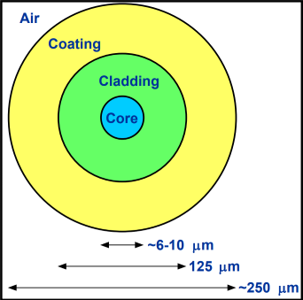

Contents
- [Fibre and waveguide related issues](#fibre-and-waveguide-related-issues)
- [Optical Circuits and Fibres](#optical-circuits-and-fibres)
  - [Theoretical analysis](#theoretical-analysis)
  - [Experimental measurements](#experimental-measurements)
  - [System related issues](#system-related-issues)
- [Basics of Optical Fibres and Waveguides](#basics-of-optical-fibres-and-waveguides)
  - [Fundamental Issues in Optical Communications](#fundamental-issues-in-optical-communications)
  - [Unguided and guided source](#unguided-and-guided-source)
    - [Unguided](#unguided)
    - [Guided](#guided)
  - [Optical fibres](#optical-fibres)

---

# Fibre and waveguide related issues

- **Attenuation**
	- Mechanisms: vibrations -  UV, IR scattering
- **Dispersion**
	- Phase velocity
	- Group velocity
	- Group index
	- GVD internodal
	- Intermodal
	- Material
	- Polarisation

- Birefringence and polarisation

- **Theoretical analysis**

- **Experimental measurements**

- Fabrication and cabling

# Optical Circuits and Fibres

- Modes
	- Multimode
	- Single-mode
- Indexes
	- Step index
	- Graded index
	- Arbitrary index
- Analysis
	- Analytical analysis
	- Approximate analysis
	- Numerical analysis
- Special designs
	- Dispersion shifted
	- Dispersion flattened
	- Polarisation maintaining
	- Twin-core / multicore
	- Photonic crystal / bandgap

## Theoretical analysis

- Ray optics
	- SI-MM, GI-MM
- Wave optics
	- SI-SM, V, U, W, $\beta$, $\lambda_c$, $\omega$ 
- Approximation methods
	- ESI
	- Moments
    
## Experimental measurements
    
| Symbols           | Definitions             |
| ----------------- | ----------------------- |
| $\lambda_c$       | Cut-off wavelength      |
| $\omega$          | Spot size               |
| $\alpha(\lambda)$ | Spectral attenuation    |
| $\alpha(z)$       | Fibre loss distribution |
| $BW$              | Fibre bandwidth         |
| $D(\lambda)$      | Fibre dispersion        |
    
## System related issues
    
- **Launching and joint**      
    - Source
    - Fibres
    - Fibre alignment, launching / coupling, connection
- **Fibre devices**
    - Connector, coupler, grating, amplifier, isolator
- System design
    - Power-limited system consideration
    - Bandwidth-limited system consideration
- Terminal equipment
    - Tx, Rx  

# Basics of Optical Fibres and Waveguides
    
- EM spectrum  
  - Optical fibre communication: $1.7\mu m-0.6\mu m$
- Important Applications
  - Optical communication
  - Optical sensing
  - Optical signal processing
    
## Fundamental Issues in Optical Communications

- Signal Power
  - Source, Attenuation, Diffraction   
- Bandwidth
  - Source, Dispersion, Detection
        
## Unguided and guided source
        
### Unguided

- In open air, free space
  - sound, light, radio, microwave…
- Features:
  - Good for broadcast
  - High loss
  - Low bandwidth 
  - Insecure 
  - Environmental influence 
  - Subject to EMI

### Guided
        
- In transmission medium
  - Waveguide, cable, fibre
- Features:
  - Secure and reliable
  - High bandwidth
  - Much less environmental and EM influence
  - Land usage

## Optical fibres

- Optical Fibre Structural

    

- Silica Optical Fibres
  - Low loss with extremely high bandwidth
- Photonic Crystal Fibres
  - Highly nonlinear
  - Polarization maintaining
  - Large mode area
  - Endlessly single-mode
  - Continuum generation

---
[Back: Course Overview](0.%20PHTN4661%20Optical%20Circuits%20and%20Fibres%20Overview.md)

[Next: Waveguide Model and Wave Method Analysis](2.%20Waveguide%20Model%20and%20Wave%20Method%20Analysis.md)