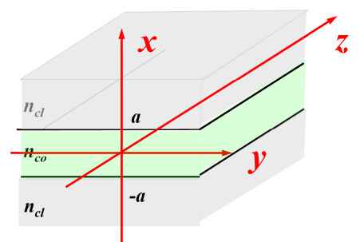
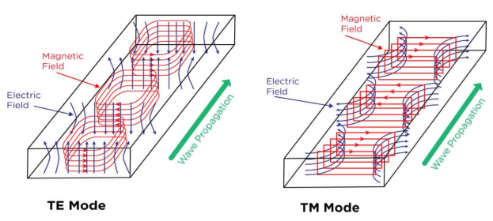
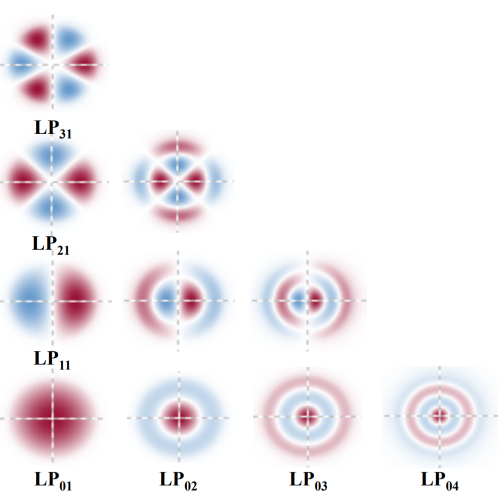

Contents
- [Wave Method](#wave-method)
- [Maxwell Equations](#maxwell-equations)
  - [Wave Equations](#wave-equations)
- [Modes in Optical Waveguides (Slab WG)](#modes-in-optical-waveguides-slab-wg)
  - [The Structure of Slab Waveguide](#the-structure-of-slab-waveguide)
  - [The Vector Wave Equations](#the-vector-wave-equations)
- [Modes in Optical Fibres (Step-Index Fibres)](#modes-in-optical-fibres-step-index-fibres)
  - [The structure of Step-Index Fibre](#the-structure-of-step-index-fibre)
  - [The Vector Wave Equations](#the-vector-wave-equations-1)
- [LP Modes](#lp-modes)
---

# Wave Method

- Ray method 
  - Reflection 
  - Refraction 
- Wave method 
  - Reflection 
  - Refraction 
  - Diffraction 
  - Coherence 
  - Interference 
- Quantum mechanic method 
  - Absorption 
  - Emission 
  - Scattering 
  - Coherence 
  - Interference 

# Maxwell Equations

- The Maxwell Equations are defined as the *differential* equations:

  $$ \begin{align*}
  \nabla \times H &= J + \frac{\partial D}{\partial t} && \text{Ampere's Circuital Law}\\
  \nabla \times E &= - \frac{\partial B}{\partial t} && \text{Fraday's Law of Induction}\\
  \nabla \cdot D &= \rho && \text{Gauss's Law for electricity}\\
  \nabla \cdot B &= 0 && \text{Gauss's Law for magnetism}
  \end{align*} $$

  - Parameters in Maxwell Equations 
  
    > | Parameter | Definition          |
    > | :-------: | :-------------------------- |
    > |  $J$  | Current density       |
    > |  $\rho$   | Total charge density    |
    > |  $H$  | Magnetizing field       |
    > |  $B$  | Magnetic field        |
    > |  $E$  | Electric field        |
    > |  $D$  | Electric displacement field |

## Wave Equations

For **optical fibres and waveguides**, the material is **DIELECTRIC** and **NON MAGNETIC**.
  
There are no free electric charges $(\rho=0)$, and no electric currents $(J=0)$ . 

- The Maxwell equations are simplified as

  $$
  \begin{align*} 
  \nabla \times H &= \frac{\partial D}{\partial t} = \varepsilon_0 \varepsilon_r \frac{\partial E}{\partial t} = \varepsilon_0 n^2 \frac{\partial E}{\partial t}\\
  \nabla \times E &= - \frac{\partial B}{\partial t} = - \mu_0 \mu_r \frac{\partial H}{\partial t} = - \mu_0 \frac{\partial H}{\partial t}\\
  \nabla \cdot D &= 0\\
  \nabla \cdot B &= 0\\
  \text{Where,}\\
  D&=\varepsilon_0 \varepsilon_rE \qquad \text{ with} \qquad \varepsilon_r=n^2\\
  B&=\mu_0 \mu_rH \qquad \text{with} \qquad \mu_r=1
  \end{align*}
  $$

The Light Field is $e^{- j \omega t}$, the angular frequency $\omega=2\pi f = \dfrac{2 \pi c}{\lambda}$. Then 

- The Wave Equations 
	
  $$
  \begin{aligned}
  &&&\left\{\begin{aligned}
  E(r,t)&=E(r)e^{-j\omega t}\\
  H(r,t)&=H(r)e^{-j\omega t}
  \end{aligned}\right.
  \qquad\Rightarrow\qquad
  \left\{\begin{aligned}
  \nabla \times H &= -j\omega \varepsilon_0 n^2 E\\
  \nabla \times E &= j \omega \mu_0 H 
  \end{aligned}\right. \\
  & \Rightarrow 
  &&\left\{\begin{aligned}
  &\nabla \times (\nabla \times H) = -j\omega \varepsilon_0 n^2 \nabla \times E\\
  &\nabla \times (\nabla \times E) = j \omega \mu_0 \nabla \times H\\
  &\nabla \cdot E = 0\\
  &\nabla \cdot H = 0
  \end{aligned}\right.\\
  & \Rightarrow 
  &&\left\{\begin{aligned}
  &\nabla^2 H + \omega^2 \varepsilon_0 \mu_0 n^2 H = 0\\
  &\nabla^2 E + \omega^2 \varepsilon_0 \mu_0 n^2 E = 0
  \end{aligned}\right. \qquad \omega^2 \varepsilon_0 \mu_0 n^2 = \left(\dfrac{\omega}{c}n\right)^2 = \left(\dfrac{2 \pi n}{\lambda}\right)^2 = k^2 n^2\\
  &\Rightarrow
  &&\left\{ \begin{aligned}
  &\nabla^2 H + k^2 n^2 H = 0\\
  &\nabla^2 E + k^2 n^2 E = 0
  \end{aligned}\right. \qquad \nabla^2 = \dfrac{\partial^2}{\partial x^2} + \dfrac{\partial^2}{\partial y^2} + \dfrac{\partial^2}{\partial z^2}
  \end{aligned}
  $$

> Like any differential equations, **boundary conditions** and **initial conditions** are necessary for a unique solution. 

# Modes in Optical Waveguides (Slab WG)

## The Structure of Slab Waveguide

- Slab WG is a simplistic 2D waveguide 

  - Two infinite cladding layers ($n_cl$) and a finite core layer ($n_co$) along x-axis
  
  - Waveguide is infinitely wide along y-axis
  
  - Guided wave (mode field), $E$, propagating along z-axis, $e^{j \beta z}$
  
  - In Slab WG, E, is uniform along y, $E=E(x)$

  - The index file: 

    > $n=\left\{\begin{aligned} n_{cl} &\qquad a<x\\ n_{co} &\qquad -a<x<a\\ n_{cl} &\qquad x<-1 \end{aligned}\right.$

- The structure graph is 

  > 

## The Vector Wave Equations

- The guided wave is expressed by

  > $E(r,t)=E(x)e^{j(\beta z-\omega t)}$

- Vector wave equations 

  > $\begin{aligned} \dfrac{\partial^2 E}{\partial x^2}+(k^2 n_{co}^2-\beta^2)E=0 &\qquad \text{in core}\\ \dfrac{\partial^2 E}{\partial x^2}+(\beta^2 - k^2 n_{cl}^2)E=0 &\qquad \text{in cladding} \end{aligned}$

- Define waveguide parameters $U,W,V$

  > $\begin{aligned} U^2 &= a^2 (k^2 n_{co}^2 - \beta^2) &\qquad &\text{in core}\\ W^2 &= a^2 (\beta^2 - k^2 n_{cl}^2) &\qquad &\text{in cladding}\\ V^2 &= W^2 + U^2\\ &=k^2 a^2 (n_{co}^2-n_{cl}^2) \end{aligned}$

- The scale wave equations with normalised $X=\dfrac x a$

  > $\begin{aligned} \dfrac{\partial^2 E}{\partial X^2}+U^2 E=0 &\qquad \text{in core}\\ \dfrac{\partial^2 E}{\partial X^2}+W^2 E=0 &\qquad \text{in cladding} \end{aligned}$

- The general solutions of the equations

  > $\begin{aligned} E_y &= Ae^{jUX}+Be^{-jUX}&&\qquad\text{in core}\\ E_y &= Ae^{WX} +Be^{-WX}&&\qquad\text{in cladding} \end{aligned}$
  
  - [General Solution for Differential Equations](A.%20PHTN4661%20Appendix%20General%20Solution%20for%20Differential%20Equations.md)

- Using the boundary conditions

  > $\begin{aligned} E_y &= Ae^{-WX}&& 1<X\\ E_y &= Be^{jUX} + Ce^{-jUX}&& -1<X<1\\ E_y &= De^{WX} && X<-1\end{aligned}$
  
  - The Continuity Boundary Conditions
  
    > $E_{y,1}=E_{y,2},\dfrac{dE_{y,1}}{dX}=\dfrac{dE_{y,2}}{dX}@X=\pm1$

- The eigenvalue equation

  > $U\tan U=W$

- For symmetric TE modes

  > $\begin{aligned} E_y&=\left\{\begin{aligned} &Ae^{-WX}&&X>1\\ &B\cos(UX)&&-1<X<1\\ &Ce^{WX}&&X<-1 \end{aligned}\right. \\\\
  & \Rightarrow U\tan{U}=W \end{aligned}$

- For antisymmetric TE modes

  > $\begin{aligned} E_y&=\left\{\begin{aligned} &Ae^{-WX}&&X>1\\ &B\sin(UX)&&-1<X<1\\ &Ce^{WX}&&X<-1 \end{aligned}\right. \\\\
  & \Rightarrow U\cot{U}=-W \end{aligned}$

# Modes in Optical Fibres (Step-Index Fibres)

## The structure of Step-Index Fibre

- Fibre is a combination of at least two concentric cylinders (one for the core and one for the cladding).

  - Use the cylindrical coordinates $(r,\theta,z)$ instead of $(x,y,z)$
  
  - Propagating along z-axis
  
  - Symmetric waveguide
  
  - Electric field $E(r)$ is a periodic function of $\theta$

## The Vector Wave Equations

- The guided wave is expressed by

  > $E(r,t)=E(r)e^{im\theta}e^{j\beta z}e^{-j\omega t}$

- The wave equations with normalised $R=\dfrac r a$

  > $\begin{aligned} \frac{\partial^2}{\partial R^2}E_z + \frac{1}{R}\frac{\partial}{\partial R}E_z + \left(U^2 - \frac{m^2}{R^2}\right)E_z = 0\\ \frac{\partial^2}{\partial R^2}E_z + \frac{1}{R}\frac{\partial}{\partial R}E_z - \left(W^2 + \frac{m^2}{R^2}\right)E_z = 0 \end{aligned}$

- The solutions are expressed as the Bessel functions

  > $\begin{aligned} &\left\{\begin{aligned} E_z(R)&=AJ_m(UR)\\ H_z(R)&=BJ_m(UR) \end{aligned}\right. &&\qquad\text{in core}\\ &\left\{\begin{aligned} E_z(R)&=CK_m(WR)\\ H_z(R)&=DK_m(WR) \end{aligned}\right. &&\qquad\text{in cladding}\\ \end{aligned}$

  - $J_m(UR)$ is the Bessel function of the first kind of order m

  - $K_m(WR)$ is the modified Bessel (Hankel) function of third kind of order m

# LP Modes

- TE modes: 
  Transverse Electric Field, 
    $E_z=0$

- TM modes: 
  Transverse Magnetic Field, 
    $H_z=0$

  - The Graph of TE and TM modes

    > 

- HE modes: 
  Hybrid mode with $H_z$ carrying more power than $E_z$

- EH modes:
  Hybrid mode with $E_z$ carrying more power than $H_z$
	
- The Graph of LP Modes
	
  > 

---
[Back: Basics  of Optical Fibres and Waveguides.md](1.%20PHTN4661%20Basics%20of%20Optical%20Fibres%20and%20Waveguides.md)

[Next: Waveguide Materials and Properties](3.%20PHTN4661%20Waveguide%20Materials%20and%20Properties.md)
