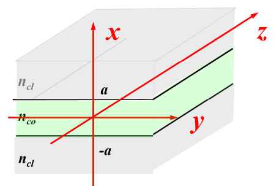

Contents
- [Wave Method](#wave-method)
- [Maxwell Equations](#maxwell-equations)
	- [Wave Equations](#wave-equations)
- [Modes in Optical Waveguides (Slab WG)](#modes-in-optical-waveguides-slab-wg)
- [Modes in Optical Fibres](#modes-in-optical-fibres)
---

# Wave Method

- Ray method 
	- Reflection 
	- Refraction 
- Wave method 
	- Reflection 
	- Refraction 
	- Diffraction 
	- Coherence 
	- Interference 
- Quantum mechanic method 
	- Absorption 
	- Emission 
	- Scattering 
	- Coherence 
	- Interference 

# Maxwell Equations

- The Maxwell Equations are defined as the *differential* equations:

$$
\begin{align*}
\nabla \times H &= J + \frac{\partial D}{\partial t} && \text{Ampere's Circuital Law}\\
\nabla \times E &= - \frac{\partial B}{\partial t} && \text{Fraday's Law of Induction}\\
\nabla \cdot D &= \rho && \text{Gauss's Law for electricity}\\
\nabla \cdot B &= 0 && \text{Gauss's Law for magnetism}
\end{align*}
$$

- Parameters in Maxwell Equations 

    | Parameter | Definition                  |     |
    | :-------: | :-------------------------- | --- |
    |    $J$    | Current density             |
    |  $\rho$   | Total charge density        |
    |    $H$    | Magnetizing field           |
    |    $B$    | Magnetic field              |
    |    $E$    | Electric field              |
    |    $D$    | Electric displacement field |

## Wave Equations

For **optical fibres and waveguides**, the material is **DIELECTRIC** and **NON MAGNETIC**.
    
There are no free electric charges $(\rho=0)$, and no electric currents $(J=0)$ . 

- The Maxwell equations are simplified as

$$
\begin{align*}
\nabla \times H &= \frac{\partial D}{\partial t} = \varepsilon_0 \varepsilon_r \frac{\partial E}{\partial t} = \varepsilon_0 n^2 \frac{\partial E}{\partial t}\\
\nabla \times E &= - \frac{\partial B}{\partial t} = - \mu_0 \mu_r \frac{\partial H}{\partial t} = - \mu_0 \frac{\partial H}{\partial t}\\
\nabla \cdot D &= 0\\
\nabla \cdot B &= 0\\\text{Where,}\\
D&=\varepsilon_0 \varepsilon_rE \qquad \text{ with} \qquad \varepsilon_r=n^2\\
B&=\mu_0 \mu_rH \qquad \text{with} \qquad \mu_r=1
\end{align*}
$$

The Light Field is $e^{- j \omega t}$, the angular frequency $\omega=2\pi f = \dfrac{2 \pi c}{\lambda}$. Then 

- The Wave Equations 

$$
\begin{aligned}
&&&\left\{\begin{aligned}
E(r,t)&=E(r)e^{-j\omega t}\\
H(r,t)&=H(r)e^{-j\omega t}
\end{aligned}\right.
\qquad\Rightarrow\qquad
\left\{\begin{aligned}
\nabla \times H &= -j\omega \varepsilon_0 n^2 E\\
\nabla \times E &= j \omega \mu_0 H 
\end{aligned}\right. \\

& \Rightarrow 
&&\left\{\begin{aligned}
&\nabla \times (\nabla \times H) = -j\omega \varepsilon_0 n^2 \nabla \times E\\
&\nabla \times (\nabla \times E) = j \omega \mu_0 \nabla \times H\\
&\nabla \cdot E = 0\\
&\nabla \cdot H = 0
\end{aligned}\right.\\

& \Rightarrow 
&&\left\{\begin{aligned}
&\nabla^2 H + \omega^2 \varepsilon_0 \mu_0 n^2 H = 0\\
&\nabla^2 E + \omega^2 \varepsilon_0 \mu_0 n^2 E = 0
\end{aligned}\right. \qquad \omega^2 \varepsilon_0 \mu_0 n^2 = \left(\dfrac{\omega}{c}n\right)^2 = \left(\dfrac{2 \pi n}{\lambda}\right)^2 = k^2 n^2\\

&\Rightarrow
&&\left\{ \begin{aligned}
&\nabla^2 H + k^2 n^2 H = 0\\
&\nabla^2 E + k^2 n^2 E = 0
\end{aligned}\right. \qquad \nabla^2 = \dfrac{\partial^2}{\partial x^2} + \dfrac{\partial^2}{\partial y^2} + \dfrac{\partial^2}{\partial z^2}
\end{aligned}
$$

> Like any differential equations, **boundary conditions** and **initial conditions** are necessary for a unique solution. 

# Modes in Optical Waveguides (Slab WG)

- Slab WG is a simplistic 2D waveguide 
  - Two infinite cladding layers ($n_cl$) and a finite core layer ($n_co$) along x-axis
  - Waveguide is infinitely wide along y-axis
  - Guided wave (mode field), $E$, propagating along z-axis, $e^{j \beta z}$
  - In Slab WG, E, is uniform along y, $E=E(x)$

- The structure of Slab Waveguide
	
	
	The index file: $n=\left\{\begin{aligned} n_{cl} &\qquad a<x\\ n_{co} &\qquad -a<x<a\\ n_{cl} &\qquad x<-1 \end{aligned}\right.$

# Modes in Optical Fibres

---
[Back: Basics  of Optical Fibres and Waveguides.md](1.%20Basics%20of%20Optical%20Fibres%20and%20Waveguides.md)

[Next: Course Overview](0.%20PHTN4661%20Optical%20Circuits%20and%20Fibres%20Overview.md)
