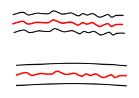
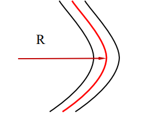

Contents
- [Fundamental issues](#fundamental-issues)
- [Fused Silica](#fused-silica)
  - [Material Dispersion $n(λ)$](#material-dispersion-nλ)
  - [Material Absorption $α(λ)$](#material-absorption-αλ)
- [Attenuation](#attenuation)
- [Dispersion and Bandwidth](#dispersion-and-bandwidth)
  - [Phase Velocity, Group Velocity and GVD](#phase-velocity-group-velocity-and-gvd)
    - [Material Dispersion](#material-dispersion)
    - [Impulse Response](#impulse-response)
- [Bending related properties](#bending-related-properties)
---

# Fundamental issues
  
- Material requirements
  - Attenuation
  - Dispersion
  - Bandwidth
  - Strength
  - Flexibility
- Material selection and waveguide design
  - Optical loss factor in materials and fabrication
  - Core size VS RI difference $\Delta$
  - Loss, dispersion, birefringence
- Waveguide materials
  - Fused silica glass
  - synthetic silica, the best waveguide material so far
  - Soft glass
  - Polymer materials
  - Optical crystals
  
- Material properties

  | Intrinsic                   | Extrinsic                               |
  | --------------------------- | --------------------------------------- |
  | Material absorption         | Structures, Impurities                  |
  | Scattering                  | Scattering                              |
  | Emission                    | Bending , Stress, Environmental factors |
  | Nonlinear optical processes | Irradiation                             |
  | Physical and chemical       | Manufacture defects, non-uniformities   |

# Fused Silica

- Key features of fused silica
  - Very low loss
  - Low material  dispersion
  - High mechanical strength
  - Very low thermal expansion
  - Very good chemical inertness
  - Very high laser damage threshold
  - Low dielectric constant
  - Low dielectric loss
  - Very high dielectric strength
  - Good UV transparency
  
## Material Dispersion $n(λ)$
  
- Sellmeier equation for glasses

  > $n^2(\lambda)=1+B_1\dfrac{\lambda^2}{\lambda^2-C_1^2}+B_2\dfrac{\lambda^2}{\lambda^2-C_2^2}+B_3\dfrac{\lambda^2}{\lambda^2-C_3^2}$

  - For fused silica

    > $\begin{aligned}
    > B_1&=0.6961663\\
    > C_1&=0.06840432\\
    > B_2&=0.4079426\\
    > C_2&=0.11624142\\
    > B_3&=0.8974794\\
    > C_3&=9.8961612
    > \end{aligned}$
  
## Material Absorption $α(λ)$
  
- Electronic - optical
- Electronic state
- Mechanical - IR, thermal
- Vibrational state

  > When the frequency of IR light matches the frequency of particular bond stretching / bending mode, the light as absorbed and the vibration or phonon is excited.
  
# Attenuation
- Attenuation & Related Issues
  - Sources (or transmitters) and their characteristics
  - Fibres and their characteristics 
  - Detector (or receivers) and their characteristics 
  - System construction 
    > Launching, Connection, Coupling, Splicing
  - System design and repeater spacing consideration 
    > Key factors: Losses and Dispersion 
    - Power limited design 
    - Bandwidth limited design
- Fundamental Issues
  - Material absorption
    - UV absorption
    - IR absorption
    - Impurities
  - Light scattering

    | $\Delta E=0$        | $\Delta E\ne0$       |
    | ------------------- | -------------------- |
    | Rayleigh scattering | Raman scattering     |
    | Mie scattering      | Brillouin scattering |
- Attenuation Types

  | UV Absorption                                                | IR Absorption                                            | Rayleigh Scattering                          |
  | ------------------------------------------------------------ | -------------------------------------------------------- | -------------------------------------------- |
  | $\alpha_{UV}\propto\exp\left(\dfrac{hc}{\lambda E_0}\right)$ | $\alpha_{IR}\propto\exp\left(-\dfrac{A}{\lambda}\right)$ | $\alpha_{Rayleigh}\propto\dfrac1{\lambda^4}$ |
  | $h$:   Plank constant                                        | $A$: material constant                                   | Air bubbles, impurity                        |
  | $c$:   light speed                                           |                                                          | Wrong bond                                   |
  | $E_0$: material constant                                     |                                                          | Structure inhomogeneity                      |
  |                                                              |                                                          | Core-cladding interface                      |

  - Attenuation Curve

    > 
  
- Attenuation or Loss Coefficient $\alpha$
  - dB per unit length (dB/cm, dB/m, dB/km)
  
    > $\begin{aligned}
    > \mathbf{P(z)} &= \mathbf{P_0} 10^{-\dfrac{\alpha}{10} \mathbf{z}}\\
    > \alpha        &= \dfrac{1}{\mathbf{z}} 10 \log\left(\mathbf{\dfrac{P_0}{P_(z)}}\right)
    > \end{aligned}$
   
  - 1 per unit length (1/cm, 1/m, 1/km)
    
    > $\begin{aligned}
    > \mathbf{P(z)} &= \mathbf{P_0} e^{-\alpha\mathbf{z}}\\
    > \alpha        &= \dfrac{1}{\mathbf{z}} \ln\left(\mathbf{\dfrac{P_0}{P_(z)}}\right)
    > \end{aligned}$
    
  - Neper per unit length
    
    > $\begin{aligned}
    > \mathbf{P(z)} &= \mathbf{P_0} e^{-\alpha\mathbf{z}}\\
    > \alpha        &= \dfrac{1}{\mathbf{z}} \ln\left(\mathbf{\dfrac{P_0}{P_(z)}}\right)
    > \end{aligned}$

# Dispersion and Bandwidth

## Phase Velocity, Group Velocity and GVD

Assume a practical modal field that may be expressed approximately as

> $\omega_1=\omega$ and $\omega_2 = \omega + d\omega$

Correspondingly the propagation constants are

> $\beta_1= \beta$ and $\beta_2 = \beta + d\beta$

The electric field along a fibre

> $\begin{aligned}E(r,t) 
> &= A(z) \psi(x,y) \left(\exp{[j(\beta_1 z - \omega_1 t)]} +\exp{[j(\beta_2 z - \omega_2 t)]}\right)\\
> &= A(z) \psi(x,y) \left(1+\exp{[j(d\beta z - d\omega t)]}\right)\exp{[j(\beta z - \omega t)]}\\
> &=2A(z) \psi(x.y) \underbrace{\cos\left(\dfrac{d\beta z - d\omega t}{2}\right)}_{\text{Moving packet (wavelet)}} \exp{\left[j\left(\dfrac{d\beta z - d\omega t}
> {2}\right)\right]} \underbrace{\vphantom{\left(\dfrac{1}{1}\right)}\exp{[j(\beta z - \omega t)]}}_{\text{Moving phase}}
> \end{aligned}$

- The Group velocity: speed of moving wavelet

  > $V_g=\dfrac{d\omega}{d\beta}$

- The Phase velocity: speed of moving phase

  > $V_p=\dfrac{\omega}{\beta}$

- Important parameters
    
  - **Group delay** or **time delay, $\tau$,** over length $L$
    
    > $\tau = \dfrac{L}{V_g}\qquad[s]$
    
  - **Group delay, $\bar\tau$,** per unit length
    
    > $\bar{\tau} \equiv \dfrac{\tau}{L}\qquad[s/m]$
    
  - **Group Velocity Dispersion (GVD)** per unit  angular frequency
    
    > $\text{GVD} \equiv \dfrac{d\bar{\tau}}{d\omega} \qquad [s^2/m]$
    
  - GVD, D, per unit wavelength
    
    > $D \equiv \dfrac{d\bar\tau}{d\lambda}\qquad[s/m^2]$
    
  - Group index $n_g$

    > $n_g=n-\lambda\dfrac{dn}{d\lambda}$

    - Derivatoin
      > $\omega = \dfrac{2 \pi c}{\lambda} \to d\omega = -\dfrac{2 \pi c}{\lambda^2} d\lambda \to \tau = \dfrac{L}{V_g} = -L \dfrac{\lambda^2}{2 \pi c} \dfrac{d\beta}{d\lambda}$
      >
      > In a uniform medium
      >
      > $\beta = n(\lambda)\dfrac{2 \pi}{\lambda} \to \dfrac{d\beta}{d\lambda} = -\dfrac{2 \pi}{\lambda^2} n + \dfrac{2 \pi}{\lambda} \dfrac{dn}{d\lambda}$
      >
      > $V_p = \dfrac{\omega}{\beta}=\dfrac{c}{n}$, $V_g = \dfrac{d\omega}{d\beta}=\dfrac{c}{n_g},\qquad n_g=n-\lambda\dfrac{dn}{d\lambda}=\text{Group index}$
      >
      > Hence,
      >
      > $\tau(\lambda)=\dfrac{L}{V_g}=L\dfrac{d\beta}{d\omega}=\dfrac{L}{c}\left(n-\lambda\dfrac{dn}{d\lambda}\right)$
      >
      > $\dfrac{d\tau}{d\lambda}=-\dfrac{L}{c}\lambda\dfrac{d^2n}{d\lambda^2}$

### Material Dispersion

The pulse broadening $\Delta\tau$ of an optical impulse with a wavelength width $\Delta\lambda$ can be found as

> $\Delta\tau=\dfrac{d\tau}{d\lambda}\Delta\lambda=-\dfrac{L}{c}\lambda\dfrac{d^2n}{d\lambda^2}\Delta\lambda$

Define a material dispersion parameter $D$  as

> $D=-\dfrac{\lambda}{c}\dfrac{d^2n}{d\lambda^2}\qquad[ps/nm\cdot km]$

With known D, the pulse broadening

> $\Delta\tau=DL\Delta\lambda$

Normally $\sigma_m = \Delta\tau$ and $S_\lambda= \Delta\lambda$. Hence the pulse broadening due to material dispersion, $\sigma_m$

> $\sigma_m = DLS_\lambda$

For an SI fibre, the normalised propagation constant, $b$

> $b = \dfrac{\beta^2 - k_2^2}{k_1^2 - k_2^2} = \dfrac{W^2}{V^2}\qquad\text{with }k_1=\dfrac{2 \pi n_1}{\lambda},\ k_2=\dfrac{2 \pi n_2}{\lambda}\text{ and }W=1.1428V-0.996$
> 
> $\to \Delta\tau=-\dfrac{L}{2 \pi c}\Delta\lambda\dfrac{d\lambda}{d}\left(\lambda^2\dfrac{d\beta}{d\lambda}\right),\qquad \sigma_m=-\dfrac{S_\lambda L}{c}\dfrac{n^2 \Delta}{\lambda}V\dfrac{d^2Vb}{dV^2}\approx-\dfrac{S_\lambda L}{c}\dfrac{n^2 \Delta}{\lambda}V\dfrac{2}{V^2}$

### Impulse Response

The impulse response of a step-index multimode optical fibre can be derived by this integral:

> $h(t)=\displaystyle\int_{0}^{\theta_c}{\delta(t-\tau(\theta))I(\theta)\sin\theta d\theta}$ 

Where $I(\theta)$ is the radiation pattern of optical source

- The average time delay $\tau_{av}$

> $\tau_{av}=\dfrac{\displaystyle\int_{-\infty}^{\infty}th(t)dt}{\displaystyle\int_{-\infty}^{\infty}h(t)dt}$

- The RMS pulse width $\sigma$

> $\sigma^2=\dfrac{\displaystyle\int_{-\infty}^{\infty}(t-\tau_{av})^2h(t)dt}{\displaystyle\int_{-\infty}^{\infty}h(t)dt}$

- Pulse Broadening

> $\sigma=\sqrt{\sigma_{in}^2 + \sigma_{int}^2 + (\sigma_m + \sigma_w)^2}$

- **Bandwidth**

> $B=\dfrac{0.25}{\sigma}$

# Bending related properties
- Key issues
  - Bending loss
  - Mode coupling
  - Applications
    - Waveguide design
    - Measurement
    - Sensing
    - Tapping optical signal
- Two kinds of Bending
  
  | Micro-bending                               | Macro-bending                               |
  | ------------------------------------------- | ------------------------------------------- |
  | Random core deformation                     | Bends                                       |
  | Size fluctuation                            | Curves                                      |
  | - Statistical parameters                    | - Radius of curvature: R                    |
  | - RMS deviation, correlation length         |                                             |
  |  |  |
  
- All bending introduce radiation loss as well as mode coupling or mixing
  
  | Radiation loss     | Bending effect on mode field   |
  | ------------------ | ------------------------------ |
  | Mode coupling      | core to cladding mode coupling |
  | Cladding mode loss | absorption at the interface    |
  
- Radiation loss due to macro-bending
  
  > $\alpha_R(\lambda)=c_1(\lambda)e^{-c_2(\lambda)R}$
  
- For MM fibre, the critical radius
  
  > $R_{c,MM}=\dfrac{2n^2_{co}\lambda}{4\pi NA^3}$
  
- For SM fibre, the critical radius
  
  > $R_{c,SM}=\dfrac{20\lambda}{NA^3}\left( 2.748-0.996 \dfrac{\lambda}{\lambda_c} \right)^{-3}$

---
[Back: Waveguide Model and Wave Method Analysis](2.%20PHTN4661%20Waveguide%20Model%20and%20Wave%20Method%20Analysis.md)

[Next: Waveguide Coupling and Light launching](4.%20PHTN4661%20Waveguide%20Coupling%20and%20Light%20launching.md)