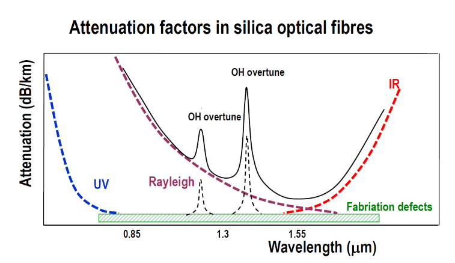
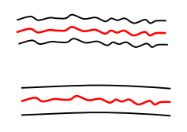
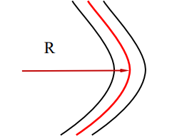

Contents
- [Fundamental issues](#fundamental-issues)
- [Fused Silica](#fused-silica)
  - [Material Dispersion $n(\\lambda)$](#material-dispersion-nlambda)
  - [Material Absorption $\\alpha(\\lambda)$](#material-absorption-alphalambda)
  - [**Attenuation**](#attenuation)
- [Bending related properties](#bending-related-properties)
---

# Fundamental issues
  
- Material requirements
  - Attenuation
  - Dispersion
  - Bandwidth
  - Strength
  - Flexibility
- Material selection and waveguide design
  - Optical loss factor in materials and fabrication
  - Core size VS RI difference $\Delta$
  - Loss, dispersion, birefringence
- Waveguide materials
  - Fused silica glass
  - synthetic silica, the best waveguide material so far
  - Soft glass
  - Polymer materials
  - Optical crystals
  
- Material properties

  | Intrinsic                   | Extrinsic                               |
  | --------------------------- | --------------------------------------- |
  | Material absorption         | Structures, Impurities                  |
  | Scattering                  | Scattering                              |
  | Emission                    | Bending , Stress, Environmental factors |
  | Nonlinear optical processes | Irradiation                             |
  | Physical and chemical       | Manufacture defects, non-uniformities   |

# Fused Silica

- Key features of fused silica
  - Very low loss
  - Low material  dispersion
  - High mechanical strength
  - Very low thermal expansion
  - Very good chemical inertness
  - Very high laser damage threshold
  - Low dielectric constant
  - Low dielectric loss
  - Very high dielectric strength
  - Good UV transparency
  
## Material Dispersion $n(\lambda)$
  
- Sellmeier equation for glasses

  $$
  n^2(\lambda)=1+B_1\dfrac{\lambda^2}{\lambda^2-C_1^2}+B_2\dfrac{\lambda^2}{\lambda^2-C_2^2}+B_3\dfrac{\lambda^2}{\lambda^2-C_3^2}
  $$

  - For fused silica

    $$
    \begin{aligned}
    B_1&=0.6961663\\
    C_1&=0.06840432\\
    B_2&=0.4079426\\
    C_2&=0.11624142\\
    B_3&=0.8974794\\
    C_3&=9.8961612
    \end{aligned}
    $$
  
## Material Absorption $\alpha(\lambda)$
  
- Electronic - optical
- Electronic state
- Mechanical - IR, thermal
- Vibrational state

  > When the frequency of IR light matches the frequency of particular bond stretching / bending mode, the light as absorbed and the vibration or phonon is excited.
  
## **Attenuation**
- Attenuation & Related Issues
  - Sources (or transmitters) and their characteristics
  - Fibres and their characteristics 
  - Detector (or receivers) and their characteristics 
  - System construction 
    > Launching, Connection, Coupling, Splicing
  - System design and repeater spacing consideration 
    > Key factors: Losses and Dispersion 
    - Power limited design 
    - Bandwidth limited design
- Fundamental Issues
  - Material absorption
    - UV absorption
    - IR absorption
    - Impurities
  - Light scattering
    | $\Delta E=0$        | $\Delta E\ne0$       |
    | ------------------- | -------------------- |
    | Rayleigh scattering | Raman scattering     |
    | Mie scattering      | Brillouin scattering |
- Attenuation Types
  | UV Absorption                                                | IR Absorption                                            | Rayleigh Scattering                          |
  | ------------------------------------------------------------ | -------------------------------------------------------- | -------------------------------------------- |
  | $\alpha_{UV}\propto\exp\left(\dfrac{hc}{\lambda E_0}\right)$ | $\alpha_{IR}\propto\exp\left(-\dfrac{A}{\lambda}\right)$ | $\alpha_{Rayleigh}\propto\dfrac1{\lambda^4}$ |
  | $h$:   Plank constant                                        | $A$: material constant                                   | Air bubbles, impurity                        |
  | $c$:   light speed                                           |                                                          | Wrong bond                                   |
  | $E_0$: material constant                                     |                                                          | Structure inhomogeneity                      |
  |                                                              |                                                          | Core-cladding interface                      |

  - Attenuation Curve

    
  
- Attenuation or Loss Coefficient $\alpha$
  - dB per unit length (dB/cm, dB/m, dB/km)
  
    $\begin{aligned}
    \mathbf{P(z)} &= \mathbf{P_0} 10^{-\dfrac{\alpha}{10} \mathbf{z}}\\
    \alpha        &= \dfrac{1}{\mathbf{z}} 10 \log\left(\mathbf{\dfrac{P_0}{P_(z)}}\right)
    \end{aligned}$
   
  - 1 per unit length (1/cm, 1/m, 1/km)
    
    $\begin{aligned}
    \mathbf{P(z)} &= \mathbf{P_0} e^{-\alpha\mathbf{z}}\\
    \alpha        &= \dfrac{1}{\mathbf{z}} \ln\left(\mathbf{\dfrac{P_0}{P_(z)}}\right)
    \end{aligned}$
    
  - Neper per unit length
    
    $\begin{aligned}
    \mathbf{P(z)} &= \mathbf{P_0} e^{-\alpha\mathbf{z}}\\
    \alpha        &= \dfrac{1}{\mathbf{z}} \ln\left(\mathbf{\dfrac{P_0}{P_(z)}}\right)
    \end{aligned}$
       
# Bending related properties
- Key issues
  - Bending loss
  - Mode coupling
  - Applications
    - Waveguide design
    - Measurement
    - Sensing
    - Tapping optical signal
- Two kinds of Bending
  
  | Micro-bending                               | Macro-bending                               |
  | ------------------------------------------- | ------------------------------------------- |
  | Random core deformation                     | Bends                                       |
  | Size fluctuation                            | Curves                                      |
  | - Statistical parameters                    | - Radius of curvature: R                    |
  | - RMS deviation, correlation length         |                                             |
  |  |  |
  
- All bending introduce radiation loss as well as mode coupling or mixing
  
  | Radiation loss     | Bending effect on mode field   |
  | ------------------ | ------------------------------ |
  | Mode coupling      | core to cladding mode coupling |
  | Cladding mode loss | absorption at the interface    |
  
- Radiation loss due to macro-bending
  
  $\alpha_R(\lambda)=c_1(\lambda)e^{-c_2(\lambda)R}$
  
- For MM fibre, the critical radius
  
  $R_{c,MM}=\dfrac{2n^2_{co}\lambda}{4\pi NA^3}$
  
- For SM fibre, the critical radius
  
  $R_{c,SM}=\dfrac{20\lambda}{NA^3}\left( 2.748-0.996 \dfrac{\lambda}{\lambda_c} \right)^{-3}$

---
[Back: Waveguide Model and Wave Method Analysis](2.%20PHTN4661%20Waveguide%20Model%20and%20Wave%20Method%20Analysis.md)

[Next: Waveguide Coupling and Light launching](4.%20Waveguide%20Coupling%20and%20Light%20launching.md)