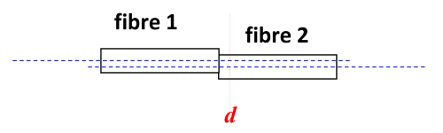
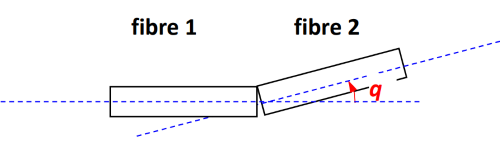
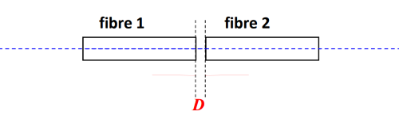

Content
- [Waveguide Coupling / light launching](#waveguide-coupling--light-launching)
  - [Source to waveguide](#source-to-waveguide)
    - [Spot size](#spot-size)
  - [Source to fibre light launching](#source-to-fibre-light-launching)
    - [Source to MM fibres](#source-to-mm-fibres)
    - [Source to SM fibres](#source-to-sm-fibres)
- [Waveguide Connection](#waveguide-connection)
  - [MM to MM Fibre Connection](#mm-to-mm-fibre-connection)
    - [Joint loss](#joint-loss)
    - [Power Loss](#power-loss)
  - [SM to SM Fibre Connection](#sm-to-sm-fibre-connection)
---

# Waveguide Coupling / light launching
## Source to waveguide
In general, light launched into a multimode waveguide will excite a superposition of different modes, which can have a complicated shape.

- The **initial field distribution** $E_0(x,y)$ at the input end of the waveguide can be determined by 

  $E_0(x,y)=\underbrace{\displaystyle\sum_{i=1}^{N}{A_iE_i(x,y)}}_{\text{Guided modal field}} + \text{unguided modes}$

  - $E_0(x,y)$ is decomposed into a linear combination of the guided modal fields and unguided modal fields (leaky modes)
  - The unguided fields may be guided in the cladding, as cladding mode
    - Cladding mode is particularly detrimental to accuracy in fibre measurement and must be removed effectively by
    
      $n_{coating}>n_{cladding}$ 

- The **launching efficiency**, $\eta$, of the guided mode can be determined by

  $\eta=\dfrac{\left|\displaystyle\int_0^{\infty}{\vec{E_0}\cdot\vec{E_i}ds}\right|^2}{\displaystyle\int_0^{\infty}{|E_0|^2ds}\displaystyle\int_0^{\infty}{|E_i|^2ds}}=(\text{overlap integral of fields})^2$

### Spot size
- Gaussian Approximation
  
  - The fundamental mode field of a SI fibre
  
    $E_z(R)=\left\{\begin{aligned}
    &\dfrac{J_0(UR)}{{J_0(U)}}&&R<1\text{ in core}\\
    &\dfrac{K_0(WR)}{K_0(W)}&&R\ge1\text{ in cladding}
    \end{aligned}\right.$
  
    - The fundamental mode field can be approximately represented by Gaussian function (**Gaussian Approximation**)
  
      $E_z(r)=e^{-{r^2}/{2\omega^2}}$
  
    - The parameter, $\omega$, is called **Spot Size**
    
- Spot Size Definition

  The radial distance from the fibre axis to the position where the electric field amplitude of light drops to $1/e$ (37%) of the maximum value at the centre of the fibre core.

  $E(\omega)=\dfrac{1}{e}E_{max}$

  - For SI fibre
  
    $\dfrac{\omega}{a}=0.65+\dfrac{1.62}{V^{3/2}}+\dfrac{2.88}{V^6}$

## Source to fibre light launching
- Issues    
  - Source and fibre related issues
    | Source and fibre | Issuse                                     |
    | ---------------- | ------------------------------------------ |
    | LED              | Power, wavelength, radiation area, pattern |
    | LD (Laser Diode) | Power, wavelength, spot size               |
    | MM               | Core diameter, index profile, NA           |
    | SM               | Spot size                                  |
  - Technical issues
    
    Tilt, offset. Separation
  
  - When launching light into optical fibres we need to maximize the efficiency
  
    Select source that match the fibre to be used
  
    e.g. LED → MM, LD → SM
        
### Source to MM fibres
  - Launching efficiency of a source to an SI-MM fibre
      
    $\eta=\underbrace{\vphantom{\left\{\begin{aligned}
    &\dfrac{A_f}{A_s}&A_f<A_s\\
    &1&A_f>A_s
    \end{aligned}\right.}\dfrac{1}{2}(NA)^2(\sigma+1)}_{\text{angle factor}}
    \underbrace{\left\{\begin{aligned}
    &\dfrac{A_f}{A_s}&A_f<A_s\\
    &1&A_f>A_s
    \end{aligned}\right.}_{\text{area factor}}$
  
    - $\sigma$ is the directivity factor of the source: $I(\theta)=I_0\cos^{\sigma}\theta$
  
      For LED, $\sigma\sim1$. For LD, $\sigma\sim20$.
        
  - Launching efficiency of a Lambertian source to a GI-MM fibre
     
    For a GI-MM fibre with the index profile 
      $n^2(r)=n_1^2\left[1-2\Delta\left(\dfrac{r}{a}\right)^a\right]$, 
      the launching efficiency is 
    
    $\eta = \left\{\begin{aligned}
    &2\Delta n_1^2 \dfrac{A_f}{A_s} \dfrac{\alpha}{\alpha+2}&&\text{ if }A_f \le A_s\\
    &\dfrac{2\Delta n_1^2}{\alpha+2}\left[\alpha+2-2\left(\dfrac{A_f}{A_s}\right)^\alpha\right]&&\text{ if }A_f\ge A_s
    \end{aligned}\right.$
        
  - Launching efficiency of a source to a GI-MM fibre
     
    For a GI-MM fibre with the index profile
      $n^2(r)=n_1^2\left[1-2\Delta\left(\dfrac{r}{a}\right)^a\right]$, 
      and a source of intensity radiation pattern
      $I(\theta)=I_0\cos(l\theta)$, 
      the launching efficiency $\eta$ between the light source and the fibre is
    
    $\eta=\dfrac{2}{b^2}\displaystyle\int_{0}^{a'}{rdr}\left\{1-\left[\left(1-2\Delta n_1^2\right)+2\Delta n_1^2\left(\dfrac{r}{a}\right)^\alpha\right]^{\frac{l+2}{2}}\right\}$
    
    - $b$ is the radius of emitting area of source
    - $a'=\min(a,b)$ 
            
### Source to SM fibres
- Consideration
  
  SM fibre → Fundamental mode only → Gaussian field description → Spot size $\omega$  given by V 

- Launching efficiency of a LD source to an SI-MM fibre

  $\eta = \left( \dfrac{2 \omega_1 \omega_2}{\omega_1^2 + \omega_2^2} \right)^2$

  - the spot size of SI-SM fibre

    $\dfrac{\omega}{a} = 0.65 + \dfrac{1.62}{V^{3/2}} + \dfrac{2.88}{V^6},\ 1.2 \le V \le 4, \text{ for fundamental mode only}$

# Waveguide Connection

- Key Issues
    
  - Different for MM and SM cases
  - Fibre related issues
    | Type    | Issues                                      |
    | ------- | ------------------------------------------- |
    | MM - MM | Core diameter, index profile, NA, direction |
    | SM - SM | Spot size                                   |
    | MM - SM | Not useful                                  |
    | SM - MM | Limited use                                 |
  - Technique related issues
    | Technique  | Issues                              |
    | ---------- | ----------------------------------- |
    | Offset     | Lateral misalignment of fibre cores |
    | Tilt       | Angular misalignment of fibre cores |
    | Separation | Gap between fibre ends              |
    | Distortion |
    | Fibre end  | Finish and Fresnel reflections      |

## MM to MM Fibre Connection
### Joint loss
1. Joint Loss due to **NA mismatch** of MM fibres
    
    $L_{NA}=\left\{\begin{aligned}
    &-10\log\left(\frac{NA_1}{NA_2}\right)^2 && NA_1>NA_2\\
    &0&& NA_1\le NA_2
    \end{aligned}\right.$
    
    - $NA_1:$ input Numerical Apertures
    - $NA_2:$ output Numerical Apertures
    
2. Joint Loss due to **core mismatch** of MM fibres
    
    $L_{a}=\left\{\begin{aligned}
    &-10\log\left(\frac{a_1}{a_2}\right)^2 && a_1>a_2\\
    &0&& a_1\le a_2
    \end{aligned}\right.$
    
    - $a_1:$ input core radii
    - $a_2:$ output core radii
    
3. Joint Loss due to **Fresnel reflection** of MM fibres
    
    $L_n=-10\log\left(1-\left(\dfrac{n_1-n_2}{n_1+n_2}\right)^2\right)$
    
    - $n_1:$ input core refractive index
    - $n_2:$ output core refractive index
    
4. Joint Loss due to **index mismatch** of GI-MM fibres
    
    For GI-MM fibre $n^2(r)=n_1^2\left[ 1 - 2 \Delta \left( \dfrac{r}{a} \right)^\alpha \right]$
    
    $L_\alpha=\left\{\begin{aligned}
    &-10\log\dfrac{\alpha_2(\alpha_1+2)}{\alpha_1(\alpha_2+2)}&& \alpha_1>\alpha_2\\
    &0&&\alpha_1<\alpha_2
    \end{aligned}\right.$
    
    - $\alpha:$ the index profile parameter
            
### Power Loss
1. Power Loss with **offset**
   
    $L_d=-10\log\left( 1-\dfrac{d}{2a}\right)$
   
    - $a:$ radius of fibre core
   
2. Power Loss with **tilt**
   
    $L_\theta=-10\log\left( 1-\dfrac{\theta}{2\theta_{C,L}}\right)$
    
    - $\theta_{C,L}:$ critical launching angle of fibre
   
3. Power Loss with **separation**
   
    $L_D=-10\log\left( 1 - \dfrac{a}{a+D\tan\theta_{C,L}}\right)^2$
    
    - $D:$ separation between two fibres
   
- Connection Mistake Types
  | Offset                              | Tilt                            | Separation                                  |
  | ----------------------------------- | ------------------------------- | ------------------------------------------- |
  |  |  |  |

## SM to SM Fibre Connection
1. Power transmission between two SM fibres
    
    $T=\dfrac{\left|\displaystyle\int_0^{\infty}G_1 G_2 r dr\right|^2}{\displaystyle\int_0^{\infty}|G_1|^2 r dr \displaystyle\int_0^{\infty}|G_2|^2 r dr}=(\text{overlap integral of fields})^2$
    
    - Fibre connection loss of SM fibre is only **Spot size mismatch**
    
2. Power Transmission with **spot size mismatch**
    
    $T_\omega=\left(\dfrac{2 \omega_1 \omega_2}{\omega_1^2 + \omega_2^2}\right)^2$
    
3. Power Transmission with **offset**
    
    $T_d=\left(\dfrac{2 \omega_1 \omega_2}{\omega_1^2 + \omega_2^2}\right)^2\exp\left[-\dfrac{2d^2}{\omega_1^2 + \omega_2^2}\right]$
    
4. Power Transmission with **tilt**
    
    $T_\theta=\left(\dfrac{2 \omega_1 \omega_2}{\omega_1^2 + \omega_2^2}\right)^2\exp\left[-\dfrac{2(\pi n_2 \omega_1 \omega_2 \theta)^2}{(\omega_1^2 + \omega_2^2)\lambda^2}\right]$
    
5. Power Transmission with **separation**
    
    $T_{D,\omega} = \dfrac{4\left[ 4Z^2 + \dfrac{\omega_1^2}{\omega_2^2}\right]^2}{\left[ 4Z^2 + \dfrac{\omega_1^2 + \omega_2^2}{\omega_2^2} \right]^2 + 4Z^2 \dfrac{\omega_2^2}{\omega_1^2}} \quad \text{with} \quad Z = \frac{D}{n_2 k_1 \omega_1 \omega_2}$
    
6. Power Transmission with **offset**, **tilt** and **separation**
    
    $\begin{aligned}
    T&=T_{D,\omega}T_d T_\theta\\
    T &= \dfrac{4\left[ 4Z^2 + \dfrac{\omega_1^2}{\omega_2^2}\right]^2}{\left[ 4Z^2 + \dfrac{\omega_1^2 + \omega_2^2}{\omega_2^2} \right]^2 + 4Z^2 \dfrac{\omega_2^2}{\omega_1^2}} 
    \exp\left[-\dfrac{2d^2}{\omega_1^2 + \omega_2^2}\right]
    \exp\left[-\dfrac{2(\pi n_2 \omega_1 \omega_2 \theta)^2}{(\omega_1^2 + \omega_2^2)\lambda^2}\right]
    \quad \text{with} \quad Z = \frac{D}{n_2 k_1 \omega_1 \omega_2}
    \end{aligned}$
    
    - The same formular may be used to work out the launching efficiency between a laser source and a SM fibre

---
[Back: Waveguide Materials and Properties](3.%20PHTN4661%20Waveguide%20Materials%20and%20Properties.md)

[Next: Optical Waveguide & Fibre Fabrication](5.%20PHTN4661%20Optical%20Waveguide%20&%20Fibre%20Fabrication.md)