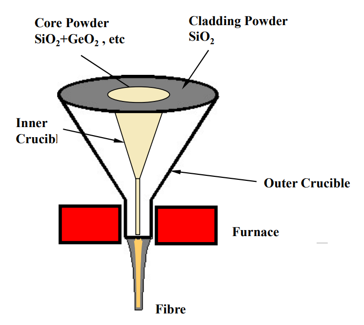
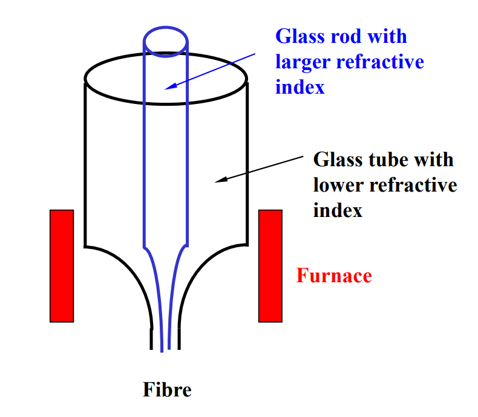

Content
- [Optical fibre fabrication](#optical-fibre-fabrication)
  - [Conventional Solid Cores](#conventional-solid-cores)
    - [Double Crucible Method](#double-crucible-method)
    - [Rod-in-Tube Method](#rod-in-tube-method)
    - [Chemical Vapour Deposition method](#chemical-vapour-deposition-method)
    - [Fibre Drawing](#fibre-drawing)
  - [Microstructured Fibres](#microstructured-fibres)
    - [Stack and draw method](#stack-and-draw-method)
- [Application-specific optical fibres](#application-specific-optical-fibres)
- [Optical waveguide fabrication](#optical-waveguide-fabrication)
- [Application-specific waveguides](#application-specific-waveguides)
---
# Optical fibre fabrication
## Conventional Solid Cores
  - Glass manufacture method 
    - [Double crucible (SI fibre only)](#double-crucible-method)
    - [Rod-in-tube](#rod-in-tube-method)
  - Preform method - *ALL modern low loss silica fibres*
    - [Vapor deposition process technique - Chemical Vapour Deposition (CVD) method](#chemical-vapour-deposition-method)
      1. [Outside Vapor Deposition (OVD)](#outside-vapour-deposition-ovd---corning-and-stc)
      2. [Vapour Axial Deposition (VAD)](#vapour-axial-deposition-vad---sumitomo--ntt)
      3. [Modified Chemical Vapor Deposition (MCVD)](#modified-chemical-vapour-deposition-mcvd---att-bell)
      4. [Plasma Modified Chemical Vapor Deposition (PMCVD)](#plasma-modified-chemical-vapor-deposition-pmcvd)
      5. [Plasma Chemical Vapor Deposition (PCVD)](#plasma-chemical-vapor-deposition-pcvd)
    - Made in a two step process 
      1. Preform fabrication
      2. [Fibre drawing](#fibre-drawing)
    - Hydrolysis process technique 

### Double Crucible Method
This method was first developed by the then British Telecom Research Laboratory in 1966 in a serious attempt to fabricate low loss fibre. It begins with glass power instead of ready made glass rod and tube. In order to lower the loss of the fibre, the powder is firstly purified by various electrolysis methods to remove the transition metals such as Cr, Mn, Fe, Co, Ni and Cu. It is then put into an oven for drying to remove the water. Finally, the powder is put into a crucible.

- Features
  - Continuous fabrication
  - Long fibres can be produced.
  - Step-index fibres and graded-index fibres can be made.
  - Low cost & high loss, often used for imaging fibre bundles.
  - Very good for soft glass fibres
  - Similar method - extrusion method for soft glass and polymer fibres

### Rod-in-Tube Method
This is one of the oldest and
simplest methods developed.
All we need to do in this
method is to find a glass rod of
higher refractive index and a
glass tube of lower refractive
index. We put the rod into the
tube and melt the tip of the
assembly and pull the melted
tip into a fine fibre thread.

### Chemical Vapour Deposition method
Chemical Vapor Deposition (CVD) is a process of **extremely high purity material synthesis** through **chemical reactions** which transform gaseous  molecules, called precursors, into a porous solid material called soot, on the surface of a substrate wafer or tube.

- Starting chemical materials / precursors: halides in gas or liquid form, e.g.
  - SiCl4 (silicon tetrachloride)  -- basic material for silicate glass
  - GeCl4 (germanium tetrachloride) – to be mixed with SiCl4 to increase the refractive index of glass.
  - POCl3 (photophorus oxitrichloride) – also increase the refractive index of glass, but it also tends to soften the glass to facilitate perform making. 
  - BCl3 (boron trichloride) – to reduce the refractive index of glass
  - Chemical reaction at ~1500°C

#### Silica optical fibre fabrication by CVD method

- Preform fabrication by a CVD method
  - Make silica glass rod of required fibre index profile
- Optical fibre fabrication using a draw tower
  - Draw fibre from the preform in a HT furnace at ~2000C
  - Protect the fibre with coating

#### Outside Vapour Deposition (OVD) - Corning and STC

#### Vapour Axial Deposition (VAD) - Sumitomo & NTT

#### Modified Chemical Vapour Deposition (MCVD) - AT&T Bell

#### Plasma Modified Chemical Vapor Deposition (PMCVD)

#### Plasma Chemical Vapor Deposition (PCVD)

### Fibre Drawing

## Microstructured Fibres
### Stack and draw method 

# Application-specific optical fibres
# Optical waveguide fabrication
# Application-specific waveguides

---
[Back: Waveguide Coupling and Light launching](4.%20PHTN4661%20Waveguide%20Coupling%20and%20Light%20launching.md)

[Next: Optical Components & Circuits](6.%20PHTN4661%20Optical%20Components%20&%20Circuits.md)