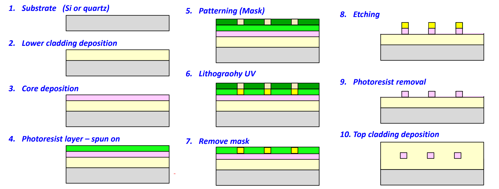

Content
- [Optical fibre fabrication](#optical-fibre-fabrication)
  - [Conventional Solid Cores](#conventional-solid-cores)
    - [Double Crucible Method](#double-crucible-method)
    - [Rod-in-Tube Method](#rod-in-tube-method)
    - [Chemical Vapour Deposition method](#chemical-vapour-deposition-method)
    - [Fibre Drawing](#fibre-drawing)
  - [Microstructured Fibres](#microstructured-fibres)
    - [Stack and draw method](#stack-and-draw-method)
- [Application-specific optical fibres](#application-specific-optical-fibres)
  - [Transmission fibre](#transmission-fibre)
  - [Application-specific fibre](#application-specific-fibre)
- [Optical waveguide fabrication](#optical-waveguide-fabrication)
  - [Optical waveguide](#optical-waveguide)
  - [related techniques](#related-techniques)
- [Application-specific waveguides](#application-specific-waveguides)
  - [Silicon photonics](#silicon-photonics)
  - [Optical-electronics Integration](#optical-electronics-integration)
  - [Optical Circuitry](#optical-circuitry)
---
# Optical fibre fabrication
## Conventional Solid Cores
  - Glass manufacture method 
    - [Double crucible (SI fibre only)](#double-crucible-method)
    - [Rod-in-tube](#rod-in-tube-method)
  - Preform method - *ALL modern low loss silica fibres*
    - [Vapor deposition process technique - Chemical Vapour Deposition (CVD) method](#chemical-vapour-deposition-method)
      1. [Outside Vapor Deposition (OVD)](#outside-vapour-deposition-ovd---corning-and-stc)
      2. [Vapour Axial Deposition (VAD)](#vapour-axial-deposition-vad---sumitomo--ntt)
      3. [Modified Chemical Vapor Deposition (MCVD)](#modified-chemical-vapour-deposition-mcvd---att-bell)
      4. [Plasma Modified Chemical Vapor Deposition (PMCVD)](#plasma-modified-chemical-vapor-deposition-pmcvd)
      5. [Plasma Chemical Vapor Deposition (PCVD)](#plasma-chemical-vapor-deposition-pcvd)
    - Made in a two step process 
      1. Preform fabrication
      2. [Fibre drawing](#fibre-drawing)
    - Hydrolysis process technique 

### Double Crucible Method
This method was first developed by the then British Telecom Research Laboratory in 1966 in a serious attempt to fabricate low loss fibre. It begins with glass power instead of ready made glass rod and tube. In order to lower the loss of the fibre, the powder is firstly purified by various electrolysis methods to remove the transition metals such as Cr, Mn, Fe, Co, Ni and Cu. It is then put into an oven for drying to remove the water. Finally, the powder is put into a crucible.

> 

- Features
  - Continuous fabrication
  - Long fibres can be produced.
  - Step-index fibres and graded-index fibres can be made.
  - Low cost & high loss, often used for imaging fibre bundles.
  - Very good for soft glass fibres
  - Similar method - extrusion method for soft glass and polymer fibres

### Rod-in-Tube Method
This is one of the oldest and simplest methods developed. All we need to do in this method is to find a glass rod of higher refractive index and a glass tube of lower refractive index. We put the rod into the tube and melt the tip of the assembly and pull the melted tip into a fine fibre thread.

> 

### Chemical Vapour Deposition method
Chemical Vapor Deposition (CVD) is a process of **extremely high purity material synthesis** through **chemical reactions** which transform gaseous  molecules, called precursors, into a porous solid material called soot, on the surface of a substrate wafer or tube.

CVD, for its great material purity and diversity are widely used in many areas of integrated electronic circuits, optoelectronic devices, sensors.

CVD techniques can also be employed to grow thin layer protecting materials, e.g. titanium carbide-coated graphite, fine metal and ceramic powders, etc

- Starting chemical materials / precursors: halides in gas or liquid form, e.g.
  - SiCl4 (silicon tetrachloride)  -- basic material for silicate glass
  - GeCl4 (germanium tetrachloride) - to be mixed with SiCl4 to increase the refractive index of glass.
  - POCl3 (photophorus oxitrichloride) - also increase the refractive index of glass, but it also tends to soften the glass to facilitate perform making. 
  - BCl3 (boron trichloride) - to reduce the refractive index of glass
  - Chemical reaction at ~1500°C
- Silica optical fibre fabrication by CVD method
  - Preform fabrication by a CVD method
    - Make silica glass rod of required fibre index profile
  - Optical fibre fabrication using a draw tower
    - Draw fibre from the preform in a HT furnace at ~2000C
    - Protect the fibre with coating

- Gas (vapour) delivery + MCVD
  
  The doped glass soot in the form of minute spheres of 0.5m in diameterare deposited at the wall of a starting rod in the case of the outsidevapour phase deposition method or the VAD method. In the case of MCVD method, the soot is deposited at the inside of the start tube.

  The by product, chlorine, being in gas form, is diluted by passing itthrough a scrubber tower and is eventually dissolved in water.
      
  The heat (1500°C) for chemical reaction is provided by an oxy-propanetorch running along the start rod or tube. At the end of one run, a layer oflayer of glass with the desired refractive index is deposited. The torch thenquickly returns to the starting position and begins the second run.Meanwhile, the vapour composition can be changed so that the refractiveindex of this second layer achieves another desired index value.

  > 

- Chemical Vapour Deposition method
  - CVD techniques are based on thermal chemical vapor reaction that forms oxides

    $
    \begin{aligned}
    SiCl_4 + O_2 &\to SiO_2 \downarrow + 2Cl_2 \uparrow\\
    GeCl_4 + O_2 &\to GeO_2 \downarrow + 2Cl_2 \uparrow
    \end{aligned}\qquad \text{Oxidation of halides, }@ \sim 1500\degree \text{C}\\
    $

  - They are deposited as layers of glass particles called **soot**
  - The starting material  SiCl4,  GeCl4, POCl3, and BCl3 are evaporated and controlled by carrying gas such as O2 and N2 through a gas delivery process.

- Gas (vapour) delivery
  - Halide vapour is produced by bubbling carrier gas though the enclosed liquid halide container - this technique avoids contamination.
    > 
  - No suitable volatile precursor exists for many useful dopants, e.g. aluminium, rare-earths. Other doping techniques have to be used.
- Index Control & Property modification
  - The refractive index of the basic glass material SiO2 is 1.457. 
  - To increase the index, we can dope the glass with GeO2. The more GeO2, the higher is the index. 
    > Changing composition of the mixture during the process influences refractive index profile and other properties of the fibre preform.

#### Outside Vapour Deposition (OVD) - Corning and STC

- OVD was exclusively used by Corning since the 1970s, and the patent of such a technology has expired since July 2000.
  - Halogens and O2 react  in a hot flame to form hot glass soot, which is deposited layer by layer on an aluminium oxide or graphite mandrel.
  - The central mandrel is removed after deposition.
  - In the last step, called sintering, a hollow porous preform is dehydrated and collapsed in controlled atmosphere, (e.g. helium) to form desired preform. 

> 

- Features 
  - Soot deposition is on a carbon or refractory rod
  - Rod is removed prior to consolidation
  - Soot is deposited in layers allowing better control of refractive
  - index profile

#### Vapour Axial Deposition (VAD) - Sumitomo & NTT

- VAD preform can be fabricated continuously
- Starting chemicals are carried from the bottom 
into oxygen-hydrogen burner lame to produce 
glass soot which is deposited on the end of a 
rotating silica rod.
- A porous preform is then grown in the axial 
direction.
- The starting rod is pulled upward and rotated.
- Finally the preform is dehydrated and vitrified in 
ring heaters.
- Great for the mass production and long fibres.
  
> 

- Features 
  - Good for mass production of transmission fibre
  - Low loss
  - Multi-mode and single mode fibre
  - Large preforms (OD=100mm) 
  - Continuous preforms hence long fibres
  - High speed deposition (grams per min)
  - Not suitable for speciality fibre

#### Modified Chemical Vapour Deposition (MCVD) - AT&T Bell

- Fabrication is carried out within a silica tube - allowing for very low water contamination. 
  - Start with synthetic silica tube. 
  - Start tube is heated by torch while rotating on lathe. 
  - SiCl4 and dopant vapours are simultaneously delivered. 
  - A preform can draw tens even hundreds of km of 125 μm fibre
- No need for lengthy drying process. 
- Very versatile process giving highly precise control of the refractive index profile.
- Especially suitable for speciality fibre fabrication.
> 
  - A small amount of water diffuses through the deposited cladding layers from the tube and from the burner. 
  - Cl2 can be used to remove this water. 
  - During the high temperatures used in the collapse, volatile components such as P2O5 or GeO2 can evaporate from the inside of the tube leading to a central dip in the refractive index profile. 
  - MCVD is versatile, however the collapse process can limit the dopants that can be included.

#### Plasma Modified Chemical Vapor Deposition (PMCVD)

- PMCVD is a modification of MCVD. Here the radio-frequency coil around the substrate tube produces a high internal temperature plasma that enables the reaction in a normal MCVD process.
> 

#### Plasma Chemical Vapor Deposition (PCVD)

- PCVD is similar to PMCVD. The radio-frequency coil is replaced by a microwave cavity resonator. In this method reactions lead directly to deposit glass layer without forming the soot.
> 

### Fibre Drawing

- Fibre structure: 
  1. Core
  2. Cladding
  3. Buffer, protective polymer layer
  4. Jacket, protective polymer layer.
  > 
- Most high quality optical fbres are made from CVD preform, following these steps
  1. Fabrication of the preform 
  2. Drawing the fbre from the preform
  3. Coating and jacketing process
  4. Cabling
  
> 

## Microstructured Fibres
### Stack and draw method 
Microstructured fibre fabrication
1. Capillaries are stacked inside a tube to form a cm-scale macroscopic replica of the desired ransverse HF cross-section. 
2. This stack can be drawn down directly into fibre on a fibre drawing tower. If small core dimensions are required, a mm-scale cane is drawn. 
3. The cane can be inserted into a solid jacket tube and drawn to fibre.

> 

# Application-specific optical fibres
- [Transmission fibre](#transmission-fibre)
  - Mainly silica, some polymer
  - Single-mode fibres
  - Multi-mode fibres
  - Polarisation maintaining fibres
  - Dispersion shifted fibres
  - Dispersion compensating fibres
- [Application-specific fibre](#application-specific-fibre)
  - Rare-earth doped fibres
  - Photosensitive fibres
  - Twin-core and multicore fibres
  - D-shaped fibres and slab fibres
  - Special properties (NLO, AO, EO, etc)

## Transmission fibre
- Transmission Fibre Properties
  - Single mode (ITU G.652)
    - Loss - 0.2 dB/Km @ 1550nm
    - NA - 0.12
    - Mode field diameter - 9 - 10mm
    - Cut-off wavelength - 1100 to 1280nm
    - Dispersion - 17 ps/nm/km @ 1550nm
    - Bend loss @ 1550nm, < 1dB for 100 turns at radius of 75mm
    > 
    1. Dispersion Shifted 
        > Segmented-core trianglar profile design
        > 
    2. Dispersion Flattened
        > Triple clad fibre
        > 
  - Multimode
    - Loss - 0.5 dB/Km @ 1550nm
    - NA - 0.2 ~ 0.5
    > 
    
## Application-specific fibre
- Photosensitive fibre - Bragg gratings
  - Germanium and Boron doped
  - Deuterium loaded
- Rare-earth doped - Fibre lasers/amplifiers
  - Erbium (phosphorous & aluminium co-doped)
  - Erbium/Ytterbium
  - Ytterbium
  - Neodymium
  - ‘Double’ clad fibre
- Polarisation maintaining - Fibre-optical polarisation components
  - Elliptical core Hi-Bi
  - ‘Panda’ Hi-Bi
  - ‘Bow-tie’ Hi-Bi
  > 

# Optical waveguide fabrication
Fabricating waveguides on various crystal and glass materials involve many different microfabrication processes and techniques, similar to microelectronics fabrication.

- **Channel waveguides** on semiconductor, crystal and glass materials can be made with lithographic methods in combination with, e.g., epitaxy, ion exchange, or thermal diffusion. 
- **Buried waveguides** can be made by growing additional layer on top of the waveguide. This may lead to lower propagation losses and a more symmetric mode profile.
- **Waveguides** can be written into transparent media (e.g. glasses or crystals) with focused and pulsed laser beams, exploiting laser-induced breakdown and related phenomena. In glasses, the affected volume often exhibits a somewhat increased refractive index, which can be directly used for guiding light. In crystals, the refractive index may be decreased; one then has to treat some region around the desired waveguide region.

Different fabrication techniques involve differently the relevant aspects such as cost, flexibility and reproducibility of manufacturing, propagation losses, possible side effects on the material, optimum mode size and symmetry for coupling to other waveguides, etc.

## Optical waveguide
- Key processing
  - Deposition Techniques
  - Patterning – Lithography
  - Etching
- Typical optical waveguide fabrication
  1. Substrate (Si or quartz)
  2. Lower cladding deposition
  3. Core deposition
  4. Photoresist layer – spun on
  5. Patterning (Mask)
  6. Lithograohy UV 
  7. Remove mask
  8. Etching
  9. Photoresist removal
  10. Top cladding deposition
  > 
## related techniques
1. Deposition Techniques
   - Spin coater 
   - Evaporation 
   - Sputtering 
   - Doping 
   - Micro-printing
   - CVD techniques
     - Plasma Enhanced CVD (PECVD)
   - Epitaxial growth techniques
     - Vapour Phase Epitaxy  (VPE)  - similar to CVD
     - Liquid phase epitaxy (LPE)
     - Molecular Beam Epitaxy (MBE) 
     - Chemical Vapor Depostion MOCVD 
     - Chemical Beam Epitaxy (CBE)
     - Waveguide Fabrication
2. Patterning - Lithography
   - Photolithography 
   - negative process 
   - positive process 
   - soft lithography 
   - Lift - off process 
   - Resist processing 
     - Exposure Nanoimprinting
   - E-beam Lithography
   - X-ray lithography 
   - Soft Lithography 
   - Thermomechanical nanolithography 
3. Etching
   - wet etching 
   - dry etching 
   - plasma etching
4. Self Assembly 
   - Self Assembled Materials may build up thin layers in a highly organized manner. 
5. Directly Laser Writing

- Hollow cathode PECVD (HC-PECVD) technique
  - This method was used to produce low loss silica waveguides.
  - It can be used to grow germanosilicate waveguide layers having large intrinsic photosensitive in the 240 nm region.
  - This process is capable of producing low loss silica at low temperature, thus significant degree of flexibility in postprocessing options, with cost effective planar waveguide fabrication.
  - UV induced $\Delta n$ in HC-PECVD waveguide may withstand temperatures up to 700°C.

# Application-specific waveguides
## Silicon photonics
Silicon-based waveguide devices Smallest & fastest silicon photonic optical signal processing.
- Optical signal processing
  - tunable resonators
  - microring resonator
  - optical waveguide couplers
  - electrostatic actuators
- Polymer waveguide by RIE 
  
  Reactive Ion Etching (RIE) can convert a slab waveguide into a channel waveguide. A metallic photo mask is applied to protect the core material. Oxygen is used to desolve the unmasked portion of the polymer. The metalic mask is removed and the core is fully encased with overcladding.

  > 

## Optical-electronics Integration
- Optical waveguide fabrication on semiconductor for photonics
  > 
- Epitaxy – Waveguide Deposition Techniques
  
  Especially for the deposition of a crystalline overlayer on a crystalline substrate
  - Epitaxy: Deposition and growth of monocrystalline structures/layers. 
  - Epitaxial growth results in monocrystalline layers differing from deposition which gives rise to polycrystalline and bulk structures.
  - Epitaxy types:
    - Homoepitaxy: Substrate & material are of same kind. (Si-Si)
    - Heteroepitaxy: Substrate & material are of different kinds. (Ga-As)
  - Epitaxy Types
    - Vapor-Phase Epitaxy (VPE)
      - Modified method of chemical vapor deposition (CVD). 
      - Good for glass waveguides. Undesirable for polycrystalline layers
      - Growth rate: ~2 µm/min.
    - Liquid-Phase Epitaxy (LPE)
      - Crystal layers are from the melt existent on the substrate.
      - Hard to make thin films
      - Growth rate: 0.1 ~ 1 µm/min.
    - Molecular Beam Epitaxy (MBE)
      - Relies on the sublimation of ultrapure elements, then condensation of them on wafer
      - In a high vacuum chamber (pressure: ~10-11 Torr) environment. 
      - Molecules do not collide to either chamber walls or existent gas atoms.
      - Growth rate: ~ 1µm/hr.
- Features 
  - High precision
  - Very well controlled 
  - Grow films with good crystal structure
  - Typically in ultra-high vacuum 
  - Deposition rates are very low (1monolayer/second)
  - Often use multiple sources to grow alloy films
  - Deposition rate is so low 
  - Expensive

## Optical Circuitry
- Arrayed waveguide gratings (AWG)
  
  AWG are very useful for optical wavelength division multiplexed (WDM) systems. They are capable of multiplexing a large number of wavelengths into a single optical fbre.

- Optical PCB
  > 

---
[Back: Waveguide Coupling and Light launching](4.%20PHTN4661%20Waveguide%20Coupling%20and%20Light%20launching.md)

[Next: Optical Components & Circuits](6.%20PHTN4661%20Optical%20Components%20&%20Circuits.md)