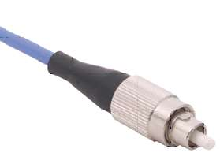

Content
- [Optical Components](#optical-components)
  - [Fibre connectors](#fibre-connectors)
  - [Fibre and waveguide couplers](#fibre-and-waveguide-couplers)
  - [Optical amplifiers](#optical-amplifiers)
  - [Isolators and circulators](#isolators-and-circulators)
    - [Isolators](#isolators)
    - [Circulators](#circulators)
  - [Bragg gratings](#bragg-gratings)
    - [Waveguide and Fibre Bragg grating](#waveguide-and-fibre-bragg-grating)
  - [Optical switches](#optical-switches)
- [Optical Circuits](#optical-circuits)
---

# Optical Components
## Fibre connectors

High precision ceramic ferrules and alignment sleeves have high concentricity at both ends, and very accurate inner and outer diameters
  > 
- Low loss connection:
  - High precision ceramic ferrules and alignment sleeves have high concentricity at both ends, and very accurate inner and outer diameters.
  - High precision optical fibres have high core concentricity, and very accurate core and cladding diameters.
  - High quality polished and clean endfaces.
- Connection Types
  - FC: Ferrule Connector  
    - FC Screw 2.5 mm IEC 61754-13 
    - Applications: 
      Datacom, telecom, measurement equipment, single mode lasers; becoming less common
  - FC/PC: Ferrule Connectors typically use a “Physical Contact" polish at the fiber and ferrule end. 
   
    > This is a slightly curved surface, so that when fibers are mated only the fiber cores touch, not the surrounding ferrules. 
  
  - FC/APC: FC with *Angled Physical Contact* or *Angle-Polished Connection*
  
    > These connectors are available with the fiber endface polished at an angle to prevent light that reflects from the interface from traveling back up the fibre. Generally angle-polished connectors have higher insertion loss and is desirabe for system where feedback to  than good quality straight physical contact ones. 

    - Because of the angle, the reflected light does not stay in the fiber core but instead leaks out into the cladding. Angle-polished connectors should only be mated to other angle-polished connectors. Mating to a non-angle polished connector causes very high insertion loss. 

    > APCs are distinguished visibly by the use of a green strain relief boot, or a green connector body.  
    > An angled FC connector may be designated FC/APC, or merely FCA. 
    Non-angled versions may be denoted FC/PC or with specialized designations such as FC/UPC or FCU to denote an "ultra" quality polish on the fiber endface.

  > 

- Fibre connector Types 
  
  | Types                | Descriptions                                                                                                                                                             | Images                                 |
  | -------------------- | ------------------------------------------------------------------------------------------------------------------------------------------------------------------------ | -------------------------------------- |
  | SMA Fibre Connectors | Multi-Mode, fibre Size: 250mm                                                                                                                                            |    |
  | FC Fibre Connector   | Single Mode 125mm, Ferrule: Ceramic, PC                                                                                                                                  |  |
  | LC Fibre Connector   | LC, developed by Lucent Corporation, is a small form factor connector that uses a 1.25 mm ferrule, half the size of the SC.                                              |      |
  | SC Fibre Connector   | SC (Standard Connector, Subscriber Connector) A fiber-optic cable connector that uses a push-pull latching mechanism.                                                    |      |
  | ST Fibre Connector   | ST “Straight Tip" connector,  by AT&T, is optical connector featuring a physically contacting non-rotating 2.5mm ferrule design and bayonet connector-to-adapter mating. |      |
  | ...                  |

## Fibre and waveguide couplers

- Couplers: For splitting or combining optical signals
    > 
- “Supermodes” of a coupled fibre structure 
  > Superposed or coupled modes have different velocities. 
  > 
  > > Coupled modes have different oscillation frequencies. 
- Principal parameters of a coupler
  
  | Parameters     | Expression                                               |
  | -------------- | -------------------------------------------------------- |
  | Coupling Ratio | $R(\text{dB})=10\log\left(\dfrac{P_3}{P_3+P_4}\right)$   |
  | Excess Loss    | $L_e(\text{dB})=10\log\left(\dfrac{P_1}{P_3+P_4}\right)$ |
  | Insertion Loss | $L_i(\text{dB})=10\log\left(\dfrac{P_1}{P_3}\right)$     |
  | Directivity    | $D(\text{dB})=10\log\left(\dfrac{P_{ref}}{P_1}\right)$   |

## Optical amplifiers 

- Erbium Doped Fibre Amplifier (EDFA)
  > 

## Isolators and circulators
- Design and fabrication
  - Faraday Effect
    Rotation of the plane of polarization of a linearly polarized light when a magnetic field is applied to the medium 
    > $\Delta\theta = \mathbf{v} \vec{H} \cdot \vec{L} = \mathbf{v H L}$
    
    where      
    
    > $\mathbf{v}$: Verdet constant
    >
    > $\mathbf{H}$: Magnetic field
    >
    > $\mathbf{L}$: Distance / Length

    > 

### Isolators 

> 

### Circulators 

> 

## Bragg gratings

- Grating analysis and design
  - Coupled mode equations
- Bragg Grating fabrication techniques
  - Interferometric writing, fs, etching
  - Grating characterisation
- FBGs and their applications
  - Dispersion compensators
  - DWDM filters
  - DFB lasers
  - Mirrors, Reflectors
- Long period fibre grating design and fabrication

### Waveguide and Fibre Bragg grating

Periodic modulation of index, $n(z)$, or any other physical properties that are inscribed 
along an optical fibre or waveguide and that lead to the periodic modulation of propagation 
constant of guided modes, $\beta=\beta(z)$.

  >   

- Bragg wavelength

  > $\lambda_B = 2 n_{eff} \Lambda$
  > 
  > $n_{eff}$: effectibe index or modal index 
  >
  > $\Lambda$: grating period

  > 

- Reflectivity
  
  > $R = \tanh^2\left[\dfrac{\pi \Delta n L}{\lambda_B}\eta(V)\right]$
  > 
  > $L$: grating length
  > 
  > $\Delta n$: index change or index modulation amplitude
  > 
  > $\lambda_B$: Bragg wavelength 
  > 
  > $\eta(V)$: fraction of mode intensity in core

## Optical switches

- Types
  - Time Domain Switching
  - Space Domain Switching / Routing
  - Wavelength Domain Switching
  - Hybrid of Space, Wavelength and Time
- Optical Switch Technologies
  - Mechanical
    > 
  - EO: Electro-optic
    > 
  - TO: Thermo-optic
  - AO: Acousto-optic
  - EA: Electro-Absorption
  - MEMS: microelectromechanical systems

# Optical Circuits
- Systems
  - Telecommunication
  - Measurement 
  - Sensing
- Subsystems and modules
  - Optical transmitters / terminals
  - Optical receivers
  - Modulation / demodulation modules  
  - Switching and routing modules 
  - Signal processing
- Applications
  - Optoelectronic integration, Optical PCB
  - Optical systems

---
[Back: Optical Waveguide & Fibre Fabrication](5.%20PHTN4661%20Optical%20Waveguide%20&%20Fibre%20Fabrication.md)

[Next: Advanced topics](7.%20PHTN4661%20Advanced%20topics.md)