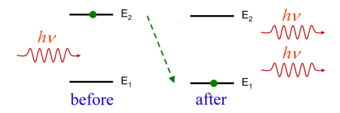
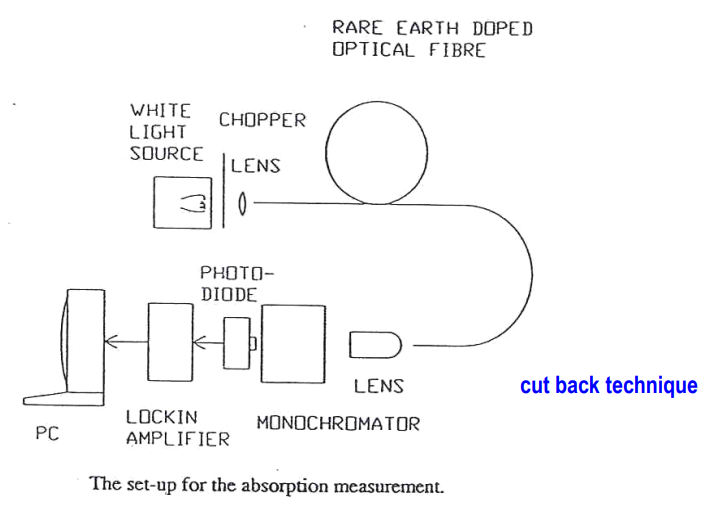

Content
- [Laser basics](#laser-basics)
  - [Laser Principle](#laser-principle)
  - [Fabry-Perot (FP) Cavity](#fabry-perot-fp-cavity)
    - [Fabry-Perot (FP) Cavity with Gain](#fabry-perot-fp-cavity-with-gain)
  - [Lasing Conditions](#lasing-conditions)
    - [Lasing Conditions and modes](#lasing-conditions-and-modes)
    - [Lasing threshold conditions](#lasing-threshold-conditions)
  - [Sources for Optical Transmitters](#sources-for-optical-transmitters)
    - [Semiconductor light sources](#semiconductor-light-sources)
- [Rare-Earth Doped Fibres](#rare-earth-doped-fibres)
  - [Two important rare-earth elements](#two-important-rare-earth-elements)
  - [Critical factors for active ions](#critical-factors-for-active-ions)
  - [Manufacture of Rare-Earth-Doped Fibres](#manufacture-of-rare-earth-doped-fibres)
  - [Characterization of Rare-Earth-Doped Fibres](#characterization-of-rare-earth-doped-fibres)
- [Fibre Amplifiers and Lasers](#fibre-amplifiers-and-lasers)
  - [Optical Fibre Amplifiers](#optical-fibre-amplifiers)
    - [Electronic amplifiers and regenerators](#electronic-amplifiers-and-regenerators)
    - [Optical amplifiers](#optical-amplifiers)
    - [Partial energy levels of Erbium in silica](#partial-energy-levels-of-erbium-in-silica)
    - [Desired amplifier properties](#desired-amplifier-properties)
    - [Important factors in rare-earth doped fibre design](#important-factors-in-rare-earth-doped-fibre-design)
    - [Key issues of Erbium doped fiber amplifiers (EDFAs)](#key-issues-of-erbium-doped-fiber-amplifiers-edfas)
    - [Advantages and Limitations](#advantages-and-limitations)
    - [Typical Erbium doped fibre](#typical-erbium-doped-fibre)
  - [Optical amplifiers](#optical-amplifiers-1)
  - [Fibre Ring Laser](#fibre-ring-laser)

---
# Laser basics
## Laser Principle
- Interaction between matter and light
  - An atom or an ion is characterized by discrete energy levels
  - Interaction process between an atom and radiation
    | Absorption                              | Spontaneous emission                                       | Stimulated emission                                       |
    | --------------------------------------- | ---------------------------------------------------------- | --------------------------------------------------------- |
    |  |  |  |
  - $\Delta E=hv=E_2-E_1$
  - State population - Boltzmann Distribution
    > 
    - Radiative transitions Processes (down) produce luminescence 
    - Non-radiative relaxation multiphonon and energy transfer 
      processes produce heat (IR).  
  - Population-inversion
      | 3 level system                                                  | 4 level system                                                  |
      | --------------------------------------------------------------- | --------------------------------------------------------------- |
      |  |  |
    - Population inversion  
      (require a pump source, metastable energy level, lifetime)
    - Stimulated emission  
      (light amplification at signal wavelength)
    - Feedback mechanism  
      (resonant cavity)
## Fabry-Perot (FP) Cavity
> 
$$E_t = t_1 t_2 E_i e^{-j \beta L} \left[1 + r_1 r_2 e^{-j 2 \beta L} + r_1^2 r_2^2 e^{-j 4 \beta L} + \cdots \right]$$
- Transmission field  
  $$E_t = E_i \left[\dfrac{t_1 t_2 e^{-j \beta L}}{1 - r_1 r_2 e^{-j 2 \beta L}}\right]$$
- Resonance condition
  $$1 - r_1 r_2 e^{-j 2 \beta L} = 0$$
  $2 \beta L = 2\dfrac{2\pi}{\lambda}nL=2m \pi \text{ or } 2nL = m\lambda$  
### Fabry-Perot (FP) Cavity with Gain
> 
$$E_t = t_{1}t_{2}E_{i}e^{-(j\beta-g)L}\left[1+r_{1}r_{2}e^{-2(j\beta-g)L}+r_{1}^{2}r_{2}^{2}e^{-4(j\beta-g)L}+\cdots\right]$$
## Lasing Conditions
- Transmission field  
  $E_t=E_i\left[\dfrac{t_{1}t_{2}e^{-(j\beta-g)L}}{1-r_{1}r_{2}e^{-2(j\beta-g)L}}\right]$
- Resonance condition: $g=G_{th}$  
  $1-r_{1}r_{2}e^{-2(j\beta-g)L}=0$
- Gain threshold (gain condition)  
  The amplitude of light field, after completing one round trip 
  within the cavity, should at least equal to its initial value 
  (round trip gain >0)
- Phase matching (resonance condition) $2nL=m\lambda$  
  The phase of light field, after completing one round trip within 
  the cavity, should be exactly multiples of $2\pi$. (round trip 
  path length $=m\lambda$, round trip phase $=2m\pi$)
### Lasing Conditions and modes
- Longitudinal modes  
  $2nL=m\lambda$  
  - $n$: refractive index of the cavity or gain medium  
  - $m$: integer
- Longitudinal mode separation  
  $\Delta\lambda=\dfrac{\lambda^2}{2nL}$  
- Coherence length  
  $L_c=\dfrac{\lambda^2}{\delta\lambda}$
  - $\delta\lambda$: spectral width of light source
> 
### Lasing threshold conditions
- Threshold gain coefficient [neper/cm]  
  $G_{th}=\alpha - \dfrac{1}{2L}\ln{r_1 r_2}$  
  - $G_{th}$: attenuation coefficient in [neper /cm]
  - $L$: cavity length in [cm]
  - $r_1$ and $r_2$: reflection coefficients of mirrors 
## Sources for Optical Transmitters
- Various optical sources are available
  - Lamps, Fluorescent tubes
  - Solid state lasers, Gas lasers, Dye lasers
  - Semiconductor sources
    - Light Emitting Diodes (LEDs)
    - Laser Diodes
  - Fibre lasers
- Semiconductor Laser Diodes are preferred
  - Small size, high efficiency, high bandwidth
  - Electrically pumped
    - Direct modulation possibility: electrical to optical signal 
      conversions
### Semiconductor light sources
- High modulation bandwidth ( > 10 Gbit/s) 
- Small size, ready to integrate
- High launching efficiency with ideal intensity  
  (radiation) pattern and single transverse mode
- High energy conversion efficiency
- Narrow spectral linewidth with single   
  longitudinal mode
- Easy and reliable operation
- Long lifetime
# Rare-Earth Doped Fibres
## Two important rare-earth elements
- Neodymium (Nd)
  - Four level energy system
  - More efficient to generate population inversion between levels 
    E2 and E4. 
  - Note: E4 is always empty 
  - Short lifetime of metastable level ~10 µs
- Erbium (Er)
  - Three level system
  - Long lifetime of metastable level ~ 10 ms
> | Neodymium                             | Erbium                          |
> | ------------------------------------- | ------------------------------- |
> |  |  |
## Critical factors for active ions
- Criteria for optical gain medium
  - Suitable energy gap for pump, $λ_p$
  - Suitable energy gap for signal, $λ_s$
  - Metastable level with long lifetime, $τ$
  - Small excited state absorption (ESA)
- Able to be made into optical fibres
## Manufacture of Rare-Earth-Doped Fibres
- Active fibre fabrication: solution doping in MCVD process  
  
## Characterization of Rare-Earth-Doped Fibres
- Absorption spectrum measurement
  | Determing $\lambda_p$                                    | Determing $\lambda_s$                                    |
  | -------------------------------------------------------- | -------------------------------------------------------- |
  |  |  |
# Fibre Amplifiers and Lasers
## Optical Fibre Amplifiers
> Overcoming attenuation for long distance transmission, one needs 
  to amplify signal periodically
### Electronic amplifiers and regenerators
- Retiming, reshaping and regeneration –all in one
- Very expensive
- Very limited bandwidth – single wavelength only 
- Difficult to upgrade
### Optical amplifiers
- Simple and inexpensive
- Very large bandwidth (>80nm, > THz for WDM or DWDM) 
### Partial energy levels of Erbium in silica
> 
> 
### Desired amplifier properties
- Broadband spectrum gain (wavelength transparency)
- Flat gain over the wavelength of operation
- Gain independent of data rate (data rate transparency)
- Low noise and high efficiency
- Gain independent of number of input channels, small cross talk
- Gain independent of polarization
- Small size and ease of integration with other components 
- Low coupling loss to optical fibers
### Important factors in rare-earth doped fibre design
- Small core radius (about 1.3 µm)
- Fe or Fe/Al doped silica core
- High numerical aperture (about 0.3)
- Pump power 2 mW
- Gain > 20 dB
- Pump wavelength 980 nm or 1480 nm
- Saturation output power 10 dBm for pump powers of 30-50 mW
- Erbium-doped fibre amplifier is insensitive to polarization of 
  light. 
### Key issues of Erbium doped fiber amplifiers (EDFAs)
- Absorption and emission of light
  - Population inversion
  - ESA
  - ASE
- Characteristics
  - Gain spectrum and bandwidth
  - Gain saturation
  - Gain flatness
  - Gain dynamics
- Noise
### Advantages and Limitations
- Advantages
  - No need of high speed electronics
    - Transparent to bit rate and format
  - Simultaneous amplification of multiple λ
- Limitations
  - No compensation for dispersion
  - Adds noise
  > If system limitation is due to insufficient optical power and 
    not due to dispersion, it needs only optical amplification
### Typical Erbium doped fibre
- Core of the fibre doped with erbium
- Er concentration: ~ 40 - 400 ppm
  - Absorption at 980/1550 nm ~ 5.5/5.2 dB/m
- Fibre NA ~ 0.2 –0.3
- Cut off wavelength ~ 930 nm
- MFD ~ 5.5 μm at 1550 nm
- Pump power is used up in creating population inversion in Er
- Signal gets amplified as it propagates through the doped fiber
- Spontaneous emission generated at any point also gets amplified
  - in both forward and backward directions
## Optical amplifiers
- Principal types of optical amplifiers for telecommunication
  - Erbium doped fibre amplifier (EDFA)
    - For operation in the C-band and L-band
  - Thulium doped fibre amplifier (TDFA)
    - For operation in the S-band
  - Raman fibre amplifier (RFA)
    - All wavelength bands
  - Semiconductor optical amplifier (SOA)
    - All wavelength bands
## Fibre Ring Laser
- Difficult to make semi-transparent mirrors at fibre ends. 
- A fibre loop forms a ring resonant cavity. 
> 
- Relevant issues
  - Threshold
  - Slope efficiency
  - Pulsed or CW
  - Tuneable or not 
  - Wavelength or spectral width
> 
- Large tunable wavelength range
- kHz linewidth

---
[Tutorial](b.%20PHTN4662%20Tutorial%202.md)

---
[Back: Fibre Fundamentals](1.%20PHTN4662%20Lecture%201%20Fibre%20Fundamentals.md)

[Next]()