Content
- [Semiconductor Optoelectronics](#semiconductor-optoelectronics)
  - [Semiconductor materials](#semiconductor-materials)
  - [p-n junction](#p-n-junction)
  - [Electrical pumping](#electrical-pumping)
- [Heterojunction LEDs and LDs](#heterojunction-leds-and-lds)
  - [Homojunction and Heterojunction](#homojunction-and-heterojunction)
    - [homojunction](#homojunction)
    - [heterojunction](#heterojunction)
  - [Energy Diagram of a Heterojunction](#energy-diagram-of-a-heterojunction)
  - [Double Heterojunction](#double-heterojunction)
  - [Source Characteristics](#source-characteristics)
    - [Quantum Efficiency](#quantum-efficiency)
    - [Power Efficiency](#power-efficiency)
    - [V-I Curve and P-I Curve](#v-i-curve-and-p-i-curve)
    - [Line Width](#line-width)
    - [Radiation pattern](#radiation-pattern)
    - [Response Time and Bandwidth](#response-time-and-bandwidth)
    - [Temperature Characteristics](#temperature-characteristics)
  - [Laser Diode](#laser-diode)
    - [Principle \& Operation](#principle--operation)
    - [Laser Chirping](#laser-chirping)
- [Semiconductor photodetectors](#semiconductor-photodetectors)
  - [Photodetectors](#photodetectors)
    - [O-E conversion](#o-e-conversion)
    - [Quantum Efficiency](#quantum-efficiency-1)
    - [Responsivity](#responsivity)
    - [Responsivity calculation \& measurement](#responsivity-calculation--measurement)
    - [Wavelength of operatio](#wavelength-of-operatio)
    - [Semiconductor Materials](#semiconductor-materials-1)
  - [PIN Photodiode](#pin-photodiode)
    - [Avalanche Photodiode (APD)](#avalanche-photodiode-apd)

---
# Semiconductor Optoelectronics
## Semiconductor materials
- Intrinsic: - pure crystal
  - Equal holes and electrons
    - no major carrier
- Extrinsic: - impurities
  - p-type: More holes than electrons
    - holes as the major carrier
  - n-type: More electrons than holes
    - electronics as the major carrier
## p-n junction
- Fermi level  
  - The energy level that will have a 50% chance of being occupied. 
- Carrier diffusion & Recombination
  > When the two materials are put together as a pn junction, the 
    holes in the p-type material will diffuse into the n-type 
    material and similar situation holds for the electrons. This 
    results in the carrier redistribution around the junction. As 
    they move across the boundary in opposite direction, there will 
    be occasion for them to combine with each other.  
  > Thus right at the junction, there will be no free charges (no 
    free holes nor electrons).  
  > In the p-type material close to the boundary, it is a negatively 
    charged. While in the n-type material close to the boundary, it 
    will be a positively charged.  
  > This charge distribution produces an electric field distribution 
    as well as potential energy distribution.  
  > The establishment of the potential prevents further diffusion of 
    the holes or electrons cross the boundary.

  | -                                                   | Open Circuit                                        | Reverse Bias                                        | Forward Bias |
  | --------------------------------------------------- | --------------------------------------------------- | --------------------------------------------------- |
  | 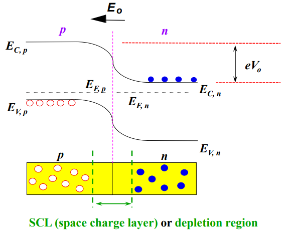 | 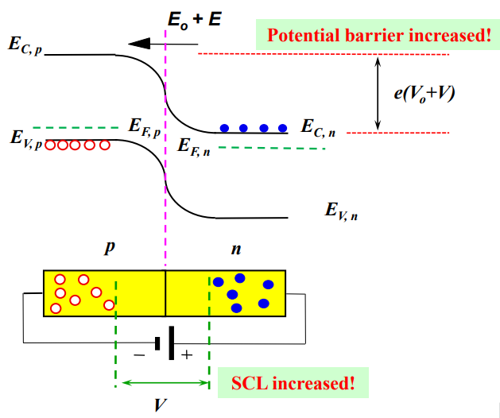 | 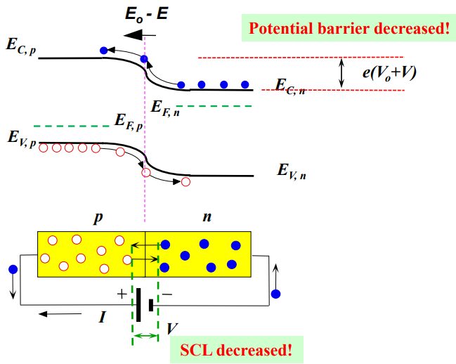 |

  - properties & features
    > 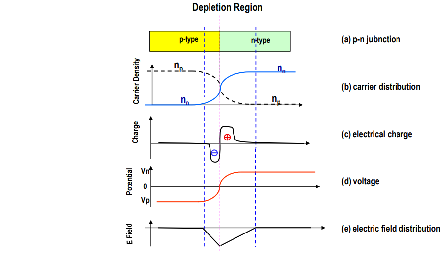

## Electrical pumping
To enable the carriers to move across we may artificially lower 
the potential. This is achieved by applying a forward bias voltage 
across the p-n semiconductor.  
The holes in the p-type material is pushed towards the n-type 
material and the electrons in the n-type material pushed towards the 
p-type material. 

# Heterojunction LEDs and LDs
## Homojunction and Heterojunction
### homojunction
If a p-n junction is made of the same material so that the 
potential distributions for both holes and electrons are 
identical. The number of electron-hole combination to generate 
photons is not large. This structure is called homojunction.
### heterojunction 
If we can allow only the holes to move across the p-n junction 
and stop the electrons from moving across, then there will be 
more electron-hole combinations and consequently more photons 
generated. To achieve this goal, we need the potential barrier 
for the electrons to be large and the barrier for holes to be 
small. This is achieved by joining two dissimilar semiconductor 
materials and the structure is called heterojunction.
## Energy Diagram of a Heterojunction
It can be seen that at forward bias, the holes can move straight 
across the junction from p-type to n-type without any hindrance 
whereas the electrons in the n-type cannot climb over the potential 
barrier to the p-type. Hence a large number of electron-hole 
combination occurs within the n-type material. This creates a large 
amount of photons.  
> 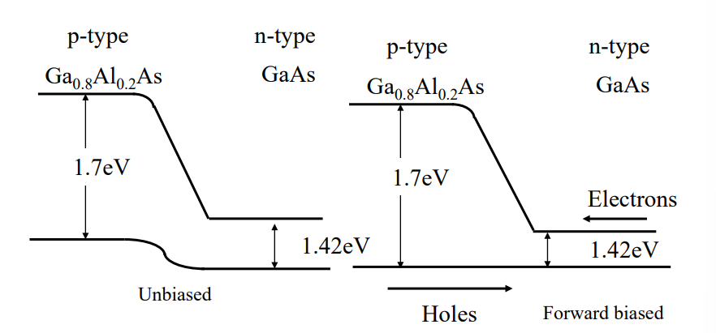 
## Double Heterojunction
> 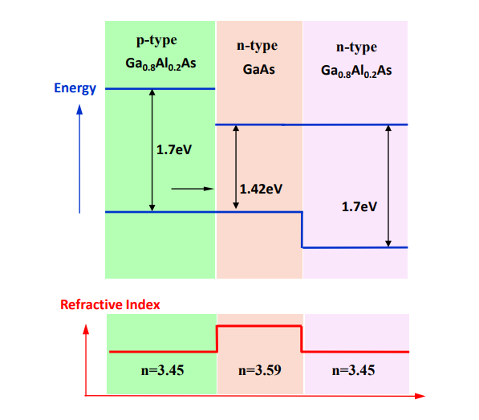
## Source Characteristics
### Quantum Efficiency  
- The quantum efficiency $ηQ$ which is mathematically defined as  
  $\eta_Q=\dfrac{Photons generated}{Electrons injected}=\dfrac{P_{int}/hv}{I_{el}/e}$  
  where $P_{int}$ is the optical power generated within the 
  semiconductor material and $I_i$ is the electrical current by 
  the diode. Physically, this means that when a forward bias is 
  applied across the pn-junction, photons are generated due to 
  electron-hole combination. Therefore quantum efficiency is the 
  ratio of the number of photons generated to the number of 
  electrons needed. 
- This efficiency is not the one that we can measure because we 
  cannot measure the actual number of photons generated. By the 
  time the photons manage to get out of the diode, some of them 
  are already consumed by the diode itself, i.e. some of the 
  photons are absorbed by the charges to excite themselves to the 
  excited states or to induce oscillations by themselves thus 
  generating heat. 
- The quantum efficiency of most semiconductor diodes has a value 
  between 0.5 and 0.8. 
### Power Efficiency
The more practical power efficiency $\eta_{PT}$ defined as  
$$\eta_{PT}=\dfrac{P_{out}}{P_{el}}$$  
where $P_{out}$ is the emitted optical power which can be 
measured
### V-I Curve and P-I Curve
- V-I Curve
  - The LED has a current-voltage relation similar to that of a 
    regular diode. 
  - The forward current is typically limited to 50 to 100mA for dc 
    operation and goes up to 1 to 2A peak for pulsed operation.
- P-I Curve
  - The P-I curve gives the output optical power Pout as a function 
    of the input forward current IF. 
  - The P-I curve of an LED is nearly a straight line, implying that 
    the relation between the current input and light power output is 
    linear. This is true for many LEDs but not for all. This is an 
    important characteristics especially when it is used in analog 
    modulation systems, because the modulating signal is not 
    distorted. 
- From V-I and P-I curves, we can work out the power efficiency of 
  the LED.

  | V-I Curve                             | P-I curve                             |
  | ------------------------------------- | ------------------------------------- |
  | 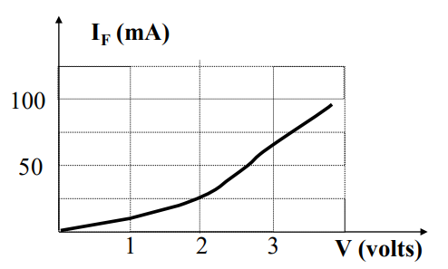 | 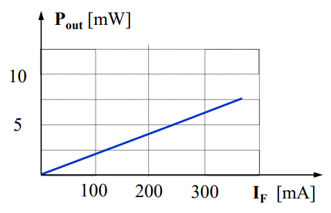 |

### Line Width
The line width is also called the spectral width of the optical 
source (both LED and LD).
In LED $∆λ 20 ~ 40nm$. This is rather large and its use in optical 
communication systems will incur large amount of pulse dispersion 
and hence a significant reduction in bandwidth. 
### Radiation pattern
LED generally radiates over a very wide angle. It can be regarded as 
a Lambertian source whose radiation pattern is described by:  
$$I(\theta)=I_0\cos\theta$$
- In general cases, the expression of the radiation pattern is 
  described by  
  $$I(\theta)=I_0\cos^\sigma\theta$$  
  where $\sigma$ is a parameter larger than unity. The larger 
  $\sigma$ is, the more directional is the source
- For LED, it is not very efficient in directly launching its output 
  into the fibre. This can be improved by introducing a microlens in 
  front of the light emitting area of the LED. 

  | Normal LED                                                  | Lensed LED                                                  |
  | ----------------------------------------------------------- | ----------------------------------------------------------- |
  | 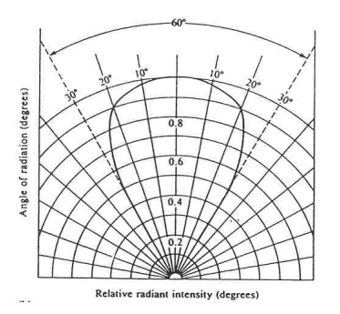 | 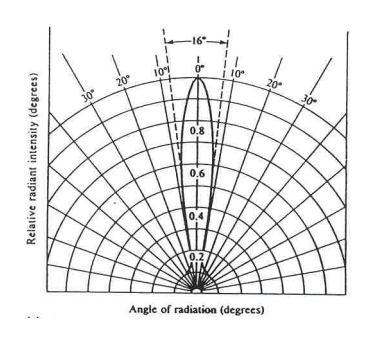 |
### Response Time and Bandwidth
- The response time is related to the modulation bandwidth of an 
  optical source.   
- It is convenient to resort to an experimental method to determine 
  its bandwidth: 
  - inject a rectangular current pulse into the source
  - record the time response of the output optical pulse.
- The optical bandwidth is then calculated from where $t_r$ is the 
  rise time:  
  - $BW_{opt}=0.35/t_r$  
- The electrical bandwidth $BW_{el}$ can be calculated from 
  $BW_{opt}$ by  
  - $BW_{el}=0.707BW_{opt}$
- 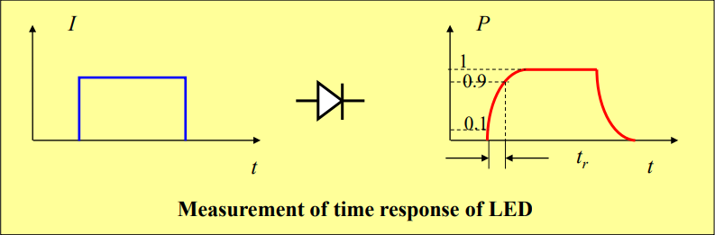
### Temperature Characteristics
- The peak emission wavelength of a LED increases with temperature. 
  The increase is linear. This behaviour is common to most 
  semiconductor sources whether it is a LED or LD. 
- The output optical power usually decreases with temperature. It is 
  therefore important maintain the operating temperature of the 
  diode. 

  | Emission Wavelength (nm)                                       | Relative Intensity                                           |
  | -------------------------------------------------------------- | ------------------------------------------------------------ |
  | 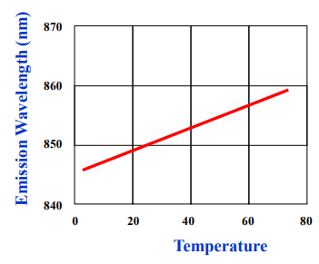 | 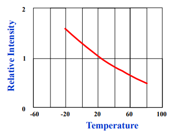 |
## Laser Diode
The simplest laser diode is a light emitting diode (LED) housed 
within a resonant cavity.
### Principle & Operation
To study the lasing condition more closely, we need write down the 
rate equations governing the generation of light by the pn-junction. 

Light is generated by stimulated emission when the excited electrons 
return from the excited state to ground state. 

Two mechanisms for light generation: stimulated emission and 
spontaneous emission. 

These excited electrons are put there because of the forward bias 
voltage which injects a current into the semiconductor material.

When forward bias voltage is applied, spontaneous emission of light 
is initiated just as in the case of LED. As the applied current is 
increased, more photons are generated until the generation of 
photons is more than sufficient to overcome the absorption of 
photons by the resonant cavity or attenuation of the mirrors.
### Laser Chirping
With very high speed electricl signal inputs, the optical output 
may not follow the input pulse faithfully. The output exhibits a 
finite rise time followed by a damped oscillation. This phenomenon 
is called the chirping of the laser. It places an upper limit to 
the frequency response of the laser, i.e. the modulation bandwidth 
of the laser.The chirping is due to the resonance between the photon 
and electron populations in the laser. 

| Laser Diode                                 | V-I Curve                                         | Laser Chirping                                    |
| ------------------------------------------- | ------------------------------------------------- | ------------------------------------------------- |
| 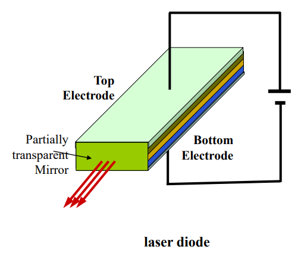 | 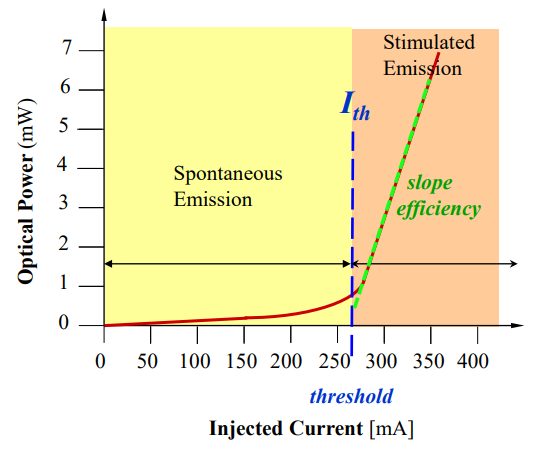 | 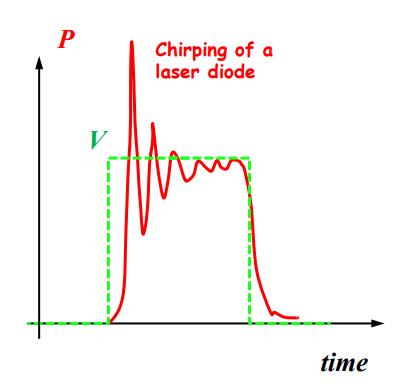 |

# Semiconductor photodetectors
## Photodetectors
### O-E conversion
- Optical detector is used to convert the optical signal from the 
  optical fibre into electric current which is then amplified by 
  an electronic amplifier to a suitable voltage level. It realises 
  the opto-electric conversion (O/E conversion).
- The most important properties of an optical detector are its 
  sensitivity and speed of response.
- Optical fibre systems tend to operate at very high speed,  
  e.g. 10Gbps or 40Gbps. 
- The four most poplar materials for photodetectors:
  - Si, GaAs, Ge, InGaAsP.
- Photodetector is a pn junction device similar to an optical source 
  such as LED except that its operation is the reverse of the 
  optical source. 
- In the case of a LED or a laser diode, when the pn junction is 
  forward bias, population inversion occurs when the electrons are 
  pumped from the ground state to the excited state.
- When the excited electrons return to the ground, light is 
  generated via either spontaneous emission (LED)or stimulated 
  emission (laser diode). 
- The frequency of the light thus generated is related to the 
  bandgap between the excited state and the ground state, i.e.   
  $v=\dfrac{E_g}{h}$
- In a photodiode, the pn junction is reverse biased. If a photon 
  with energy equal to the bandgap energy Eg, it will be absorbed by 
  an electron in the valence band. With the extra energy, the 
  electron jumps to the conduction band.
- Once in the conduction band, the electron is free to move. Under 
  reverse bias voltage, it leaves the photodiode and forms a current,
- Thus, the material suitable for photodetection must have a bandgap 
  energy $E_g$ related to the wavelength of the incident photon by:
  $$E_g=hv=\dfrac{hc}{\lambda}$$
- Since the absorption spectrum of the material is very broad, The 
  relation does not have to be satisfied exactly. Wavelengths somewhat shorter than $\lambda$ can still be appropriate. 
### Quantum Efficiency
It is defined as the ratio of the number of electrons 
collected to the number of photons injected into the 
semiconductor material, i.e.
$$\eta=\dfrac{\text{number of electrons collected}}{\text{number of photons injected}}$$  
Obviously, the efficiency is not $100\%$ because of optical 
absorption of the material. Generally, $\eta≈80\%$.  
However, it is difficult to measure this quantity directly because 
everything happened within the semiconductor. 
### Responsivity
It is equal to the ratio of the induced photocurrent to the 
incident optical power, i.e.  
$$R=\dfrac{\text{Induced photon current}}{\text{Injected optical power}}=\dfrac{I}{P}\quad\text{A/W}$$  
This is a practical and measurable quantity.   
The injected optical power is the total optical energy per 
unit time. Thus if there are $N$ photons per unit time, the 
optical power will be $N hν$.   
The electric current induced is equal to the number of 
photons per unit time times the quantum efficiency, hence  
$$R=\dfrac{\eta n e}{n h v}=\dfrac{\eta e}{h v}$$  
The responsivity can be written in an explicit function of 
wavelength $\lambda$   
$$R=\dfrac{\eta e \lambda}{h c}$$  
The responsivity increases linearly with wavelength if the quantum 
efficiency $\eta$ is a constant. This makes $R$ increases linearly 
with $\lambda$. The upper wavelength limit of the diode is 
determined by the bandgap. 
### Responsivity calculation & measurement
The responsivity $R$ of a photodiode can be measured by monitoring 
its incident optical power $P_{in}$ and the residual output power 
$P_o$. $R$ is wavelength dependent and also depends on the spectral 
behaviour of the photon absorption coefficient $\alpha(\lambda)$ of 
the constituent material.
$P_{ab}=P_{in}-P{o}=P_{in}(1-e^{\alpha w})$  
where:
- $P_{ab}$: Optical power absorbed by the photodiodeOptical power 
  absorbed by the photodiode
- $P_{in}$: Incident light power entering the semiconducting material
- $P_{o}$: Residual light power after the active region
- $w$: The thickness of the material
- $\alpha\lambda$: Absorption coefficient
### Wavelength of operatio
Need to select the appropriate material to make photodiodes for 
different applications, e.g. fibre transmission systems   
For wavelengths less than 1000nm, a silicon photodiode should be 
used.   
For wavelengths between 1300nm and 1550nm, a germanium or InGaAs photodiode is used. 
### Semiconductor Materials
| Material | Bandgap $E_g(eV)$ $T=300K$ | Wavelength(nm) |
| :------: | :------------------------: | :------------: |
|    Si    |            1.17            |      1067      |
|    Ge    |           0.775            |      1610      |
|   GaAs   |           1.424            |      876       |
|   InP    |            1.35            |      924       |
|  InGaAs  |         0.75~1.24          |   1664~1006    |
|  AlGaAs  |         1.42~1.92          |    879~650     |
| InGaAsP  |         0.75~1.35          |    1664~924    |
## PIN Photodiode
- What is PIN?
  > It is a material structure consisting of p-type, intrinsic-type 
  and n-type semiconductors.
- Why PIN?
  > Since a usual pn junction has very narrow depletion region, its 
    light collection is efficient. Hence it is not effective for 
    photodetection.  
    Furthermore, in the p-type semiconductor there resides a large 
    amount of positive charge carriers and in the n-type 
    emiconductor there are a large amount of negative charge 
    carriers. The distance between them is small and this makes the 
    photodetector have a relatively large capacitance of $C$ since
    $$C=\dfrac{\varepsilon A}{d}$$
    where   
      $\varepsilon$ is the permittivity of the depletion region,   
      $A$ is cross-section area of the junction and   
      $d$ is the width of the region.   
    
    A large capacitance limits the photodetector’s bandwidth.
- A PIN photodiode has an intrinsic layer between the pn junction. 
  It is charge-neutral, it will form part of the depletion region. 
  - It increases the active area / volumn and improve the detection 
    efficiency.
- Thus the distance between the two effective electrodes (p-type and
  n-type semiconductors) is increased by the thickness of the 
  intrinsic layer. 
  - This significantly reduces the capacitance and increase the 
    bandwidth of the photodiode.
- Hence PIN diodes are most popular for optical systems.
- Front-illuminated PIN photodiode.
  > 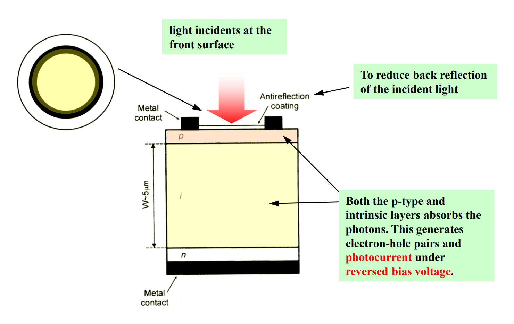
### Avalanche Photodiode (APD)
The maximum quantum efficiency of an ideal PIN is 100%, i.e. each 
incident photon produces a free electron. Its gain is 1. 

It is desirable to have a photodiode with a gain much larger than 1, 
i.e. one incident photon can produce hundreds of electrons. 

One mechanism to achieve this aim is by means of electrons 
themselves. The incident photon initially produces one electron. The 
electron can be empowered with a large momentum by passing it 
through a large electric potential. Then this electron can excite 
more electrons residing in the valence band into the conduction 
band, and produce more free electrons. 

The secondary electrons, if they have enough momentum, will in turn 
set more electrons free and excite them to the conduction band. Here 
we need to apply a high voltage across the pn junction of the diode

  > 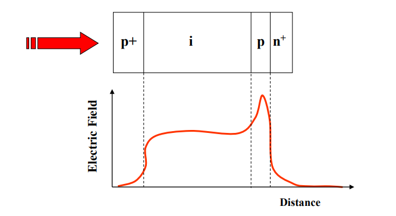

In APD, the photons pass through the heavily doped p+ region and 
enter the intrinsic layer, where they produce electron-hole pairs. 

Reverse voltage separates photon-generated electrons and holes and 
moves them toward the pn+ junction, where a high electric field (on 
the order of 105V/cm) exists.

This electric field accelerates the charge carriers, resulting in 
impact ionisation, i.e. the release of bound electrons. 

The APD offers a very large gain characterized by the multiplication 
factor:

$$M=\dfrac{I}{I_p}$$

where $I$ is the total output current and $I_p$ is the initial or 
primary photcurrent, i.e. before the avalanche occurs

APD could have both very large bandwidth and very high gain.

However, the number of electrons generated through avalanche effect 
can vary with time, temperature etc. Hence APD introduce additional 
noise, excess noise, not found in PIN diodes.

---
[Tutorial](c.%20PHTN4662%20Tutorial%203.md)

---
[Back: FIbre Amplifiers and Lasers](2.%20PHTN4662%20Lecture%202%20FIbre%20Amplifiers%20and%20Lasers.md)

[Next: Analog and Digital ptical Communications](4.%20PHTN4662%20Lecture%205A%20Analog%20and%20Digital%20Optical%20Communications.md)