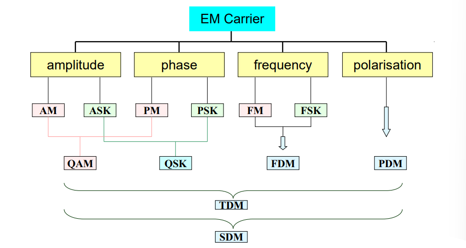
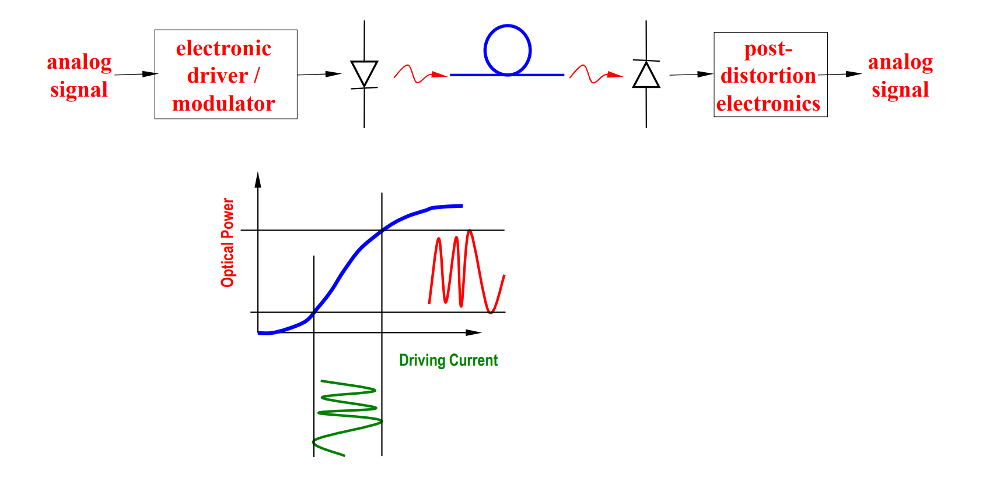
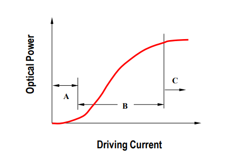
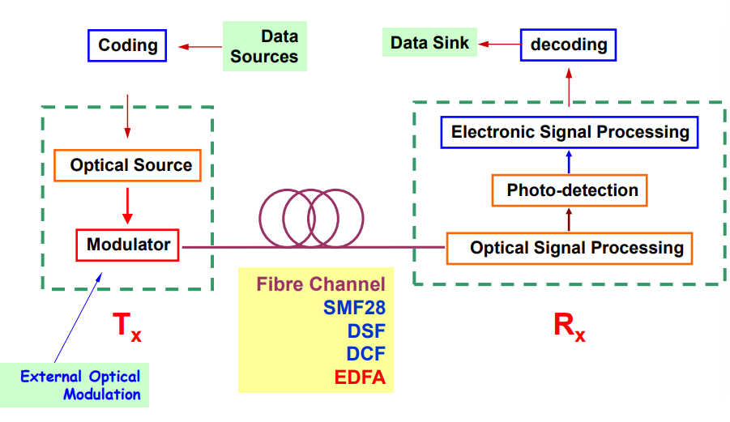
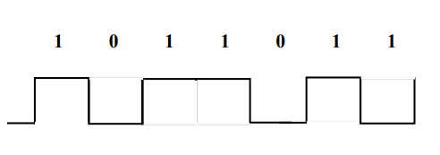
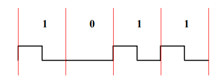
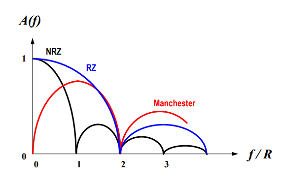

Content 
- [System and Analog Technique Basics](#system-and-analog-technique-basics)
  - [Telecom Network / System Techniques](#telecom-network--system-techniques)
  - [Modulation Techniques](#modulation-techniques)
- [IM-DD optical communication system](#im-dd-optical-communication-system)
  - [Analog optical fibre system](#analog-optical-fibre-system)
  - [Optical Modulation](#optical-modulation)
  - [IM Signals and Spectra](#im-signals-and-spectra)
- [Digital communication systems](#digital-communication-systems)
- [Digital Optical Communication System](#digital-optical-communication-system)
  - [Analogue and Digital Bandwidth](#analogue-and-digital-bandwidth)
  - [Three key digital techniques](#three-key-digital-techniques)
    - [Line Coding](#line-coding)
    - [Channel coding](#channel-coding)

---
# System and Analog Technique Basics
## Telecom Network / System Techniques
- Channels
  - EM waves propagate in free space, air and various media
  - Transmission depends largely on frequency and medium nature.
- Transmission modes
  - Unguided mode --radio, radar, mobile & satellite, laser
    - no channel and implementation cost, flexible, broadcast
    - low capacity, cross talk and attenuation
  - Guided mode --wire, coaxial cable, optical fibre
    - high installation and maintenance cost, not flexible, 
    - high capacity, low cross talk and low noise
  - Composite mode= G+UG --Networked
- Optical fibre systems in various communication architectures
  - Single, independent, point-to-point channels, telemetric links,
    field telephones
    - e.g. Terminals connected at one-way/two way-communications, 
      telephone, data networks 
  - High density, high speed parallel multiple-to-multiple computer 
    links
  - Few-to-multiple: Subscriber databank / TV film library
  - Multiple-to-few: telemetric control
  - Fully switched point-to-point links
  - Broadcast systems
  - Intelligent, integrated optical switched networks
- System components #star
  - Transmitter (source and antenna)
  - Coder / Decoder (codec)
  - Modulator / Demodulator (modem)
  - Switch and multiplexer
  - Amplifier
  - Repeater
  - Receiver
## Modulation Techniques
- Carrier: EM waves #star
  > EM waves are the most useful carriers for telecommunication
  - electrical, optical, radio, microwave
  - Parameters of EM waves
    - Frequency
    - Phase
    - Amplitude
    - Polarization
- Modulation #star
  > the most important telecommunications technique
  - Imprinting message information onto a carrier at higher 
    frequency --(similar to transportation)
  - Modulation used to produce a signal that can be easily 
    accommodated by a channel
  - Modulation process translates message signal to a new spectral 
    location determined by the intended frequency of transmission
  - Many modulation techniques have been developed
- Advantages of modulation:
  - Enable more efficient transmission 
    - Increase capacity (multiplexing)
    - Enable multiplexing
      > (better use of bandwidth transmitting many signals 
        simultaneously)
  - Facilitate long distance transmission
  - practical circuits
  - Reduce noise and interference
  - Smaller antenna (longer that 1/10 of wavelength) –RF or microwave
  - Exchange of SNR with bandwidth 
    - given by Shannon’s formula: $C = B \log2(1+\text{SNR})$
- Summary of Modulation Techniques
  > #star 
- Choice of modulation technique influenced by:
  - Characteristics of message signal
    - Characteristics of channel
    - Desired performance of overall communication system
    - The use to be made of the transmitted data
    - Economic factors
  - In Continuous-wave modulation a parameter of a high frequency carrier is varied proportionally to the message signal
  - Gives a one-to-one correspondence between the carrier and the message signal
  - Carrier: $E(t)=A(t)\cos(\omega_c t+\phi(t))$
# IM-DD optical communication system
## Analog optical fibre system
#star
- Intensity Modulation (IM) results when a DC bias A is added to the message signal m(t) prior to the modulation process.
- Unique property:
  - Envelope (intensity / amplitude) of the modulated carrier has the same shape as the message
- This allows the simple technique known as Direct Detection (DD) similar to envelope detection to be used to demodulate an AM signal if sufficient carrier power is transmitted.
- IM-DD system #star
  > 
## Optical Modulation
- Modulation distortion (nonlinearity) in analog system #star
  > 
## IM Signals and Spectra
#star
- Direct Detection
- Envelope of IM signal has the same shape as message independent of carrier frequency and phase
- Demodulation achieved by extracting envelope, similar to AM with Envelope Detection – incoherent detection without phase synchronisation
- Typically RC acts as low pass filter.
# Digital communication systems
- Goal of telecommunication system:
  - Fast, reliable and accessible information transport over long and short distances
  - Considerations:
    - System cost and simplicity
    - Compatibility with existing techniques
    - Network transparency
    - Upgradability
    - Quality, reliability, security
- Digital communication systems
  - exchange of information in digital form transfer analog signal with digital techniques transfer digital data with analog and/or digital techniques 
  - Digital and data communication systems have experienced explosive growth in recent years. Modern communications are fast moving into a phase of dominantly digital.
- Note:  
  Most physical signals are analog.  
  We always need to have analog signals converted into digital signals and vice versa.
- Typical communication system configuration
  > ![Typical_communication_system]
# Digital Optical Communication System
- System Diagram #star
  > 
## Analogue and Digital Bandwidth
- The channel capacity, C, is given by Shannon's formula (theorem) #star
  $$C=B\log_2\left(1+\dfrac{S}{N}\right)\quad\text{bits/s}$$
  Where 
  - $B$ is the signal bandwidth in Hz
  - $S/N$ is the signal-to-noise power ratio (Watts/Watts) at the input of the receiver.[ bits /s]
- The significance of the formula:  
  - It provides the general relation between analog and digital signalling.
  - For the case of signal plus white Gaussian noise, if the rate of information R is less than C, the channel capacity (bit/s), there exists a code that its the probability of bit error can be made to zero. 
  - This theorem suggests the existence of such a code but does not give any indication how to construct this code.
## Three key digital techniques
#star
1. Source coding
2. Line coding
3. Channel coding
### Line Coding
- Different line codes have different properties and advantages in different situations. Important properties of line codes include:
  - self-synchronisation
  - probability of error 
  - spectrum compatible with the channel 
  - bandwidth 
  - error detection capability 
  - transparency 
  - complexity 
- Unipolar signalling (On-Off Keying):
- Polar signalling
- Bipolar signalling
- Non-Return to Zero Binary Code (NRZ)
- Return to Zero Binary Code (RZ)
  - This is also a simple and easy to implement code by IM. 
  - It is widely used in fibre systems 
- Typical Frequency Spectrum of Usual Line Codes
  | NRZ                         | RZ                        | Compare #star                               |
  | --------------------------- | ------------------------- | ------------------------------------------- |
  |  |  |  |
### Channel coding
It allows for error check and correction at the expenses of bandwidth efficiency
- mBnB Code #star
  - Simplest channel coding
  - Bandwidth efficiency $\eta = m / n$
  - When both $m$ and $n$ are large, the of this code, $\eta$, approaches 1.

---
[Tutorial](d.%20PHTN4662%20Tutorial%204.md)

---
[Back: Light Sources and Detectors](3.%20PHTN4662%20Lecture%204%20Light%20Sources%20and%20Detectors.md)

[Next: Photonic Network Multiplexing Technologies](5.%20PHTN4662%20Lecture%205B%20Photonic%20Network%20Multiplexing%20Technologies.md)