Content 
- [Multiplexing Techniques](#multiplexing-techniques)
  - [Multiplexing Techniques](#multiplexing-techniques-1)
    - [Time-Division Multiplexing (TDM)](#time-division-multiplexing-tdm)
    - [Frequency Division Multiplexing (FDM)](#frequency-division-multiplexing-fdm)
    - [Code-Division Multiplexing (CDM)](#code-division-multiplexing-cdm)
    - [Mode-Division Multiplexing (MDM)](#mode-division-multiplexing-mdm)
  - [Optical Multiplexing Techniques](#optical-multiplexing-techniques)
    - [Time Division Multiplexing (TDM)](#time-division-multiplexing-tdm-1)
    - [Subcarrier Multiplexing (SCM)](#subcarrier-multiplexing-scm)
    - [Wavelength Division Multiplexing (WDM)](#wavelength-division-multiplexing-wdm)
    - [Spliced Spectrum Multiplexing](#spliced-spectrum-multiplexing)

---
# Multiplexing Techniques
#star
- Objectives & Issues
  - Capacity
    - Ever increasing demand on network capacity
    - Cost effectiveness
    - Scalability (easy upgrade)
    - Channel banwidth efficiency
      - Multiplexing would lead to more efficient use of the carrier bandwidth in optical fibres.
    - System transparency and compatibility
## Multiplexing Techniques
#star
- TDM - Time Division Multiplexing
- FDM - Frequency Division Multiplexing
- QAM - Amplitude and Phase Division Multiplexing 
- SDM - Spatial Division Multiplexing 
- CDM - Code Division Multiplexing
- PDM - Polarisation Division Multiplexing 
- MDM - Mode Division Multiplexing
### Time-Division Multiplexing (TDM)
#star
The most fundamental multiplexing technique.

Several baseband-modulated channels are transmitted along a
single fiber but with each channel located at a different time.

TDM can be accomplished in the electrical or optical domain, with each lower-speed channel transmitting a bit or a packet in a given time slot and the waiting its turn to transmit another bit (or packet) after all the other channels have had their opportunity to transmit.
### Frequency Division Multiplexing (FDM)
#star
- Wireless  
  - FM radio is a form of multiplexing many radio channels 
    onto the same medium that we are all aware of that 
    uses frequency modulation and multiplexing
  - Same is true for mobile phone, TV, and a number of 
    wireless communication methods – all sharing the same 
    frequency spectrum
- Cable Networks
  - Cable TV networks use FDM within a contained medium 
    in the same way as FDM is used in wireless networks
### Code-Division Multiplexing (CDM)
#star
Multiple signals share same broadband frequency spectrum
and over the same time, but unique codes are used to
distinguish each signal.

Each channel transmits its bits as a coded channel-specific
sequence of pulses. This coded transmission typically is accomplished by transmitting a unique time-dependent series of
short pulses. All channels, each with a different code scheme, can
be transmitted on the same fibre and asynchronously
demultiplxed.
### Mode-Division Multiplexing (MDM)
#star
Multiple signals transmit the same time, frequency and 
space, but in different guided modes (field patterns) al
Has advantages in wireless as received signal is resilient 
against drop out in portion of frequency spectrum
Has been shown to work in optical systems using Bragg 
gratings for codinge
## Optical Multiplexing Techniques
#star
- Optical multiplexing format
  - TDM -> SDH / SONET
    > Need fast switching
    - Mechanic optical switch, slow
    - E/O optical switch up to 50GHz, may higher
    - Photonic switch > 100GHz
  - FDM -> WDM
        -> SCM
  - CDM -> Optical CDMA
  - SDM -> Separate fibres
  - MDM -> Individual modes
- SDH/SONET #star
  - SDH and SONET are the core of the photonic network today
  - A hierarchy built up from 64kb/s digital voice telephone circuits
  - Thousands of phone lines can be multiplexed onto a single SDH or SONET signal, typically at 2.5Gb/s, 5Gb/s, 10GB/s, 40Gb/s and higher
  - Not designed for carrying video, data or storage services
  - Circuit switched
- Ethernet
  - Ethernet is another form of TDM that is designed for carrying data packets and is packet switched
  - A decimal hierarchy built up from 10Mb/s to 10Gb/s
  - Not designed for carrying voice, video or storage services
- Comparison of Optical Multiplexing Systems #star
  | FORMAT | Capacity |    Key components    | Key limiting factor |
  | :----: | :------: | :------------------: | :-----------------: |
  |  TDM   | ~20Gb/s  |     Fast Switch      |     Dispersion      |
  |  SCM   | ~40Gb/s  | Ultrafast Tx and Rx  | Tx and Rx Bandwidth |
  |  WDM   | >10Tb/s  | Add/Drop Multiplexer |         NLO         |
  - Key requirement for multiplexing: No significant cross talk!
### Time Division Multiplexing (TDM)
- Dispersion
  - Material Dispersion
    - Refractive index varies with wavelength.
    - Discrete spectral components of a pulse travel at different speeds (e.g. in a multi-frequency laser)
  - Waveguide dispersion
    - Pulse spreads out in optical fibre, even in a single frequency laser
  - Pulse broadening #star
    - Pulse broadening in the time-domain due to dispersion leads to ISI and eye-closure.
    - Characterized by accumulated dispersion $D\cdot L$
- Limiting factors
  > #star 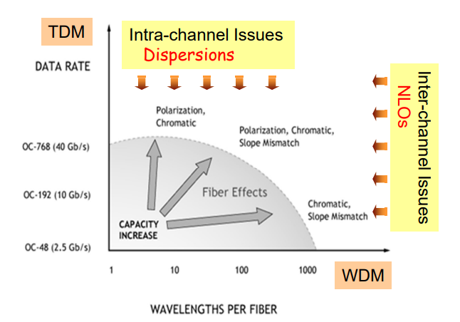
- Dispersion Compensation #star
  - The pulse broadening in the fibre can be reduced by an addition of a device which compresses the pulse.
  - There are several approaches to realise DC, e.g.
    1. Chirped Fibre Bragg Grating
       - Reflection of different wavelengths along the grating length
       - Enable to varying dispersion adjustment
       - Narrow band correction
    2. Dispersion Compensating Fibre (DCF)
       - Singlemode fiber designed with high negative dispersion
    3. Nolinear Optical Effects (OKE)
  - Negative dispersion fibre
    > 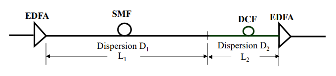
    - Overall Aim: Total Dispersion = 0; $D_1L_1+D_2L_2=0$

  | Dispersion Compensation       | Description                                                                         |
  | ----------------------------- | ----------------------------------------------------------------------------------- |
  | Normal transmission           | 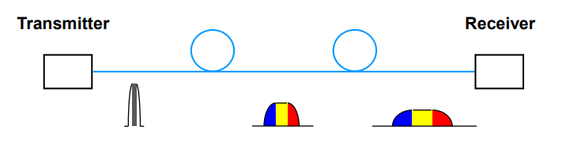                                  |
  | Pre-chirped transmission      | 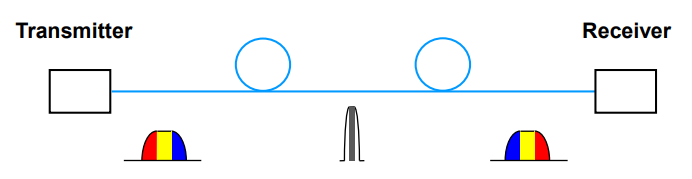                        |
  | Negative dispersion fibre     | 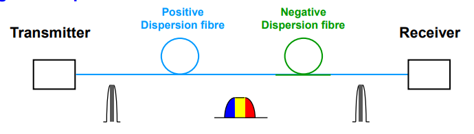               |
  | Mid-system spectral inversion | 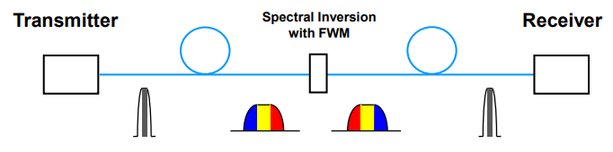 |#star

### Subcarrier Multiplexing (SCM)
It is often more efficient and economical to transmit many channels of signals 
simultaneously using a single communications channel, e.g.
- Time Division Multiplexing (TDM)
- Frequency Division Multiplexing (FDM)
- Quadrature Multiplexing (QM)
> #star 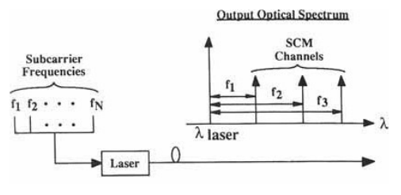
> Each channel is located at a different subcarrier frequency, thereby occupying a different portion of the spectrum surrounding the optical carrier.
> #star 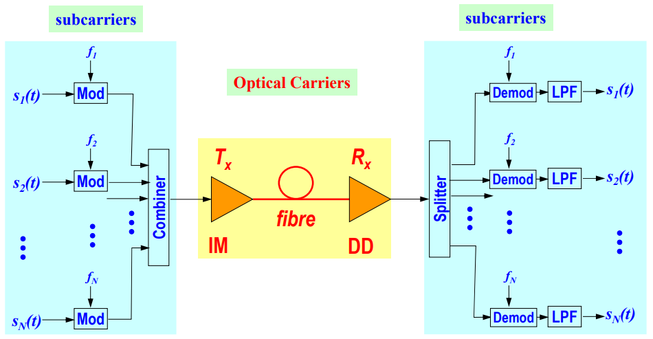
- Key features of SCM #star
  - Both the optical transmitter (Tx) and optical receiver (Rx) must have bandwidth (BW) greater than the total system BW.
  -  Hence very high BW Tx and Rx is required. It uses conventional microwave technology
  - Now Tx and Rx have bandwidth > 20GHz
  - SCM does not require high speed demultiplexing and broadband amplification
  - SCM can be used for both analog and digital communications
  - No synchronisation is needed (compared with TDM). Hence no need for a high speed master clock
### Wavelength Division Multiplexing (WDM)
- Wavelengths for WDM
  > 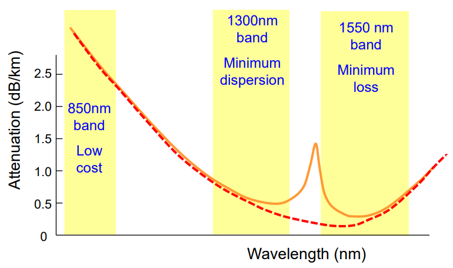
- WDM
  > Two or more wavelengths per fibre.
  - Coarse WDM (CWDM)
    - Usually four to eight wavelengths per fibre, but it can also be more.
    - Providing increased capacity for a much lower cost than the DWDM.
  - Dense WDM (DWDM)
    - From eight wavelengths per fibre. 
    - Supporting hundreds of wavelengths per fibre.
- Point-to-Point WDM System #star
  > 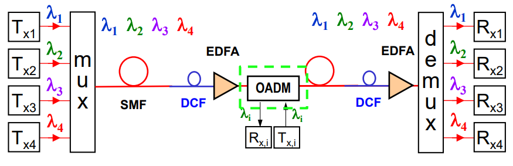
  - Simple and reliable 
  - Bandwidth = No. of $\lambda$s $\times$ channel bitrate
  - Down-shift bitrate per wavelength relaxes system limitations
  - Scalable and upgradable: 8 channel of 5Gb/s -> 8 channels of 20Gb/s
  - Multiplying bandwidth-distance product
  - Used in most current fibre communication systems: trunk or transoceanic
- Two Networks #star
  | WDM Broadcast-and-Select Networks                                          | WDM Routing Networks                             |
  | -------------------------------------------------------------------------- | ------------------------------------------------ |
  | 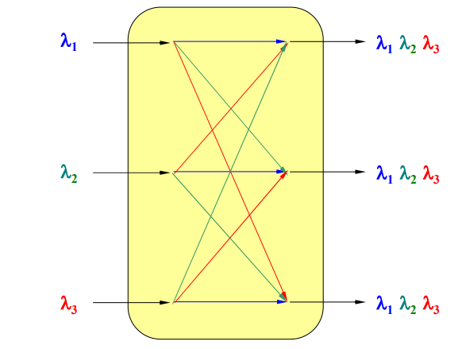 | 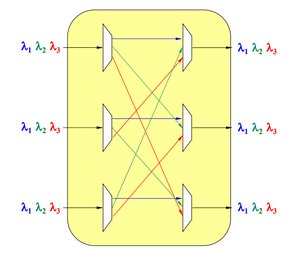 |
### Spliced Spectrum Multiplexing
> 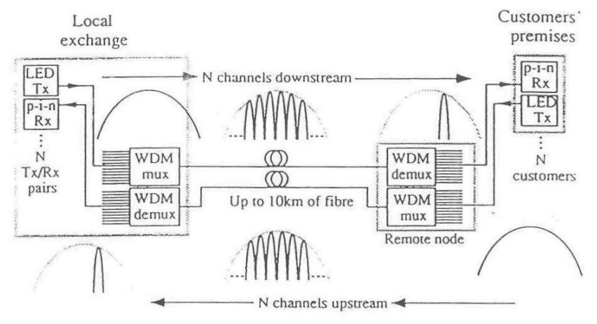

---
[Tutorial](<e. PHTN4662 Tutorial 5.md>)

---
[Back: Analog and Digital Optical Communications](<4. PHTN4662 Lecture 5A Analog and Digital Optical Communications.md>)

[Next: SNR in Photonic Systems](<6. PHTN4662 Lecture 8A SNR in Photonic Systems.md>)