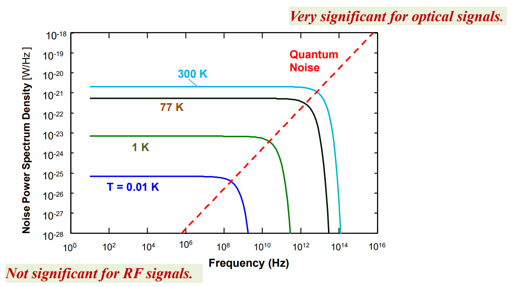
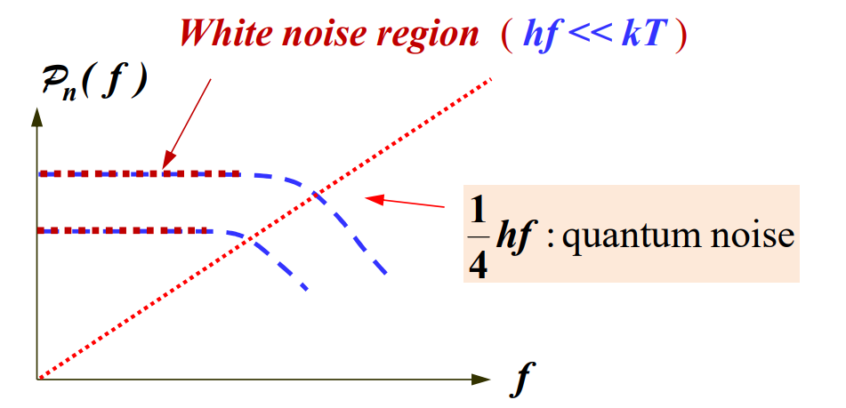
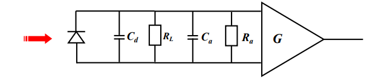

Content
- [Noises in optical communication system](#noises-in-optical-communication-system)
  - [Signal and noise in system](#signal-and-noise-in-system)
  - [Power Spectral Density (PSD) of noise](#power-spectral-density-psd-of-noise)
  - [Thermal noise](#thermal-noise)
  - [Quantum noise](#quantum-noise)
  - [Dark Current Noise](#dark-current-noise)

---
# Noises in optical communication system
## Signal and noise in system
Transmitter Noise  
Channel Noise and Interference  
Receiver Noise  
- Signalling and system issue #star
  - digital & analog
  - simplex, half duplex (HDX), full duplex (FDX), full/full duplex (F/FDX, in multipoint system)
  - broadcasting point-to-point 
  - networks protocol and interface
- Signal and noise issues
  - attenuation
  - noise & distortion
  - capacity / bandwidth

## Power Spectral Density (PSD) of noise
The power spectral density of thermal noise under 
equipartition and quantum noise is given by #star
$$
p_n(f)=\frac{1}{2}\frac{h|f|}{e^{h|f|/kT}-1}+\frac{1}{4}h|f|\qquad[\text{W/Hz}]
$$
where
- $h=6.23\times10^{-34}[\text{J}\cdot\text{s}]$ is the Plank's constant  
- $k=1.38\times10^{-23}[\text{J/K}]$ is the Boltzmann's constant  
- $T=$ absolute temperature in K (Kelvin)

Thermal noise and quantum noise under equipartition
#star 

#star 

Note: Thermal noise is white Gaussian noise (for frequencies up to $10^{12}$Hz). The cumulative noise effect of a large number of random noisetypically produces a white Gaussian noise process.

## Thermal noise
Thermal noise is produced by the random motion of electrons in a medium. It is also called Brownian Noise or Johnson Noise because J. B. Johnson related this noise to the Brownian particle motion of electron. #star

The intensity of this noise increases with the increase of temperature. You may work without it only at the absolute zero degree (0 Kelvin)!

Thermal Noise comes from electronic devices in the system. It is caused by the fluctuation of the amount of electrons flowing through a device. 

The thermal noise current decreases with the increase of resistance $R_L$ because it can be intuitively imagined that as $R_L$ increases, the current reduces and this also reduces the fluctuation of the electrons.

The relationship of mean square of the thermal noise current (also called thermal noise power) can be written: #star
$$
i_{t,rms}^2=\left<i_t^2\right>=\overline{i_t^2}=\dfrac{4KTB}{R_L}\qquad \text{Amp}^2
$$

where
- $k=1.38\times10^{-23}[\text{J/K}]$ is the Boltzmann's constant  
- $T=$ absolute temperature in K (Kelvin)
- $B=$ Electrical bandwidth of the receiver in Hz

## Quantum noise

Quantum noise arises from the quantum nature of EM wave. It is the noise caused by its 'particle', discrete nature – 'photons' arrived at a photodetector with a certain fluctuation. It is a noise similar to the shot noise of an electric current.

Quantum noise is significant for $|f|>10^{13}$Hz. It is a major noise for visible and infrared optical frequencies.

Note: In optical fibre communications, quantum noise manifests itself as shot noise of photocurrent.

For a photocurrent $I_p$ produced at the optical detector, the root mean square quantum noise current $i_{q,rms}$ is given by #star
$$
i_{q,rms}^2 = \left<i_q^2\right> = i_q^2 = 2 e I_p B
$$

where
- $e$: charge of an electron, $1.6\times10^{-19}$ Coulomb
- $I_p$: photocurrent through the devices
- $i_q$: quantum noise current through the devices
- $B$: system (receiver) bandwidth

Quantum noise is proportional to the the incident optical signal power $P_0$ or the signal photocurrent signal $I_p$. 

This property is in different from the thermal noise which is signal level independent

When a digital signal consisting of 1 and 0 is detected by an optical receiver, the noise content in the 1 bit is normally much larger than in the 0 bit

Another term often used in optical communication is Noise Equivalent Power (NEP) defined as the optical power required to induce the shot noise current $\overline{i_s}$ in the photodetector

In order to derive an expression for the calculation of $NEP$, we need to quote the responsivity $R$ of the photodetector:

$$
R = \frac{\overline{i_s}}{NEP}\qquad[\text{A/W}]
$$

or 

$$
NEP = \frac{\overline{i_s}}{R} = \frac{\sqrt{2eBI_{p}}hc}{\eta e \lambda}
$$

where $\eta$ is the quantum efficiency of the photodetector

## Dark Current Noise

Dark current noise is the current in the photodetector when there is no incident light and only reverse bias voltage. This current forms the noise background of the signal photocurrent.

The dark current is a current shot noise and its power is 
given by

$$
\overline{i_d^2}=2eBI_d
$$

## Amplifier Noise
An amplifier following the photodetector usually need to amplify the signal. It can be represented in input resistance $R_a$ and input capacitance $C_a$ followed by an ideal noiseless amplifier with gain $G$

#star 

The amplifier noise is mainly due to the thermal noise in the input resistance $R_a$. Hence thermal noise of the load resistance $R_L$
and the amplifier noise can be combined by including a noise factor $F_n$:

$$
\overline{i_t^2}+\overline{i_{amp}^2}=\frac{4KTBF_n}{R_L}
$$

The total noise power is the sum of all the contributing noise sources: 
- thermal noise
- quantum noise 
- dark current noise 
- amplifier noise  

Hence the signal to noise ratio of an optical receiver can be expressed as: #star
$$
S/N = \frac{I_p^2}{2eB(I_p + I_d) + \dfrac{4KTBF_n}{R_L}}
$$
This equation applies to *PIN* photodiodes only because its internal gain is assumed one. 

## Noise in Avalanche Photodetector (APD)
APD could produce large internal gain and improved sensitivity. Its amplification is represented by the multiplication factor $M$.

It suffers from two disadvantages:
1. It requires a large bias voltage in the order to 100V to 400V. This sort of voltage supply is not normally available in electronic circuits. 
2. It introduces an excess noise which is gain dependent, i.e. the larger the APD gain, the larger is the electric noise. 

The induced signal photocurrent by an APD is
$$
I_p' = MI_p
$$
where $I_p=RP_0$ with $R$ is the responsivity of the APD and $P_0$ the incident optical power.

APD introduces an excess noise factor $M_x$ where $x$ depends on the 
material of the APD. Hence the quantum noise and current noise combined is given by
$$
\overline{i_p^2} + \overline{i_d^2} = 2eB (I_p + I_d) M^{2+x}
$$
where $M^2$ is due to the signal and dark current noise power and $M^x$ is the excess noise above the normal noise power. Hence the $M^{2+x}$ is included.

The *excess noise* related to the multiplication factor $M$ of APD has to be taken into account in the calculation of the signal to noise ratio of an optical receiver.

The expression of signal to noise ratio of the receiver system when 
APD is used: #star
$$
S/N = \frac{M^2 I_p^2}{2eB(I_p + I_d)M^{2+x} + \dfrac{4KTBF_n}{R_L}}
$$

Since the APD on one hand is to increase the induced current signal and on the other hand introduces extra noise, exist an optimum value of $M$ that gives an improvement of $S/N$. #star
$$
M_{op}^{2+x} = \frac{4KTF}{x e R_L (I_p + I_d)}
$$

---
[Back: Photonic Network Multiplexing Technologies](<5. PHTN4662 Lecture 5B Photonic Network Multiplexing Technologies.md>)

[Next: NLO Effects in Optical Networks](<7. PHTN4662 Lecture 8B NLO Effects in Optical Networks.md>)