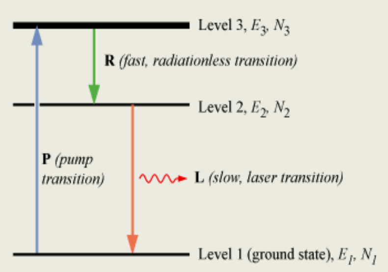

1.  What general information is included in an energy diagram for a particular material system? What are the general aspects and factors that contribute to formation of the energy diagrams?

> > [Lec_2, 8](<2. PHTN4662 Lecture 2 FIbre Amplifiers and Lasers.md#energy-level-diagram>)
>   - General Information:  
>       Energy Axis, Energy Levels, Transitions and Labels
>   - General Aspects:  
>       - Ground State: The lowest energy state of the system.
>       - Excited States: Higher energy states that the system can occupy after absorbing energy.
>       - Activation Energy: The energy required to transition from one state to another.

2.  What is Boltzmann distribution? What are the key factors in determining the distribution for energy state population? Under what conditions can this distribution be valid? Under what conditions can this distribution be substantially violated? 

> > [Lec_2, 7](<2. PHTN4662 Lecture 2 FIbre Amplifiers and Lasers.md#interaction-between-matter-and-light>)
>   - Boltzmann distribution   
>       It describes the distribution of particles among various energy states in a system at thermal equilibrium.
>       $$\rho=\exp(-\dfrac{E}{kT})$$
>   - Key Factors in Determining the Distribution for Energy State Population
>       - Energy Levels $E$
>       - Temperature $T$
>       - Boltzmann Constant $k$
>   - Conditions for the Validity
>       - Thermal Equilibrium: The system must be in thermal equilibrium, meaning the temperature is uniform throughout the system.
>       - Classical Limit: The distribution applies to systems where quantum effects are negligible.
>       - Non-Interacting Particles: Particles should not significantly interact with each other, as interactions can alter energy states.
>    - Conditions Leading to Substantial Violation
>       - Non-Equilibrium Systems: Systems not in thermal equilibrium e.g., rapidly changing systems or those with external energy inputs.
>       - Strong Interactions: In systems where particles interact strongly the simple Boltzmann distribution may not apply.

3.  What are fundamental processes involving light and matter interaction? What are their basic characteristics?

> > [Lec_2, 5-6](<2. PHTN4662 Lecture 2 FIbre Amplifiers and Lasers.md#interaction-between-matter-and-light>)
>   - Fundamental processes: Absorption and Emission
>   - Absorption
>       - Energy Transfer: Light (photons) is absorbed by matter, transferring energy to the electrons or other particles within the material. 
>       - Electronic Transitions: In atoms and molecules, absorption can cause electrons to transition from a lower energy level to a higher one (excited state). 
>       - Selective Wavelengths: Absorption occurs at specific wavelengths corresponding to the energy difference between the electronic states. 
>   - Emission
>       - Spontaneous Emission: When electrons in an excited state return to a lower energy level, they release energy in the form of photons. 
>       - Stimulated Emission: External photons induce electrons in an excited state to drop to a lower energy level, emitting additional photons with the same phase, frequency, and direction. 
 
4.  How is 'absorption' linked to 'excitation' in a light and matter interaction?

>   - Energy Transfer:
>       - Absorption: When a material absorbs light (photons), it takes up the energy of the photons.
>       - Excitation: The absorbed energy is used to promote electrons within the material to higher energy states.
>   - Electronic Transitions:
>       - Absorption: Photons with specific energies (corresponding to particular wavelengths) are absorbed by the material if their energy matches the energy difference between the initial and excited states of electrons.
>       - Excitation: The electron transitions from a lower energy state (ground state) to a higher energy state (excited state) due to this absorbed energy.
>   - Wavelength:
>       - Absorption: The absorption of photons at specific wavelengths leads to an absorption spectrum, which shows dark lines or bands at these wavelengths. This spectrum is characteristic of the material and provides information about the energy levels and electronic structure.
>       - Excitation: The wavelengths at which absorption occurs indicate the energy levels to which electrons are excited.
 
5.  What is a 'radiative transition'? What is a 'non-radiative transition'? Where the released energy goes in a 'radiative transition'? Where the released energy goes in a 'non-radiative transition'?

> > [Lec_2, 8](<2. PHTN4662 Lecture 2 FIbre Amplifiers and Lasers.md#energy-level-diagram>)
>   - Radiative Transition
>       - A radiative transition is a process where an excited electron returns to a lower energy state, and the excess energy is released in the form of a photon (light).
>   - Non-Radiative Transition
>       - A non-radiative transition is a process where an excited electron returns to a lower energy state without emitting a photon. Instead, the excess energy is dissipated through heat (IR).
 
6.  What is the life time of an energy level? When an energy level is referred as a metastable level?

>   - Lifetime of an Energy Level
>       - The lifetime of an energy level refers to the average time an electron or particle remains in that energy state before transitioning to a lower energy state. 
>   - Metastable level
>       - when it has an unusually long lifetime compared to other excited states.
 
7.  What is optical amplification? 

>   Optical amplification is a process by which the power of an optical signal is increased without converting it to an electrical signal. This is achieved by using a medium that amplifies the light signal as it passes through.
 
8.  What are basic conditions to build a laser? 

> > [Lec_2, 42-43](<2. PHTN4662 Lecture 2 FIbre Amplifiers and Lasers.md#desired-amplifier-properties>)
>   - Desired amplifier properties
>       - Broadband spectrum gain (wavelength transparency)
>       - Flat gain over the wavelength of operation
>       - Gain independent of data rate (data rate transparency)
>       - Low noise and high efficiency
>       - Gain independent of number of input channels, small crostalk
>       - Gain independent of polarization
>       - Small size and ease of integration with other components 
>       - Low coupling loss to optical fibers
>   - Important factors in rare-earth doped fibre design
>       - Small core radius (about 1.3 µm)
>       - Fe or Fe/Al doped silica core
>       - High numerical aperture (about 0.3)
>       - Pump power 2 mW
>       - Gain > 20 dB
>       - Pump wavelength 980 nm or 1480 nm
>       - Saturation output power 10 dBm for pump powers of 30-50 mW
>       - Erbium-doped fibre amplifier is insensitive to polarization of light. 
 
9.  What is a three-level system for optical amplifier and laser? What are its general features?

> > [Lec_2, 11](<2. PHTN4662 Lecture 2 FIbre Amplifiers and Lasers.md#energy-level-diagram>) [Lec_2, 29](<2. PHTN4662 Lecture 2 FIbre Amplifiers and Lasers.md#two-important-rare-earth-elements>)
>   
 
10. What is a four-level system for optical amplifier and laser? What are its general features? How it compares with a three-level system?

> > [Lec_2, 11](<2. PHTN4662 Lecture 2 FIbre Amplifiers and Lasers.md#energy-level-diagram>) [Lec_2, 29](<2. PHTN4662 Lecture 2 FIbre Amplifiers and Lasers.md#two-important-rare-earth-elements>)
>   

 
11. What is Fabry-Perot cavity or resonator? How are the lasing conditions established for a FP cavity with optical gain?

> > [Lec_2, 27](<2. PHTN4662 Lecture 2 FIbre Amplifiers and Lasers.md#rare-earth-doped-fibres>)
 
12. What are transverse modes and longitudinal modes of a laser? 

> 
 
13. What is a ring cavity?

> 
 
14. How can we build up a truly single mode (both transversely and longitudinally single-moded) fibre laser?

> 
 
15. Why rare earths are useful for lasers and optical amplifiers? What are their general properties?

> 
 
16. What are techniques in fabricating rare earth doped fibres?

> 
 
17. What are the general properties and basic parameters of rare earth doped fibres of concern for lasers and amplifiers?

> 
 
18. For an Erbium doped fibre, how to achieve optical gain? What conditions and parameters affect its optical gain?

> 
 
19. What makes erbium-doped fibres very useful? What are the key parameters and issues related their application for optical amplification? What are the usual techniques to address these issues?

> 
 
20. A Fabry-Parot laser operates at wavelength $\lambda$. The gain medium has an absorption / attenuation coefficient $\alpha$, a gain coefficient $g$ and a refractive index $n$. The F-P cavity of length $L$ consists of 2 mirrors with their reflection coefficients $r_1$ and $r_2$ . Prove that the gain threshold for this laser is $g_{th}=\alpha-\dfrac{1}{2L}\ln(r_1r_2)$ and the longitudinal mode spacing of this laser is $2nL=m\lambda$.

> 
 
21. The FBG at either end of the 5 cm long Erbium doped optical fibre has a reflectivity of 0.9. The loss coefficient of the optical fibre is 2 dB/m at the laser wavelength region around 1550 nm. If the gain factor of the fibre is 0.1 dB/m per mW of the pump power.  

> 
 
    1. Work out the threshold pump power, required for the fibre laser to lase.   

    > 
 
    2. Assume the Erbum doped fibre has a Gaussian spontaneous emission (gain profile), $g(\lambda)$, with a spectral width of 30nm, and the fibre laser operates at the wavelength region around 1550nm, determine how many longitudinal modes will lase if the pump power is 1.1 times of the threshold.  

    > 
 
    3. Calculate the coherence length of the laser, based on the result of (ii).

    > 

---
[Back: Tutorial 1](<a. PHTN4662 Tutorial 1.md>)

[Next: Tutorial 3](<c. PHTN4662 Tutorial 3.md>)