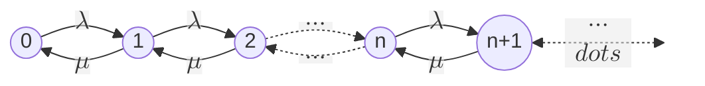
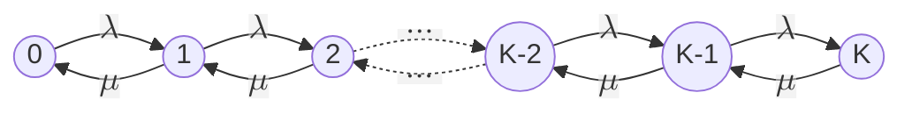
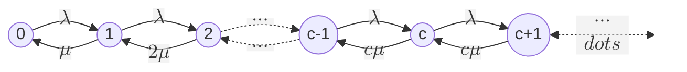

Content
- [M/M/1 Queue](#mm1-queue)
- [Markov Chain Representation](#markov-chain-representation)

---

# M/M/1 Queue
- Single queue
- Single server (single transmission line)
- Customers (packets) arrive according to a Poisson process with rate l per second
- The service time distribution is exponential with mean 1/µ seconds
- First-In-First-Out service
- Infinite buffer
## Markov Chain Representation
- Objective: system state should be a Markov process
- State: number of customers N(t) in system at time t
- Markov chain representation of system state:

## Global Balance
For any set of states A, the flux out of set A equals the flux into set A

Balance applied to A = {n}:
$$
\lambda p_0 = \mu p_1\\
(\lambda+\mu)p_n = \lambda p_{n-1} + \mu p_{n+1},\qquad n=1,2,...
$$
Balance applied to A = {0, 1, ..., n-1}:
$$\lambda p_{n-1} = \mu p_n,\qquad n=1,2,...$$

## Mean Performance Measures

System utilisation: 
$$\rho = \frac{\lambda}{\mu} = 1-p_0$$

Mean number of customers in system: 
$$E[n] = \displaystyle\sum_{n=0}^{\infty}np_n = \frac{\rho}{1-\rho}$$

Average a customer spend in the system:
$$E[\tau] = \displaystyle\sum_{n=0}^{\infty}\frac{n+1}{\mu}p_n = \frac{1}{\mu-\lambda}$$

# M/M/1 Variants
Type-1 customers have priority over type-2

Objective: determine mean number of customers and mean sojourn time for each type
- Preemptive-resume priority
  - Type-2 service is interrupted if type-1 customer arrives
  - Know $E(T_1)$, $E(N_1)$, and $E(N_1)+E(N_2)$
  - Can compute $E(N_2)$ and $E(T_2)$ from Little’s law
- Non-preemptive priority
  - Type-1 customer cannot interrupt service of type-2
  - Determine $E(T_1)$ and $E(N_1)$ from Little’s law
  - Use $E(N_1)+E(N_2)$ and Little’s law to determine $E(N_2)$ and $E(T_2)$

## M/M/1/K System: Finite Storage

Identical to M/M/1, except finite capacity of K customers in the system

Markov chain representation:

### M/M/1/K Solution
Applying balance to state set A={0,1,…,n-1}:
$$p_n=\rho^n p_0,\qquad 0\le n\le K$$

Total probability $\displaystyle\sum_{n=0}^{K}p_n=1$ yields:
$$\begin{align*}
  & p_n=\frac{(1-\rho)\rho^n}{1-\rho^{K+1}}, \qquad 0\le n \le K\\ 
  & \bar{n} = E[n] = \displaystyle\sum_{n=0}^{K}np_n = \frac{\rho}{1-\rho}-\frac{(K+1)\rho^{K+1}}{1-\rho^{K+1}}
\end{align*}$$

Blocking: refers to an arriving customer being rejected because the system is already full
- For Poisson arrivals, blocking probability equals the probability that there are K customers in the system
- Blocking probability: $pK$
- Rate of rejected customers: $\lambda pK$

## M/M/c System: Multiple Servers
Identical to the M/M/1, except that there are c servers instead of 1

Any arriving customer is served by any available server; if none available, it enters a single queue

### M/M/c: Markov Chain Formulation
Arrival rate in each state is $\lambda$

Service rate in state $n$ is $\min(n,c)\times\mu$

### M/M/c Solution
Probability of n customers in system, for $\rho = \frac{\lambda}{c\mu}<1$:
$$p_n=\left\{\begin{aligned}
  p_0\frac{(c\rho)^n}{n!},n\le c\\ 
  p_0\frac{c^c\rho^n}{c!},n\ge c
\end{aligned}\right.$$

Probability of 0 customers in system:
$$p_0 \left[\displaystyle\sum_{n=0}^{c-1}\frac{(c\rho)^n}{n!}+\frac{(c\rho)^c}{c!(1-\rho)}\right]^{-1}$$

---
[Back: Probability Theory](<1. TELE4642 Lecture 1 Probability Theory.md>)

[Next]