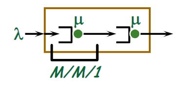
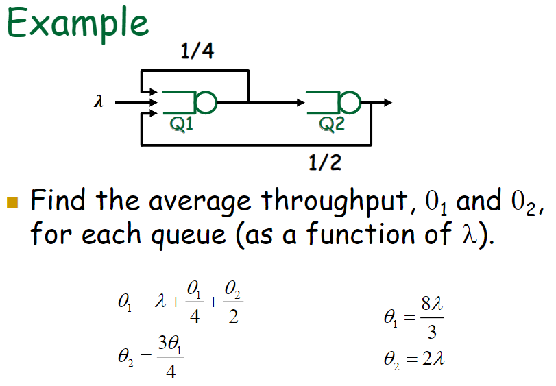

Content
- [M/M/1 departure process](#mm1-departure-process)
  - [Burke’s Theorem](#burkes-theorem)
- [Networks of queues](#networks-of-queues)
  - [Lack of Independence](#lack-of-independence)
  - [Kleinrock Independence Approximation](#kleinrock-independence-approximation)
  - [Open Queueing Networks](#open-queueing-networks)
  - [Average Throughput](#average-throughput)
  - [State Description of the System](#state-description-of-the-system)
    - [Jackson’s Theorem for Open Networks](#jacksons-theorem-for-open-networks)

---
# M/M/1 departure process
Show that the departure process from an M/M/1 system is Poisson

Answer:  
Denote by
- $C_n$ the n-th customer.
- $A_{n+1}$ the interval between $C_n$ departure and $C_{n+1}$ arrival.
- $U_{n+1}$ the inter-departure time between customer $C_n$ and $C_{n+1}$
  $$
  U_{n+1}=\left\{\begin{aligned} &S_{n+1}&& \text{if} C_{n+1}\text{was in queue on}C_n\text{departure}\\ &A_{n+1}+S_{n+1}&&\text{otherwise}\end{aligned}\right.
  $$
- Compute $P[U_{n+1}\le x]$
## Burke’s Theorem
Consider an M/M/m (m ≥ 1) system in steady state with arrival rate $\lambda$
- The departure process is Poisson with rate $\lambda$ 
- At each time $t$, the number of customers in the system is independent of the sequence of departure times prior to $t$
 
Proof relies of time reversibility of system, namely “forward” and “reversed” systems are statistically indistinguishable

# Networks of queues

The inter-arrival times at the second queue are 
correlated with packet service times!
## Lack of Independence
At the second queue
- Inter-arrival time between packet $n$ and $n+1$ is greater than or equal to the transmission time for packet $n+1$, i.e. $\tau \ge s_{n+1}$.
- A long packet that arrives at the second queue is more likely to find fewer customers in queue  

## Kleinrock Independence Approximation
The Kleinrock independence approximation (KIA) provides an approach to analyze delay in networks carrying multiple packet streams
- Based on the assumption that merging packet streams from several sources “restores” the independence of interarrival times and packet lengths
- Allows networks to be analyzed as multiple queues, e.g. as multiple M/M/1 systems

Burke’s theorem combined with KIA allows analysis of feed-forward networks.
- What if the network has feedbacks?

## Open Queueing Networks
“Open” network is one where external customers arrive and 
depart from the system.
Notation:
- $\lambda$:  total mean arrival rate to the network
- $\mu_i$:  mean service rate of *i*-th server
- $r_{sj}$:  probability that a customer arriving from the source will be routed to queue $j$
- $r_{jd}$:  probability that a customer departing from queue $j$ will be routed to the destination (and depart the system)
- $r_{jk}$:  probability that a customer departing from queue $j$ will be routed to queue $k$

## Average Throughput
Let qi be the average throughput through queue $i$
- Mean rate of entering (leaving) a particular queuing system

Traffic equations
$$
\theta_i = \underbrace{\lambda r_{si}}_{\text{from source}} + \underbrace{\displaystyle\sum_{j=1}^{M}r_{ji}\theta_j}_{\text{from queues}},\qquad i=1,2,...,M
$$

## State Description of the System
The state of a system with *M* queues can be defined as an *M*-element vector, where $n_i$ is the number of customers in the *i*-th queuing system (in queue and in service)
$$\vec{n}=(n_1,n_2,...,n_i,...,n_M)$$

Goal is to find the PMF $\pi(\vec{n})$

### Jackson’s Theorem for Open Networks
Shows that networks of queues have product form solution, i.e. each queue can independently be treated as an M/M/1

Jackson’s Theorem:  Assuming $\rho_j < 1, j = 1,..., M$, then
$$\pi(\vec{n})=\pi_1(n_1)\pi_2(n_2)\cdots\pi_K(n_M)$$
where
$$\pi_j(n_j)=\rho_j^{n_j}(1-\rho_j),\quad n_j\ge0$$

- Assumptions
  - Poisson arrivals to the system and exponential service times
    - Note that arrivals to individual queues will, in general, not be Poisson
  - Independence of inter-arrival times and packet lengths
  - Stream splitting is randomized using probabilities $r_{ij}$ which apply to all packets departing from queue $i$  
    - Different streams may not have different routing probabilities
    - Jackson’s Theorem may be extended to account for different classes of customers

---
[Back: M/M/1 Queues](<2. TELE4642 Lecture 2 MM1 Queues.md>)

[Next: Basics of SDN](<4. TELE4642 Lecture 4 Basics of SDN.md>)