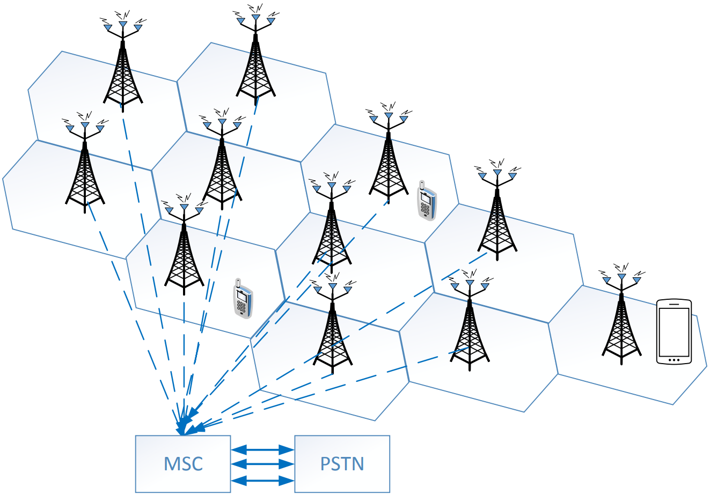
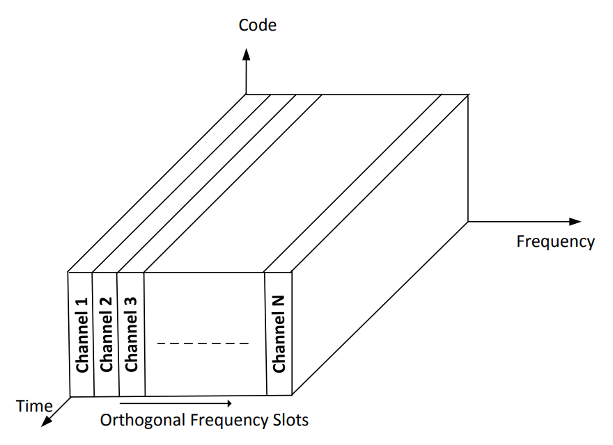
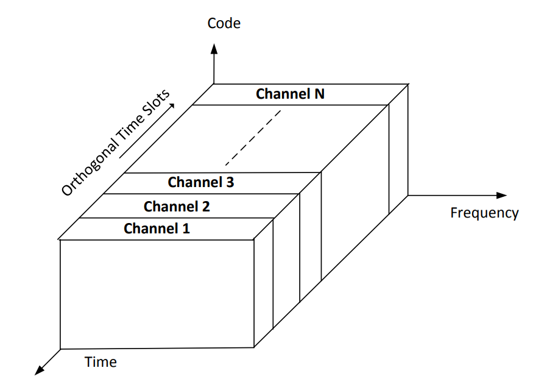
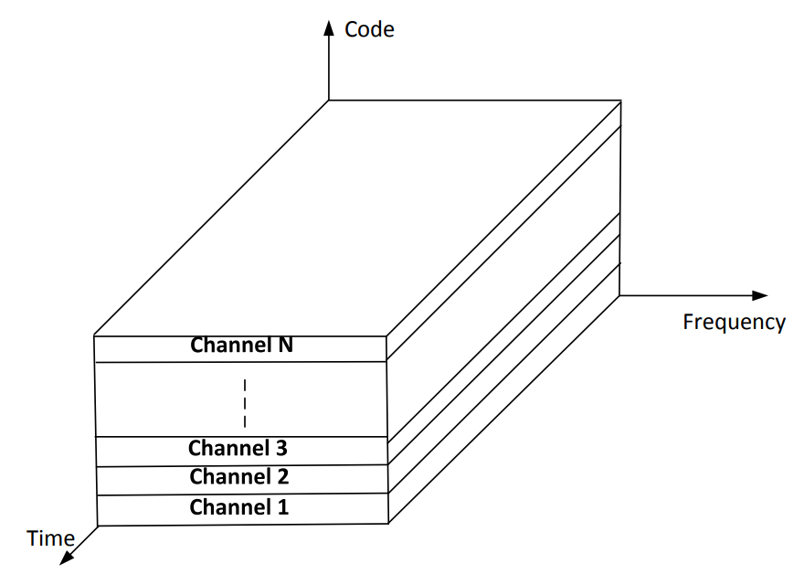
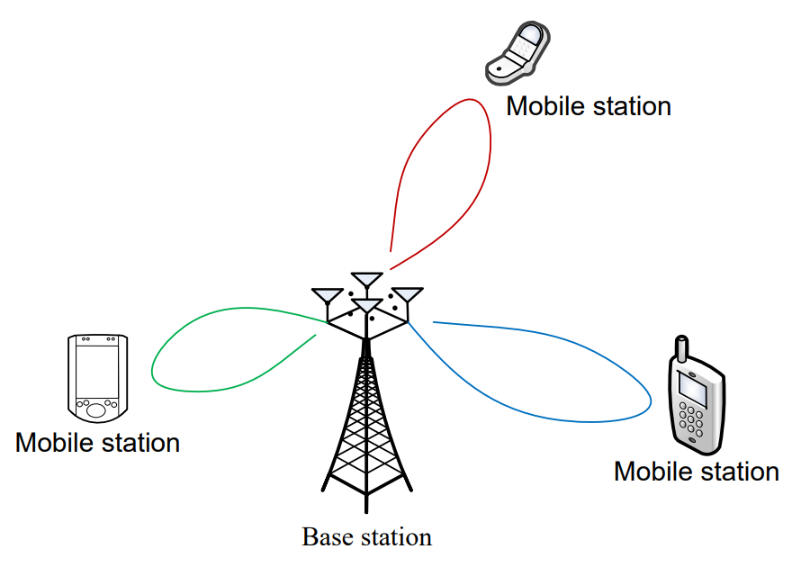

Content
- [Wireless Communication Networks: An Introduction](#wireless-communication-networks-an-introduction)
  - [Wireless Communication Networks](#wireless-communication-networks)
  - [Traditional Wireless Communication](#traditional-wireless-communication)
  - [Recent Growth in Wireless Communications](#recent-growth-in-wireless-communications)
- [Cellular Systems](#cellular-systems)
  - [Cellular Concepts](#cellular-concepts)
  - [Evolution of Cellular Systems](#evolution-of-cellular-systems)
    - [First generation (1G)](#first-generation-1g)
    - [Second generation (2G) (early 90s)](#second-generation-2g-early-90s)
    - [3G Standards: International Mobile Telecom System 2000 (IMT 2000)](#3g-standards-international-mobile-telecom-system-2000-imt-2000)
    - [4G long term evolution (LTE) Systems](#4g-long-term-evolution-lte-systems)
    - [5G communication systems](#5g-communication-systems)
- [Resource Allocation](#resource-allocation)
  - [Definition](#definition)
  - [Power Control](#power-control)
- [Duplexing and Multiple Access Strategies](#duplexing-and-multiple-access-strategies)
  - [Duplexing](#duplexing)
    - [Frequency Division Duplexing (FDD)](#frequency-division-duplexing-fdd)
    - [Time Division Duplexing (TDD)](#time-division-duplexing-tdd)
  - [Multiple Access Strategies](#multiple-access-strategies)
    - [Definition](#definition-1)
    - [Frequency Division Multiple Access (FDMA)](#frequency-division-multiple-access-fdma)
    - [Time Division Multiple Access (TDMA)](#time-division-multiple-access-tdma)
    - [Code Division Multiple Access (CDMA)](#code-division-multiple-access-cdma)
    - [Space/Spatial Division Multiple Access (SDMA)](#spacespatial-division-multiple-access-sdma)
    - [Multiple Access Strategies techniques in different wireless communication systems](#multiple-access-strategies-techniques-in-different-wireless-communication-systems)
- [Key Technologies](#key-technologies)
- [Glossary](#glossary)

---

# Wireless Communication Networks: An Introduction
## Wireless Communication Networks
- Definition  
  A telecommunication network whose interconnections between nodes are implemented without the use of a physical waveguide
- Advantage  
  Seamless mobility and coverage  
  Communication can be made anywhere, anytime!
- Example  
  Satellite Communications  
  Digital TV and Audio Broadcast (DAB, DVB, etc)  
  Mobile Phone (2G, 3G, 4G, 5G, and B5G)  
  Wireless LAN (Wi-Fi)  
  Bluetooth  
  Wireless sensor networks (wearable devices)
## Traditional Wireless Communication
- Wireless broadcasting system  
  - TV or Radio Broadcast (simple devices)
  - Short Range Transmission (Walkie Talkie)
- Expensive wireless two-way system
  - Mainly used by Special Groups, e.g. police & emergency services, satellite Uplink & Downlink for Real-time newscast  
    Two-way synchronization is needed
## Recent Growth in Wireless Communications
- Hardware Technology  
  Digital Signal Processing (DSP),  
  Very-Large-Scale Integration (VLSI),  
  RF Integrated Circuit (RFIC) technology  
- Government Regulations  
  Releases frequency bands for wireless applications via auction or license  
- Market Demand  
  Demand for wireless communication systems (people are becoming more mobile)  

# Cellular Systems
## Cellular Concepts  
> 
- Base stations (BSs)  
  Connected together using a high-speed wireline network to the Mobile Switching Centers (MSCs)
- MSCs 
  Connected together and to the Public Switch Telephone Network (PSTN)
- To increase capacity via frequency Reuse
## Evolution of Cellular Systems  
### First generation (1G)  
- Cellular concept was developed in the 50s and 60s
- Frequency modulation (FM) is used to modulate voice signals
- System limitations:  
  High required signal-to-interference ratio (SIR): 18dB  
  Frequency reuse factor: 7 -> Limited system capacity  
  Bulky and power hungry receiver  
  Incompatible 1G systems  
  The main driving force for evolution: System capacity (number of users)  
### Second generation (2G) (early 90s)  
> For 2G communication systems, circuit-switched data connection are charged on a per-second basis.  

Global System for Mobile (GSM): TDMA based  
Interim Standard 95 (IS-95): CDMA based
- Digital Cellular Systems:  
  Carrier Frequency: ∼ 800 MHz (US), ∼ 900 MHz (Europe)
- Personal Communication Systems (PCS)  
  Carrier Frequency: ∼ 1, 800 MHz (US), ∼ 1, 900 MHz (Europe)   
- Major breakthroughs:
  - Smaller handset  
  - Longer lifetime of handset  
    GSM: Power control for prolonging battery life by reducing the transmit power
  - Gaussian Minimum Shift Keying is used for modulation
  - Lower SIR requirements (Channel coding: Convolutional code)
  - Data services for mobile (SMS text messages)
- 2.5G Standards: General Packet Radio Services (GPRS)
  - Packet Switched connection  
    Based on GSM networks, an extension by combining up to all 8 times slots in a GSM channel (Scheduling)  
    Data rates from 9.6 to 171 kbps
- 2.75G Standards: Enhanced Data Rates for GSM Evolution (EDGE)
  - Based on GPRS networks and cannot work alone
  - Data rates is up to 384 Kbps
  - 8-ary phase shift keying (8-PSK)
  - Spectral efficiency improvement via  
    Adaptive modulation (rate control)  
    Rate control maintains the bit signal-to-noise ratio (SNR), at the desired level
### 3G Standards: International Mobile Telecom System 2000 (IMT 2000)
- System basic requirements:
  - Bit rates up to 2 Mbps
  - Quality of service (QoS)
  - High spectral efficiency
- Universal Mobile Telecommunications System (UMTS) – Backward compatible to GSM
  - Wideband Code Division Multiple Access (WCDMA)
  - Time Division Synchronous Code Division Multiple Access (TD-SCDMA)
- CDMA 2000 – Backward compatible to IS 95
### 4G long term evolution (LTE) Systems  
Initiate work started in 2004 and finalized the first version in Dec. 2008.
- System basic requirements
  - Increases user data rate
  - Reduces latency: < 5 ms for small IP packets 
  - Optimized for low speed (< 20 km/hr); support up to 350 km/hr
  - Increases the spectral efficiency of cell-edge users
### 5G communication systems  
Launched in various countries
- System basic requirements   
  - Massive connectivity  
    1 million communication devices per Km$^2$
  - High data rates everywhere  
    $>$ 10 Gbps in specific scenarios: indoor and dense outdoor environments  
    $>$ 100 Mbps: urban and suburban environments  
    $>$ 10 Mbps: sparsely populated rural areas in both developed and developing countries
  - Low latency  
    End-to-end latency of 1 ms or less

# Resource Allocation
## Definition   
  - Resource allocation is the concept of making the best use of limited resources based on the available information.
  - Traditionally, there are four main system design objectives:   
    > cell coverage, cell capacity, energy efficiency, Quality of Service (QoS)  
    - Maximize the cell coverage (number of bits per unit area/volumn (3D))
      - Possible solution: Radiate with maximum power all the time  
          - Increase the multicell interference to other cells -> vicious circle  
          - Results in a very low energy efficiency (in some cases)
    - Maximize the cell capacity (number of bits per Hz)
      - Possible solution: Allocate all the resources to the best user
        - Only one user can be served -> some users are starving -> unfair resource allocation
    - Maximize the system energy efficiency (bit/Joule)
      - Possible solution: Reduce the transmitted power
        - Loss in coverage
        - Cannot guarantee QoS to all users
    - Ensure required QoS such as minimum data rate requirement of a user
      - Possible solution: Allocate all the resources to the user who requires a minimum data rate
        - Results in a very low spectral efficiency if the user is located at the cell edge
        - Some users are starving
        - System resources are under utilized (unfair to the service provider)
## Power Control
  - Basics
    - Guarantee a certain link quality and for interference management
    - To ensure the link quality, it is necessary to maintain the signal-to-noise-plus-interference ratio (SINR) of all active users above some threshold
    - Power control algorithm adjusts the transmitted power frequently for achieving this goal
    - SINR may not increase by simply boosting the transmit power of all users
  - Near-far Problem
    - A condition in interference channel
    - A receiver captures a strong signal and thereby makes it impossible for the receiver to detect a weaker signal due to hardware limitation.
  - Cell Breathing Problem
    - A term in describing the variation of the service coverage with respect to the load of the system
    - The traffic in the cell increases, the sensitivity of the BS decreases because of the increased interference
  - Solution: Power control 
    - Power control in interference channels is the adjustment of the transmit power to achieve:  
      - Desired link quality (receiver power level, or SIR)
      - Minimize interference (overall transmit power)
      - Battery saving (less important compared with interference management)
  - Power Control Strategy  
    One strategy for maintaining reliable links for all users is to equalize as much as possible the received power per bit of all users at all times.

# Duplexing and Multiple Access Strategies
## Duplexing
  - Allowing communication in both directions (transmit and receive)
  - Full-Duplex Solution
    - Transmit and receive simultaneously in the same frequency band
    - Advance interference cancellation techniques are adopted to suppress self-interference
    - New technology: There is no commercial product, yet. (only prototypes are available)
  - Half-Duplex Solution
    - Frequency Division Duplexing (FDD): transmit and receive at different frequencies
    - Time Division Duplexing (TDD) – rapidly switch between transmit and receive operations, so it appears seamless to the user receive signal
### Frequency Division Duplexing (FDD)
- Transmit (Tx) and receive (Rx) at different frequencies concurrently
- FDD provides two simplex frequency channels at the same time for communication.
- A filter can be used to separate Tx and Rx signals
- Frequency separation
  - Frequency separation is large enough such that we can filter out the received Tx signal signal
  - Rule of thumb: 5% of the nominal frequency (in order to use inexpensive duplexer)
- Practical Considerations
  - Isolation often requires in excess of 100 dB
  - Requires a good filter and accurate impedance matching
  - Notch filters are a common choice
### Time Division Duplexing (TDD)
- Provides two simplex time slots on the same frequency for communication.
- Reuse the filters, mixers, frequency sources, and synthesizers, eliminating the complexity and costs associated with isolating the transmit antenna and the receive antenna.
- More flexible than FDD in meeting the need to dynamically reconfigure the allocated upstream and downstream bandwidth in response to customer needs.
- A time latency due to duplexing
## Multiple Access Strategies
### Definition  
A multiple access strategy allows several users to share the available bandwidth
### Frequency Division Multiple Access (FDMA)
> 
- Basics
  - Individual orthogonal channels are assigned to individual users
  - Guard band channels may be needed to avoid adjacent-channel interference
  - FDMA is a continuous transmission scheme
  - If an FDMA channel is not in use, then it sits
idle
- Capacity
  - The number of channel that can be simultaneously supported in a FDMA system is given by  
    $$N = \dfrac{B_t - 2 B_{guard}}{B_c}$$  
    where $B_t$ is the total spectrum allocation, $B_{guard}$ is the guard band allocated at the edge of the allocated spectrum, and $B_c$ is the channel bandwidth.
- Guard bands
  - Performance of channel filters to reject out of band signal
  - Range of signal amplitude variation between channels
  - Out of band spectral occupancy of transmitted signal
- FDMA Advantages
  - Narrow bandwidth channels -> flat-fading -> so no complex receivers (equalizers) required
  - No synchronization overheads (suits uncoordinated users) 
  - Simple, analog circuitry and signal processing(e.g. Frequency modulation)
- FDMA Disadvantages
  - Dedicated channel per user for voice conversation is resource inefficient
    - more 50% of average conversation is silence
  - Guard bands waste spectrum
    - typical 10 − 25% of channel bandwidth
  - Require complex band-pass filters and RF filters to reject adjacent channel interference

### Time Division Multiple Access (TDMA)
> 
- Basics
  - TDMA shares a single carrier frequency with several users in a round robin manner
  - Individual orthogonal time slots are assigned to individual users
  - In each time slot, the selected user occupies the entire channel bandwidth
- Capacity
  - The number of channel that can be simultaneously supported in a FDMA system is given by
    $$N = \dfrac{m(B_t - 2 B_{guard})}{B_c}$$  
    where $m$ is the maximum number of TDMA users supported on each radio channel
- TDMA Advantages
  - Low battery consumption due to burst transmissions
  - It is possible to allocate different numbers of consecutive time slots to a user (higher flexility)
  - Duplexer is not required (cheaper hardware)
- TDMA Disadvantages
  - Adaptive equalization is usually necessary in TDMA systems
  - High synchronization overhead is required
  - Guard time is required

### Code Division Multiple Access (CDMA)
> 
- Basics
  - A narrowband message signal is multiplied by a very large bandwidth signal (spreading signal)
  - Users use the same frequency and are allowed to transmit simultaneously
  - The power of multiple users at a receiver determines the noise floor (performance)
  - Soft system capacity
- CDMA Advantages
  - Many users of a CDMA system share the same frequency concurrently
  - A channel is released if it is not occupied by a user
  - Soft handoff (make-before-break) can be used to exploit spatial diversity
- CDMA Disadvantages
  - Near-far problem (performance is sensitive to power control)
  - Cell breathing (performance is sensitive to power control)
  - Rake receiver is required to improve reception (exploit multipath diversity)
  - Self-jamming arises from the fact that the spreading sequences of different users are not exactly orthogonal

### Space/Spatial Division Multiple Access (SDMA)
> 
- Basics
  - SDMA controls the radiated energy for each user in space
  - Base station uses the same frequency/different frequencies to serve multiple users simultaneously
  - Static approach: Sectoring; Dynamic approach:
    - Beamforming (adapt to the real-time channel condition)
  - Ultimate goal: To create parallel spatial data pipes (no multiuser interference)
- SDMA Advantages
  - Users can be served concurrently by the same frequency (in TDMA or CDMA) or different frequencies (in FDMA)
  - Spatial degrees of freedom can be exploited for resource allocation (multiplexing and diversity gains)
- SDMA Disadvantages
  - Multiple antennas are needed
  - For adaptive approach, the base station has to keep tracking the status of the time-varying channel -> High signalling overhead
  - May not suitable for small devices
  - Energy consumption for non-radiating components, i.e., transmit filter, mixer, frequency synthesizer, and digital-to-analog converter

### Multiple Access Strategies techniques in different wireless communication systems
| Wireless Communication Systems          | Multiple Access Strategies Techniques |
| --------------------------------------- | ------------------------------------- |
| Advanced Mobile Phone Systems (AMPS) 1G | FDMA/FDD                              |
| Global System for Mobile                | TDMA/FDD                              |
| Digital European Cordless Telephone     | FDMA/TDD                              |
| U.S. Narrowband Spread Spectrum (IS-95) | CDMA/FDD                              |
| IMT-2000 (3G)                           | WCDMA/FDD                             |

# Key Technologies
- High data rates, high energy efficiency, and ubiquitous wireless services are the driving force for the evolution of wireless communication systems
- Resource allocation plays an important role in enhancing the system performance (system capacity, energy efficiency, etc)
- Key technologies for enabling wireless communication
  - Diversity (time, frequency, spatial, etc.)
  - Channel coding
  - Spread spectrum
  - Orthogonal frequency division multiplexing (OFDM)
  - Multiple-Input Multiple-Output (MIMO)
  - Adaptive modulation
  - Multi-user diversity

# Glossary
| Terminology             | Definition                                                                                                              |
| ----------------------- | ----------------------------------------------------------------------------------------------------------------------- |
| Base station            | A fixed station in a mobile radio system used for radio communication with mobile stations.                             |
|                         | Base stations are located at the center                                                                                 |
|                         | On the edge of a coverage region and consist of radio channels and transmitter and receiver antennas mounted on a tower |
| Mobile station          | A station in the cellular radio service intended for use while in motion at unspecified locations.                      |
|                         | Mobile stations may be hand-held personal units (portables) or installed in vehicles (mobiles).                         |
| Handoff (Handover)      | The process of transferring a mobile station from one channel or base station to another                                |
| Forward link (downlink) | Radio channel used for transmission of information from the base station to the mobile                                  |
| Reverse link (uplink)   | Radio channel used for transmission of information from the mobile to base station                                      |
| Transceiver             | A device capable of transmitting and receiving radio signals                                                            |

---
[Back: Mobile and Satellite Communications Systems Overview](0.%20TELE4652%20Mobile%20and%20Satellite%20Communications%20Systems%20Overview.md)

[Next]()