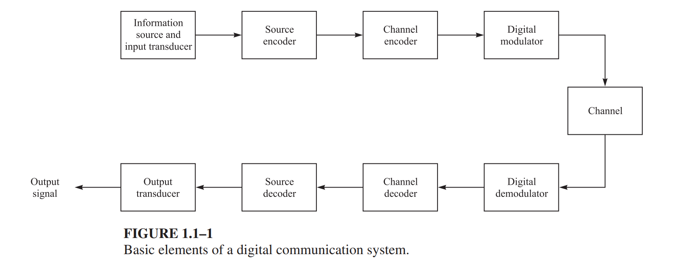
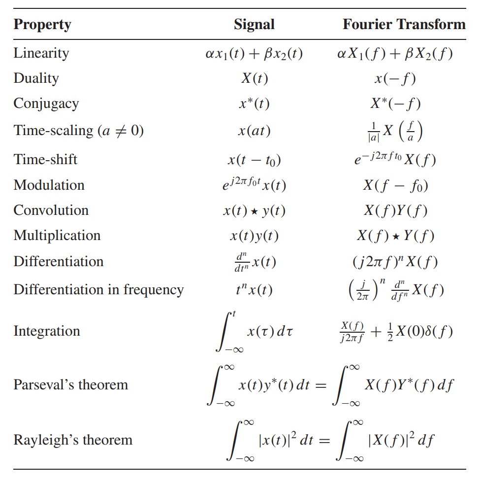
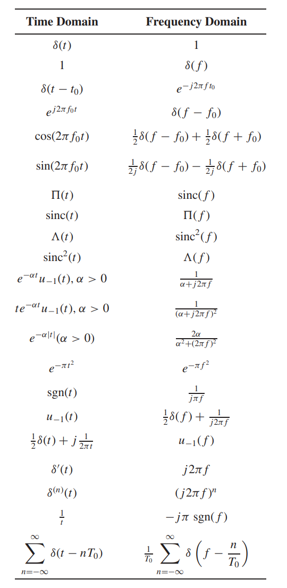
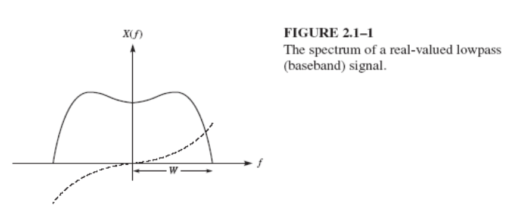
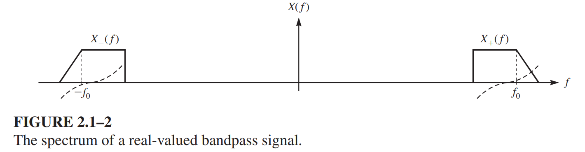

Content
- [Introduction to Communications](#introduction-to-communications)
  - [The elements of digital communication system](#the-elements-of-digital-communication-system)
  - [Modulation](#modulation)
  - [Properties of FT:](#properties-of-ft)
- [Lowpass (LP) and Bandpass (BP) Signals](#lowpass-lp-and-bandpass-bp-signals)
  - [Lowpass Signals](#lowpass-signals)
  - [Bandpass Signals](#bandpass-signals)
  - [Lowpass Equivalent of Bandpass Signals](#lowpass-equivalent-of-bandpass-signals)
- [Signal Space Concepts](#signal-space-concepts)
- [Expansion of BP Signals](#expansion-of-bp-signals)

---

# Introduction to Communications

## The elements of digital communication system
> 
## Modulation
- Information signal: low frequency signal
- Spectrum of the channel: high frequency
- **Modulation process: translate the information signal to a higher frequency signal to matches the channel spectrum**
## Properties of FT:
<!-- >  -->
| Property                     |                       Signal                        |                   Fourier Transform                    |
| ---------------------------- | :-------------------------------------------------: | :----------------------------------------------------: |
| Linearity                    |           $\alpha x_1(t) + \beta x_2(t)$            |             $\alpha X_1(f) + \beta X_2(f)$             |
| Duality                      |                       $x(t)$                        |                        $X(-f)$                         |
| Conjugacy                    |                      $x^*(t)$                       |                       $X^*(-f)$                        |
| Time-scaling                 |                       $x(at)$                       |      $\dfrac{1}{\|a\|}X\left(\dfrac{f}{a}\right)$      |
| Time-shift                   |                    $x(t - t_0)$                     |                 $e^{-j2\pi f t_0}X(f)$                 |
| Modulation                   |                $e^{j2\pi f_0t}x(t)$                 |                      $X(f - f_0)$                      |
| Convolution                  |                    $x(t) * y(t)$                    |                       $X(f)Y(f)$                       |
| Multiplication               |                     $x(t)y(t)$                      |                     $X(f) * Y(f)$                      |
| Differentiation              |               $\dfrac{d^n}{dt^n}x(t)$               |                   $(j2\pi f)^nX(f)$                    |
| Differentiation in frequency |                     $t^n x(t)$                      | $\left(\dfrac{j}{2\pi}\right)^n \dfrac{d^n}{df^n}X(f)$ |
| Integration                  | $\displaystyle\int_{-\infty}^{\infty} x(\tau)d\tau$ |  $\dfrac{X(f)}{j2\pi f} + \dfrac{1}{2}X(0)\delta(f)$   |
| Parseval’s theorem           | $\displaystyle\int_{-\infty}^{\infty} x(t)y^*(t)dt$ |  $\displaystyle\int_{-\infty}^{\infty} X(f)Y^*(f)df$   |
| Rayleigh’s theorem           |   $\displaystyle\int_{-\infty}^{\infty}x(t)^2 dt$   |    $\displaystyle\int_{-\infty}^{\infty}X(f)^2 df$     |

<!-- >  -->
|                        Time Domain                        |                                  Frequency Domain                                  |
| :-------------------------------------------------------: | :--------------------------------------------------------------------------------: |
|                        $\delta(t)$                        |                                        $1$                                         |
|                            $1$                            |                                    $\delta(f)$                                     |
|                     $\delta(t - t_0)$                     |                                 $e^{-j2\pi ft_0}$                                  |
|                     $e^{j2\pi f_0t}$                      |                                 $\delta(f - f_0)$                                  |
|                     $\cos(2\pi f_0t)$                     |                 $\dfrac{1}{2}[\delta(f - f_0) + \delta(f + f_0)]$                  |
|                     $\sin(2\pi f_0t)$                     |                 $\dfrac{1}{2j}[\delta(f - f_0) - \delta(f + f_0)]$                 |
|                         $\Pi(t)$                          |                                  $\text{sinc}(f)$                                  |
|                     $\text{sinc}(t)$                      |                                      $\Pi(f)$                                      |
|                       $\Lambda(t)$                        |                                 $\text{sinc}^2(f)$                                 |
|                    $\text{sinc}^2(t)$                     |                                    $\Lambda(f)$                                    |
|              $e^{-\alpha t}u(t), \alpha > 0$              |                           $\dfrac{1}{\alpha + j2\pi f}$                            |
|             $te^{-\alpha t}u(t), \alpha > 0$              |                         $\dfrac{1}{(\alpha + j2\pi f)^2}$                          |
|             $e^{-\alpha \| t \|}, \alpha > 0$             |                      $\dfrac{2\alpha}{\alpha^2 + (2\pi f)^2}$                      |
|                      $e^{-\pi t^2}$                       |                                   $e^{-\pi f^2}$                                   |
|                      $\text{sgn}(t)$                      |                                $\dfrac{1}{j\pi f}$                                 |
|                      $u(t) - u(t-1)$                      |                   $\dfrac{1}{2}[\delta(f) + \dfrac{1}{j2\pi f}]$                   |
|                       $\delta'(t)$                        |                                     $j2\pi f$                                      |
|                     $\delta^{(n)}(t)$                     |                                   $(j2\pi f)^n$                                    |
|                      $\dfrac{1}{t}$                       |                               $-j\pi \text{sgn}(f)$                                |
| $\displaystyle\sum_{n=-\infty}^{\infty} \delta(t - nT_0)$ | $\displaystyle\dfrac{1}{T_0} \sum_{n=-\infty}^{\infty} \delta(f - \dfrac{n}{T_0})$ |

# Lowpass (LP) and Bandpass (BP) Signals
- The Fourier transform of a **real** signal x(t) has *Hermitian symmetry*
  
  > $X(-f)=X^*(f) \ \to\ |X(-f)|=|X(f)|\ \&\ \angle X^*(f)=-\angle X(f)$

## Lowpass Signals
> 
> Usually lowpass signals are low frequency signals
> > $X_+(f)=\left\{\begin{aligned}{lr}
> > X(f),& f>0\\
> > X(0)/2, & f=0\\
> > 0,& f<0
> > \end{aligned}\right.\quad
> > X_-(f)=\left\{\begin{aligned}{lr}
> > X(f),& f<0\\
> > X(0)/2, & f=0\\
> > 0,& f>0
> > \end{aligned}\right.$
> > > $X_+(f)=X(f)u_{-1}(f),$  $X_-(f)=X(f)u_{-1}(-f).$

- The bandwidth of a real lowpass signal is the minimum positive $W$ such that $X( f ) = 0$ outside $[−W, +W]$ (*frequency support*)
- In general and for all signals, real or complex, the bandwidth is defined as one-half of the frequency support.
  
  > $\begin{aligned}
  > \text{Lowpass Signal } && \underrightarrow{Modulation} && \text{ Bandpass Signal}\\
  > \text{Low Frequency } && && \text{Higher Frequency}
  > \end{aligned}$

- In modulation process, the spectrum of the lowpass message signal is translated to higher frequencies. 
- The resulting modulated signal is a bandpass signal.
        
## Bandpass Signals
> 

- Bandpass signal is a real signal $x(t)$ for which there exists positive $f_0$ and $W$ such that the positive spectrum of $X( f )$, i.e., 
  - $X_+( f )$, is nonzero only in the interval $[ f_0 − W/2, f_0 +W/2]$ 
  - $X_-( f )$, is nonzero only in the interval $[ -f_0 − W/2, -f_0 +W/2]$ 
  - $X(f)=X_+(f)+X_−(f)=X_+(f)+X^∗_+(f)\to x(t)=x_+(t)+x_-(t)$ 
  - $f_0$: central frequency. Bandwidth is $W$       
  
## Lowpass Equivalent of Bandpass Signals
        
> $\begin{aligned}
> x_+(t) 
> & = F^{-1}[X_+(f)]=F^{-1}[X(f)u_{-1}(f)]&&\\
> & = x(t)*F^{-1}[u_{-1}(f)] &&\text{Convolution Property}\\
> & = x(t)*\left(\dfrac1 2 \delta(t) + j\dfrac1{2\pi t}\right)\\
> & = \dfrac1 2x(t)+\dfrac j 2 \hat{x}(t)&&\hat{x}(t)=\dfrac{1}{\pi t}*x(t),\text{ the Hilbert transform}
> \end{aligned}$
        
- We define $x_l(t)$, the lowpass equivalent of bandpass signal $x(t)$
- And the spectrum of $x_l(t)$ is $X_l(f)=2X_+(f+f_0)=2X(f+f_0)u_{-1}(f+f_0)$    
  > $\begin{aligned}
  > x_l(t)&=F^{-1}[X_l(f)]=F^{-1}[2X_+(f+f_0)] &&\\
  > &=2x_+(t)e^{-j2\pi f_0t} && \text{Modulation Property}\\
  > &=[x(t)+j\hat{x}(t)]e^{-j2\pi f_0t}&&\text{Alternatively }
  > x(t)=\Re[x_l(t)e^{j2\pi f_0t}]\\
  > &=[x(t)\cos(2\pi f_0t)+\hat x (t) \sin (2 \pi f_0 t )]\\
  > &+j[\hat x(t)\cos(2\pi f_0t)-x(t) \sin (2 \pi f_0 t )]
  > \end{aligned}$    

- For simplicity, $x_l(t)=x_i(t)+jx_q(t)$, $i$ means in-phase, $q$ means quadrature
  > $x_i(t)=x(t)\cos(2\pi f_0t)+\hat x (t) \sin (2 \pi f_0 t )\\
  > x_q(t)=\hat x(t)\cos(2\pi f_0t)-x(t) \sin (2 \pi f_0 t )$

  We can get

  > $x(t)=x_i(t)\cos(2\pi f_0t)+x_q(t) \sin (2 \pi f_0 t )\\
  > \hat x(t)=x_q(t)\cos(2\pi f_0t)-x_i(t) \sin (2 \pi f_0 t)$

- Also, we can write a similar relation in polar coordinates expressing x(t) in terms of its magnitude $r_x(t)$ and phase $\theta_x(t)$

  > $\begin{aligned}
  > &&r_x(t)&=\sqrt{x_i^2(t)+x_q^2(t)}\\
  > &&\theta_x(t)&=\arctan{\dfrac{x_q(t)}{x_i(t)}}\\
  > \Rightarrow&&x_l(t)&=r_x(t)e^{j\theta_x(t)}\\
  > \Rightarrow&&x(t)&=\Re[r_x(t)e^{j(2\pi f_0t+\theta_x(t))}]\\
  > &&&=r_x(t)\cos(2\pi f_0t+\theta_x(t))
  > \end{aligned}$

# Signal Space Concepts
- Vector Space Concepts
  
  > $\begin{array}{ll}
  > \text{Inner product}& \left<\mathbf{v}_1,\mathbf{v}_2\right>=\sum^n_{i=1}v_{1i}v_{2i}^*=\mathbf{v}_2^H\mathbf{v}_1\\
  > \text{Orthogonal} &\left<\mathbf{v}_1,\mathbf{v}_2\right>=0\\
  > \text{Norm}&\|v\|=\sqrt{\sum^n_{i=1}|v_i|^2}\\
  > \text{Triangle inequality}&\|\mathbf{v}_1+\mathbf{v}_2\|\le\|\mathbf{v}_1\|+\|\mathbf{v}_2\|,&\text{equal if }\mathbf{v}_1=a\mathbf{v}_2\ \text{for positive real scalar }a\\\text{
  > Cauchy-Schwarz inequality}&|\left<\mathbf{v}_1,\mathbf{v}_2\right>|\le\|\mathbf{v}_1\|\cdot\|\mathbf{v}_2\|,&\text{equal if }\mathbf{v}_1=a\mathbf{v}_2\text{ for complex scalar } a
  > \end{array}$
  
- Signal Space Concepts
  
  > $\begin{array}{ll}
  > \text{Inner product}& \left<x_1(t),x_2(t)\right>=\int^\infty_{-\infty}x_1(t)x_2(t)^*dt\\
  > \text{Orthogonal} &\left<x_1(t),x_2(t)\right>=0\\
  > \text{Norm}&\|x(t)\|=\sqrt{\int^\infty_{-\infty}|x(t)|^2dt}=\sqrt{\mathcal{E} _x}\\
  > \text{Triangle inequality}&\|x_1(t)+x_2(t)\|\le\|x_1(t)\|+\|x_2(t)\|\\
  > \text{Cauchy-Schwarz inequality}&|\left<x_1(t),x_2(t)\right>|\le\|x_1(t)\|\cdot\|x_2(t)\|
  > \end{array}$

# Expansion of BP Signals
- Orthogonal Expansion of Signals
  - Gram-Schmidt procedure
      
    > $\mathbf{v}\in\mathbf{V}^n$, $\mathbf{V}^k$ is  the subspace of $\mathbf{V}^n$  with orthogonal set $\{n_1,n_2,...,n_k\}$ and $\mathbf{v}\notin \mathbf{V}^k$
    > 
    > $\begin{array}{rclc}
    > \beta_1&=&v_1&n_1=\dfrac{\beta_1}{\|\beta_1\|}\\
    > \beta_2&=&v_2-\left<v_2,n_1\right>n_1&n_2=\dfrac{\beta_2}{\|\beta_2\|}\\
    > &&\vdots&\vdots\\
    > \beta_n&=&v_n-\displaystyle\sum^{n-1}_{i=1}\left<v_n,n_n\right>n_n&n_n=\dfrac{\beta_n}{\|\beta_n\|}
    > \end{array}$

  - Using a set of signal $s_m(t),m=1,2,...,M$ to construct a set of orthonrmal waveforms $\phi_n(t)$
    - $\phi_1=\dfrac{s_1(t)}{\sqrt{\mathcal E_1}}$
    - $\phi_k(t)=\dfrac{\gamma_k(t)}{\sqrt{\mathcal E_K}}\text{ for }k=2,...,N,(N\le M)$
      
    where
      
    > $\begin{array}{rcl}
    > \gamma_k(t)&=&s_k(t)-\displaystyle\sum^{k-1}_{i=1}c_{ki}\phi_i(t)\\
    > c_{ki}&=&\left<s_k(t),\phi_i(t)\right>=\displaystyle\int^{\infty}_{-\infty}s_k(t)\phi_i^*(t)dt\\
    > \mathcal E_k&=&\displaystyle\int^{\infty}_{-\infty}\gamma_k^2(t)dt
    > \end{array}$
      
    Once constructed $\phi_n(t)$, 
  
      > $s_m(t)=\displaystyle\sum^N_{n=1}s_{mn}\phi_n(t),\ m=1,2,...,M$
  
- BP and LP Orthonormal Basis
  
  > $\begin{array}{}
  > s_m(t)&=&\Re[s_{ml}(t)e^{j2\pi f_0t}], m=1,2,...,M\\
  > &=&\Re\left[\left(\displaystyle\sum^N_{n=1}{s_{mln}\phi_{nl}(t)}\right)e^{j2\pi f_0t}\right]\\
  > &=&\displaystyle\sum^N_{n=1}\left\{\Re\left[s_{mln}\left(\phi_{nl}(t)e^{j2\pi f_0t}\right)\right]\right\}
  > \end{array}$
  
  Define
  
  > $\begin{aligned}
  > \phi_n(t) &= \sqrt{2}\Re \left[ \phi_{nl}(t)e^{j2\pi f_0 t} \right] \\
  > \tilde{\phi}_n(t) &= -\sqrt{2}\Im \left[ \phi_{nl}(t)e^{j2\pi f_0 t} \right].
  > \end{aligned}$
  
  Then 
  
  $s_m(t) = \sum_{n=1}^{N} \left[ \dfrac{s^{(r)}_{mln}}{\sqrt{2}} \phi_n(t) + \dfrac{s^{(i)}_{mln}}{\sqrt{2}} \tilde{\phi}_n(t) \right]$
  
  Where we have assumed that $s_{mln}=s_{mln}^{(r)}+js_{mln}^{(i)}$

---
[Back: Course Overview](0.%20TELE4653%20Digital%20Modulation%20&%20Coding.md)

[Next: Digital Modulation](2.%20TELE4653%20Digital%20Modulation.md)