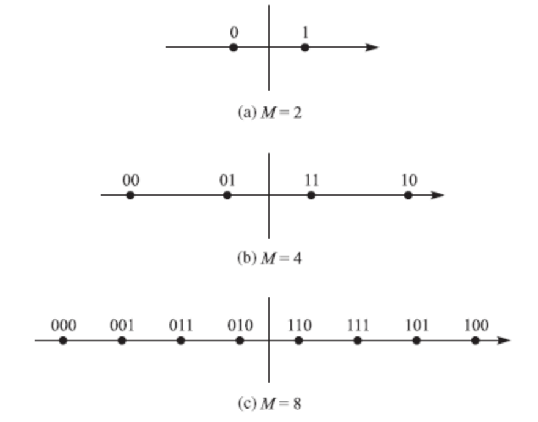
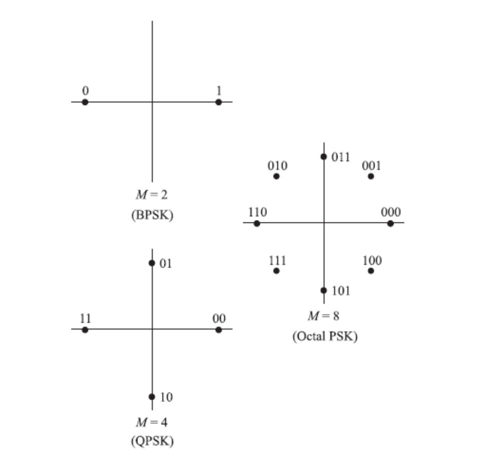
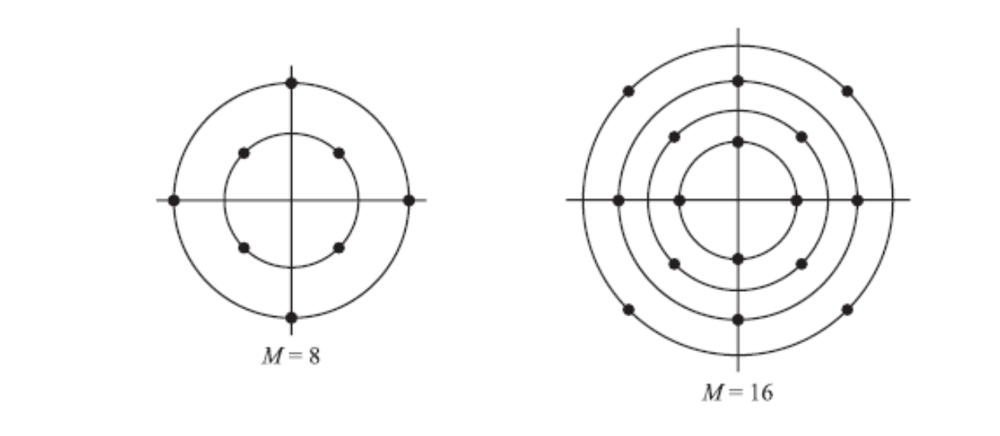

Content
- [PAM (ASK)](#pam-ask)
  - [Bandpass PAM](#bandpass-pam)
    - [Expansion](#expansion)
    - [$d\_{\\min}$](#d_min)
- [PSK](#psk)
  - [Expansion](#expansion-1)
  - [$d\_{\\min}$](#d_min-1)
- [QAM](#qam)
  - [Expansion](#expansion-2)
  - [$d\_{\\min}$](#d_min-2)
  - [Square QAM](#square-qam)
- [PAM, PSK, QAM](#pam-psk-qam)

---
- Modulation
  - Source information to be transmitted is usually in the form of a binary data stream.
  - The transmission medium, i.e., communication channel suffers from noise, attenuation, distortion, fading, and interference.
  - Digital Modulation - To generate a signal that represents the binary data stream and matches the characteristics of the channel
  - Modulation with Memoryless or with Memory
- Definitions
  - Signaling Interval: $T_s$. Signaling (Symbol) Rate: $R_s=\dfrac{1}{T_s}$
  - Bit Interval: $T_b=\dfrac{T_s}{k}$ for a signal carrying k bits of information.
  - Bit Rate: $R = kR_s = R_s \log_2^M$.
  - Average signal energy: $\mathcal{E}_{avg} = \displaystyle\sum_{m=1}^M p_m\mathcal{E}_m$ with $p_m$ being the probability of the mth signal.
  - Average energy per bit: $\mathcal{E}_{bavg}=\dfrac{\mathcal{E}_{avg}}{k}=\dfrac{\mathcal{E}_{avg}}{\log_2^M}$

# PAM (ASK)
- The signal waveform may be represented as
  
  > $s_m(t) = A_m p(t), \quad 1 \le m \le M$

- where $p(t)$ is a pulse of duration T and Am denotes the amplitude with the mth value, given by

  > $A_m=2m-1-M,\quad 1 \le m \le M$
  - i.e., the amplitudes are $±1, ±3, ±5, · · · , ±(M − 1)$.

- Digital amplitude modulation is usually called amplitude-shift keying (ASK).
- PAM constellation 
  > 

- The energy of signal $s_m(t)$ is given by

  > $\mathcal{E}_m=\displaystyle\int_{-\infty}^{\infty}{A_m^2 p^2(t) dt} = A_m^2 \mathcal{E}_p$

- The average signal energy is

  > $\displaystyle\mathcal{E}_{avg}=\sum_{m=1}^{M}{p_m \mathcal{E}_m}=\dfrac{\mathcal{E}_p}{M}\sum_{m=1}^{M}A_m^2$

- The average energy per bit is

  > $\mathcal{E}_{bavg}=\dfrac{(M^2-1)\mathcal{E}_p}{3\log_2^M}$
  
## Bandpass PAM
- The bandpass PAM signals are carrier-modulated bandpass signals with **lowpass equivalents** of the form $s_{ml}(t) = A_m g(t)$, where $A_m$ and $g(t)$ are real. The signal waveform is

  > $s_m(t) = \Re \left\{ s_m(t)e^{j2\pi f_c t} \right\} = A_mg(t)\cos(2\pi f_c t)$

- The energy of signal $s_m(t)$ is given by

  > $\mathcal{E}_m=\dfrac{A_m^2}{2}\mathcal{E}_g$

  Moreover 

  > $\mathcal{E}_{avg}=\dfrac{(M^2-1)\mathcal{E}_g}{6},\quad\mathcal{E}_{bavg}=\dfrac{(M^2-1)\mathcal{E}_g}{6\log_2^M}$ 

### Expansion 
- For **basedband PAM**, the expansion of $s_m(t) = A_mp(t)$ is
  
  > $s_m(t)=A_m\sqrt{\mathcal{E}_p}\phi(t)$

  where

  > $\phi(t)=\dfrac{p(t)}{\sqrt{\mathcal{E}_p}}$

- For **bandpass PAM**, the expansion of $s_m(t) = A_mg(t) \cos(2πf_ct)$ is

  > $s_m(t)=A_m\sqrt{\dfrac{\mathcal{E}_p}{2}}\phi(t)$

  where 

  > $\phi(t)=\sqrt{\dfrac{2}{\mathcal{E}_g}}g(t)\cos(2\pi f_c t)$

### $d_{\min}$
- The bandpass PAM can be represented as the one-dimensional vector: 
  
  > $s_m=A_m\sqrt{\mathcal{E}_g/2},\ A_m=\pm1,\pm3,...,\pm(M-1)$

- The Euclidean distance between any pair of signal points is

  > $d_{mn}=\sqrt{\|s_m-s_n\|^2}=|A_m-A_n|\sqrt{\dfrac{\mathcal{E}_g}{2}}$

- For adjacent signal points $|A_m − A_n| = 2$, it has

  > $d_{\min}=\sqrt{2\mathcal{E}_g}=\sqrt{\dfrac{12\log_2M}{M^2-1}\mathcal{E}_{bavg}}$

# PSK
- The bandpass PM signal waveform may be represented as

  > $\begin{aligned}s_m(t) &= \Re \left\{ g(t)e^{j \frac{2\pi(m-1)}{M}} e^{j2\pi f_c t} \right\}, \quad 1 \leq m \leq M \\
  > &= g(t) \cos \left( \frac{2\pi(m-1)}{M} + 2\pi f_c t \right)\end{aligned}$

- Let $θ_m = \dfrac{2π(m−1)}{M}, m = 1, 2, · · · , M$. Then

  > $s_m(t) = g(t) \cos \theta_m \cos(2\pi f_c t) - g(t) \sin \theta_m \sin(2\pi f_c t).$

- Digital phase modulation is usually called phase-shift keying
(PSK).
- The PSK signals have equal energy, $\mathcal{E}_{avg}=\mathcal{E}_m=\dfrac{1}{2}\mathcal{E}_g$

  > 

## Expansion
- The expansion of PM signal $s(t) = ℜ\left[g(t)e^{j\frac{2\pi(m-1)}{M}}e^{j2\pi f_c t}\right]$ is 

  > $s_m(t)=\sqrt{\dfrac{\mathcal{E}_g}{2}}\cos(\theta_m)\phi(t) + \sqrt{\dfrac{\mathcal{E}_g}{2}}\sin(\theta_m)\~\phi(t)$

  where 

  > $\phi(t) = \sqrt{\dfrac{2}{E_g}} g(t) \cos(2\pi f_c t)$
  >
  > $\~{\phi}(t) = -\sqrt{\dfrac{2}{E_g}} g(t) \sin(2\pi f_c t)$

## $d_{\min}$
- The bandpass PM can be represented as the two-dimensional vector:
  
  > $s_m=\left(\sqrt{\dfrac{\mathcal{E}_g}{2}}\cos\theta_m,\sqrt{\dfrac{\mathcal{E}_g}{2}}\sin\theta_m\right), m=1,2,...M$

  where 

  > $\theta_m=\dfrac{2\pi (m-1)}{M},m=1,2,...,M$

- The Euclidean distance between any pair of signal points is

  > $\begin{aligned}d_{mn}&=\sqrt{\|s_m-s_n\|^2}=\sqrt{\dfrac{\mathcal{E}_g}{2}}\sqrt{|\cos\theta_m-\cos\theta_n|^2+|\sin\theta_m-\sin\theta_n|^2}\\
  > &=\sqrt{\mathcal{E}_g[1-\cos(\theta_m-\theta_n)]}\end{aligned}$  

- For adjacent signal points $|m − n| = 1$, it has

  > $\begin{aligned}d_{\text{min}} &= \sqrt{E_g \left[ 1 - \cos\left(\frac{2\pi}{M}\right)\right]} \\
  > &= \sqrt{2E_g \sin^2\left(\frac{\pi}{M}\right)} \\
  > &= 2\sqrt{E_{\text{avg}} \log_2 M} \times \sin^2\left(\frac{\pi}{M}\right)\end{aligned}$

- For large values of $M$, we have $\sin\left(\dfrac{\pi}{M}\right)\approx\dfrac{\pi}{M}$, and then 

  > $d_{\min}\approx2\sqrt{\mathcal{E}_{bavg}\log_2M\times\dfrac{\pi^2}{M^2}}$

# QAM
- The quadrature amplitude modulation (QAM) signal waveform
may be expressed as

  > $\begin{aligned}s_m(t) &= \Re \left\{ \left(A_{mi} + jA_{mq}\right) g(t)e^{j2\pi f_c t} \right\}, \quad m = 1, 2, \ldots, M \\
  > &= A_{mi}g(t) \cos(2\pi f_c t) - A_{mq}g(t) \sin(2\pi f_c t),\end{aligned}$

- where $A_{mi}$ and $A_{mq}$ are the information-bearing signal amplitudes of the quadrature carriers and $g(t)$ is the signal pulse.

- Alternatively, the QAM signal may be expressed as

  > $\begin{aligned}s_m(t) &= \Re \left\{ r_m g(t)e^{j(\theta_m + 2\pi f_c t)} \right\} \\
  > &= r_m g(t) \cos(\theta_m + 2\pi f_c t), \end{aligned}$

  where 

  > $r_m = \sqrt{A_{mi}^2 + A_{mq}^2}$ and $\theta_m = \tan^{-1}\left(\dfrac{A_{mq}}{A_{mi}}\right).$

- It is apparent that QAM signal can be viewed as combined amplitude $r_m$ and phase θm modulation.

> 

## Expansion

- Similar to PSK case,$\phi(t)$ and $\~\phi(t)$ can be used as orthonormal basis for expansion of QAM signals.

  > $s_m(t) = A_{mi}\sqrt{\dfrac{E_g}{2}}\phi(t) + A_{mq}\sqrt{\dfrac{E_g}{2}}\~{\phi}(t)$

  which results in vector representation of the form

  > $S_m = (s_{m1}, s_{m2}) = \left( A_{mi}\sqrt{\dfrac{E_g}{2}}, A_{mq}\sqrt{\dfrac{E_g}{2}} \right)$

  and

  > $E_m = \| S_m \|^2 = \dfrac{E_g}{2} \left( A_{mi}^2 + A_{mq}^2 \right).$

## $d_{\min}$

- The Euclidean distance between any pair of signal vectors in

  > $\begin{aligned}d_{mn} &= \left\| S_m - S_n \right\|^2 \\
  > &= \sqrt{\frac{E_g}{2} \left[ (A_{mi} - A_{ni})^2 + (A_{mq} - A_{nq})^2 \right]}.\end{aligned}$

- In the case when the signal amplitude take values of $±1, ±3, · · · , ±(\sqrt{M} − 1)$ on both $A_{mi}$ and $A_{mq}$, the signal space diagram is rectangular, as shown Figure on next page. In this case,

  > $d_{\min}=\sqrt{2\mathcal{E}_g}$

## Square QAM

- In the case of square QAM (i,e., $M = 4, 16, 64, 256, \cdots$) with amplitudes of $±1, ±3, \cdots , ±(\sqrt{M}-1)$

  > $\begin{aligned}\mathcal{E}_{\text{avg}} &= \dfrac{1}{M} \dfrac{\mathcal{E}_g}{2} \sum_{m=1}^{\sqrt{M}} \sum_{n=1}^{\sqrt{M}} \left( A_{m}^2 + A_{n}^2 \right) \\
  > &= \frac{\mathcal{E}_g}{2M} \times \frac{2M(M - 1)}{3} = \frac{M - 1}{3}\mathcal{E}_g \end{aligned}$

  and

  > $\begin{aligned}\mathcal{E}_{bavg} &= \dfrac{M - 1}{3 \log_2 M} \mathcal{E}_g \\
  > d_{\min} &= \sqrt{\dfrac{6 \log_2 M}{M - 1} \mathcal{E}_{\text{bavg}}}\end{aligned}$

# PAM, PSK, QAM
- For bandpass PAM, PSK, and QAM, the signaling schemes are
of the general form

  > $s_m(t)=\Re\left\{A_m g(t) e^{j 2 \pi f_c t}\right\},\quad m=1,2,\cdots,M$

  - For PAM, $A_m$ is real, equal to $±1, ±3, · · · , ±(M − 1)$
  - For PSK, $A_m$ is complex and equal to $e^{j \tfrac{2π}{M} (m−1)}$
  - For QAM, $A_m = A_{mi} + jA_{mq}$.

- Therefore, PAM and PSK can be considered as special cases of
QAM.

---
[Back: Fundamentals](1.%20TELE4653%20Fundamentals)

[Next: Digital Modulation (Cont')](3.%20TELE4653%20Digital%20Modulation%20(Cont').md)