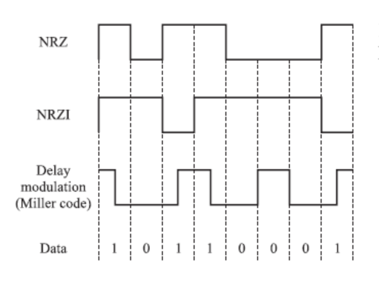
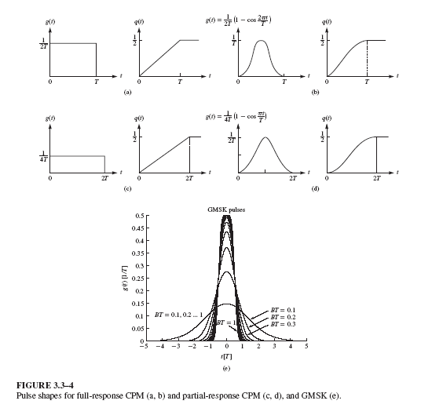
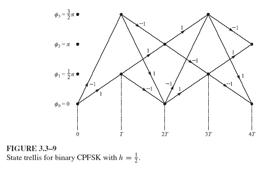
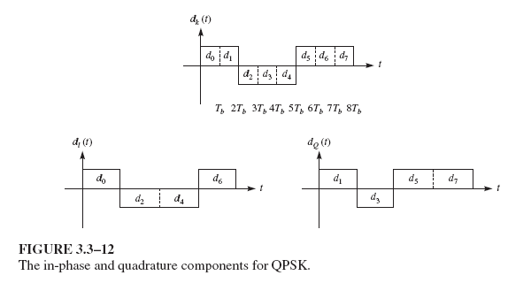

Content
- [FSK](#fsk)
  - [Modulation with Memory](#modulation-with-memory)
  - [CPFSK](#cpfsk)
- [CPM](#cpm)
- [MSK](#msk)
- [Offset QPSK](#offset-qpsk)

---
# FSK
- The FSK signal waveform is 

  > $\begin{aligned}s_m(t) &= \Re \left\{ s_{ml}(t)e^{j2\pi f_c t} \right\}, \quad 1 \leq m \leq M, \ 0 \leq t \leq T \\
  &= \sqrt{\frac{2\mathcal{E}}{T}} \cos(2\pi f_c t + 2\pi m \Delta f t)\end{aligned}$

  where

  > $s_{ml}(t) = \sqrt{\dfrac{2\mathcal{E}}{T}} e^{j2\pi m \Delta f t}, \quad 1 \leq m \leq M \text{ and } 0 \leq t \leq T.$

- FSK signaling is a nonlinear modulation scheme, whereas ASK, PSK, and QAM are linear modulation schemes.

  > $\displaystyle\langle s_{ml}(t), s_{nl}(t) \rangle = \dfrac{2\mathcal{E}}{T} \int_{0}^{T} e^{j2\pi(m-n)\Delta f t} dt$

  and 

  > $\Re \left\{ \langle s_{ml}(t), s_{nl}(t) \rangle \right\} = 2\mathcal{E} \text{sinc}(2T(m - n) \Delta f)$

- FSK is an orthogonal signaling when $\Delta f = k/2T$. The minimum frequency separation $\Delta f$ that guarantees orthogonality is

  > $\Delta f=\dfrac{1}{2T}$

## Modulation with Memory

- Modulation is the mapping between the digital sequence and the signal sequence to be transmitted over the channel.
- Modulation with memory: the mapping depends on the current and the past bits.
- Example: differential encoding.
  > $b_k=a_k ⊕ b_{k−1}$
  
  > 

## CPFSK 
- Why do we need Continuous-Phase FSK (CPFSK)?
  - A conventional FSK signal is generated by shifting the carrier by $m\Delta f, 1 ≤ m ≤ M$. It can be accomplished by having $M$ separate oscillators tuned to the desired frequencies.
  - The abrupt switching from one oscillator output to another results in large spectral side lobes of the signal.
  - To address spectral side lobes, the frequency is changed **continuously**.

- The signal waveform of CPFSK is given by

  > $s(t) = \sqrt{\frac{2E}{T}} \cos \left[ 2\pi f_c t + \phi(t;I) + \phi_0 \right] \\$

  where $\phi(t; \mathbf{I})$ represents the time-varying phase of the carrier, as

  > $\phi(t;I) = 4\pi T_f \int_{-\infty}^{t} d(\tau)d\tau$

  with a PAM signal

  > $d(t) = \sum_{n} I_n g(t - nT).$

  $I_n$ denotes the sequence of amplitudes and $g(t)$ is the rectangular pulse of amplitude of $\dfrac{1}{2T}$ and duration of $T$.

- Although $d(t)$ contains discontinuities, $\phi(t; \mathbf{I})$ is continuous.
- The phase $\phi(t; \mathbf{I})$ in the interval $nT ≤ t ≤ (n + 1)T$ is
  
  > $\begin{aligned}\phi(t;\mathbf{I}) &= 2\pi f_d T \sum_{k=-\infty}^{n-1} I_k + 4\pi f_d T q(t - nT) I_n \\
  > &= \theta_n + 2\pi h I_n q(t - nT)\end{aligned}$

  where $h = 2f_dT$ is the modulation index, $\theta_n=\pi h\displaystyle\sum_{k=-\infty}^{n-1}I_k$ represents the accumulation of all symbols, and

  > $q(t) = \displaystyle\left\{
  > \begin{aligned}
  > &0 & t < 0 \\
  > &\dfrac{t}{2T} & 0 \leq t \leq T \\
  > &\dfrac{1}{2} & t > T
  > \end{aligned}\right.$

# CPM
- For continuous-phase modulation (CPM) signals,

  > $\displaystyle\phi(t;\mathbf{I}) = 2\pi \sum_{k=-\infty}^{n} I_k h_k q(t - kT), \quad nT \leq t < (n + 1)T \\$

  where $\{Ik\}$ is the sequence of $M$-ary symbols selected from $\{±1,±3, · · · ,±(M − 1)\}$, $\{h_k\}$ is a sequence of modulation indices, and $q(t)$ is some normalized waveform shape as

  > $\displaystyle q(t) = \int_{0}^{t} g(\tau)d\tau$

- **Full-response** CPM if $g(t) = 0$ for $t > T$,
- **Partial-response** CPM if $g(t) \ne 0$ for $t > T$.

> 

# MSK
- Minimum-shift keying (MSK) is a special case of binary CPFSK (and CPM) in which $h = \dfrac 1 2$ and $g(t)$ is a rectangular pulse of duration $T$. The phase of the carrier in the interval $nT ≤ t ≤ (n + 1)T$ is 

  > $\displaystyle\phi(t;\mathbf{I}) = \theta_n + \pi I_n\left(\dfrac{t - nT}{2T}\right), \quad nT \leq t < (n + 1)T \\$

  and the MSK signal is

  > $\begin{aligned}s(t)
  > &=A\cos\left[2\pi f_c t + \phi(t;\mathbf{I})\right]\\
  > &=A\cos\left[2\pi\left(f_c + \dfrac{1}{4T}I_n\right)t - \dfrac{1}{2}n \pi I_n + \theta_n\right]
  > \end{aligned}$

  for $nT ≤ t ≤ (n + 1)T$.

- For binary CPFSK, i.e., $I_n = {±1}$, the signal may be written as
  
  > $s_i(t) = A \cos\left[2\pi f_i t + \theta_n + \dfrac{1}{2}n\pi(−1)^{i−1}\right], i = 1, 2$

  where

  > $f_1 = f_c − \dfrac{1}{4T}$
  > 
  > $f_2 = f_c + \dfrac{1}{4T}$

  Note $\Delta f = f_2 − f_1 = 1/2T$, i.e., the minimum frequency separation that is necessary to ensure the orthogonality of signals $s_1(t)$ and $s_2(t)$. This explains why binary CPFSK with $h = \tfrac{1}{2}$ is called the MSK.

> 

# Offset QPSK

- For conventional QPSK signals, the possible $180\degree$ phase change can occur when both I and Q components change simultaneously.
- To prevent $180\degree$ phase changes that cause abrupt changes in the signal, resulting in large spectral side lobes, offset QPSK (OQPSK) is introduced, by misalignment of the I and Q components. The OQPSK signal can be written as

> $\begin{aligned} s(t) &= A \left\{ \left[ \sum_{n=-\infty}^{\infty} I_{2n}g(t - 2nT) \right] \cos(2\pi f_c t) \right. \\ &+ \left. \left[ \sum_{n=-\infty}^{\infty} I_{2n+1}g(t - 2nT - T) \right] \sin(2\pi f_c t) \right\} \end{aligned}$

> 

---
[Back: Digital Modulation](2.%20TELE4653%20Digital%20Modulation.md)

[Next: Synchronization](4.%20TELE4653%20Synchronization.md)