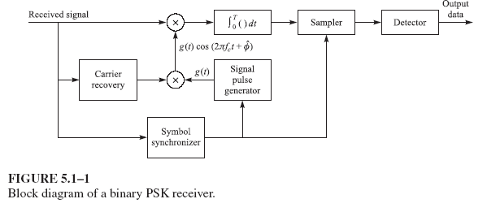
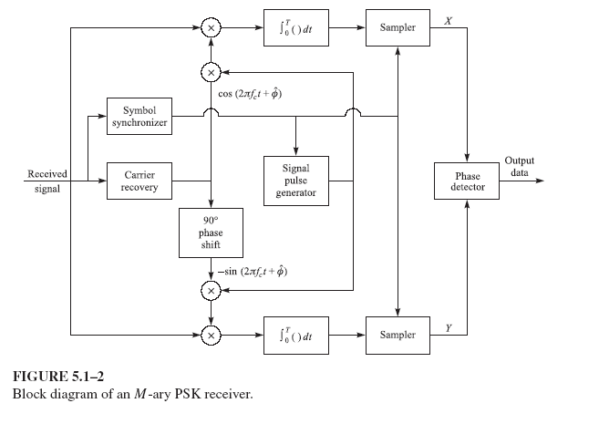
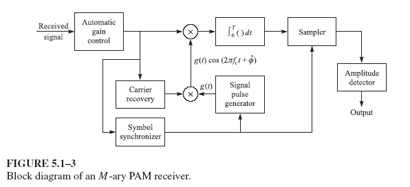
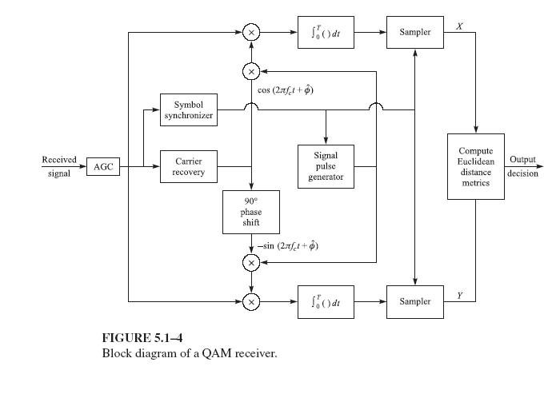
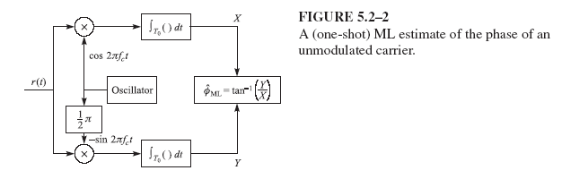
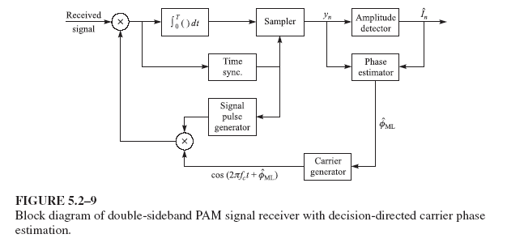
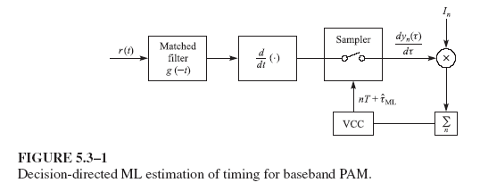

Content

---
# Carrier Phase Estimation
## Signal Model
- The received signal may be expressed as

  > $r(t)=\Re\left\{ [s_l(t-\tau) e^{j\phi} + z(t)] e^{j 2\pi f_c t} \right\}$

  where the carrier phase $\phi$, dut to the propagation delay $\tau$ is $\phi=-2\pi f_c t$

  > $r(t) = s(t;\phi,\tau) + n(t) = s(t;\theta) + n(t)$

  where $\theta$ denotes the parameter vector $\{\phi,\tau\}$

- By performing an orthonormal expansion of $r(t)$ using $N$ orthonormal functions $\{\phi n(t)\}$, we may represent $r(t)$ by the vector of coefficients $(r_1 r_2 \cdots r_N) \triangleq r.$

## ML Estimation
- Since the noise $n(t)$ is white and zero-mean Gaussian, the joint PDF $p(\mathbf{r}|\theta)$ may be expressed as

  > $\displaystyle p(\mathbf{r}|\theta) = \left( \frac{1}{\sqrt{2\pi\sigma}} \right)^N \exp\left( -\sum_{n=1}^{N} \frac{ [r_n - s_n(\theta)]^2 }{2\sigma^2} \right)$

  where $r_n = \int_{T_0}{r(t)\phi(t)dt}$ and $s_n(\theta) = \int_{T_0}s(t;\theta)\phi_n(t)dt$ where $T_0$ is the integration interval. 
 
- The maximization of $p(\mathbf{r}|\theta)$ is equivalent to the maximization of the likelihood function

  > $\displaystyle \Lambda(\theta) = \exp\left( -\frac{1}{N_0} \int_{T_0} [r(t) - s(t;\theta)]^2 dt \right)$

## Receiver Structure

  | Receivers      | Binary PSK receiver                                       | M-ary PSK receiver                                      | M-ary PAM receiver                                      | QAM receiver                                |
  | -------------- | --------------------------------------------------------- | ------------------------------------------------------- | ------------------------------------------------------- | ------------------------------------------- |
  | Block Diagrams |  |  |  |  |

## Carrier Phase Estimation
- Suppose we have an AM signal of the form

  > $s(t) = A(t) \cos(2\pi f_c t + \phi)$

- If we demodulate the signal by multiplying s(t) with the carrier reference

  > $c(t) = \cos(2\pi f_c t + \hat{\phi})$

  and pass $c(t)s(t)$ through a LP filter, we obtain

  > $y(t) = \dfrac{1}{2} A(t) \cos(\phi - \hat{\phi})$

- A phase error of $30\degree$ results in a power loss of $1.25$ dB.

- The effect of carrier phase errors in QAM and $M$-ary PSK is much more severe. The QAM and $M$-PSK signals may be expressed as

  > $s(t) = A(t) \cos(2\pi f_c t + \phi) - B(t) \sin(2\pi f_c t + \phi)$

- The signal is demodulated by two quadrature carriers $c_i(t) = \cos(2\pi f_c t + \hat{\phi})$ and $c_q(t) = −\sin(2\pi f_ct + \hat{\phi})$. Multiplication of $s(t)$ with $c_i(t)$ and $c_q(t)$ followed by LP filtering, respectively, yields

  > $\displaystyle \begin{aligned}
  > y_I(t) &= \frac{1}{2} A(t) \cos(\phi - \hat{\phi}) - \frac{1}{2} B(t) \sin(\phi - \hat{\phi}) \\
  > y_Q(t) &= \frac{1}{2} B(t) \cos(\phi - \hat{\phi}) + \frac{1}{2} A(t) \sin(\phi - \hat{\phi}).
  > \end{aligned}$

## ML Phase Estimation
- Assume $\tau = 0$. The likelihood function becomes

  > $\begin{aligned}\Lambda(\phi) &= \exp \left( -\frac{1}{N_0} \int_{T_0} \left[ r(t) - s(t;\phi) \right]^2 dt \right) \\
  > &= \exp \left( -\frac{1}{N_0} \int_{T_0} r^2(t) dt + \frac{2}{N_0} \int_{T_0} r(t)s(t;\phi) dt - \frac{1}{N_0} \int_{T_0} s^2(t;\phi) dt \right)\end{aligned}$

- The log-likelihood function is 

  > $\Lambda_L(\phi) = \frac{2}{N_0} \int_{T_0} r(t)s(t;\phi) dt$

### An Example
- Consider the received signal as $r(t) = Acos(2\pi f_c t + \phi) + n(t)$, where $\phi$ is the unknown phase and can be estimated by maximizing

  > $\displaystyle\Lambda_L(\phi) = \frac{2A}{N_0} \int_{T_0} r(t) \cos(2\pi f_c t + \phi) dt \\$

- A necessary condition for a maximum is that $\dfrac{d\Delta_L(\phi)}{d\phi} = 0$, which

  > $\displaystyle\int_{T_0} r(t) \sin(2\pi f_c t + \hat{\phi}_{ML}) dt = 0 \\$

  or, equivalently,

  > $\displaystyle\hat{\phi}_{ML} = -\tan^{-1} \left( \dfrac{\int_{T_0} r(t) \sin(2\pi f_c t) dt}{\int_{T_0} r(t) \cos(2\pi f_c t) dt} \right)$

> 

# Decision-Directed Loops
- A problem may arise in maximizing log-likelihood function when the signal $s(t;\phi)$ carries the information sequence $\{I_n\}$. In decision-directed parameter estimation, we assume that $\{I_n\}$ has been estimated.
- Consider linear modulation for which the received equivalent LP signal may be expressed as

  > $\displaystyle r_l(t) = e^{-j\phi} \sum_{n} I_n g(t - nT) + z(t) = s_l(t) e^{-j\phi} + z(t)$

where $s_l(t)$ is a known signal if $\{I_n\}$ is assumed known. The log-likelihood function is

  > $\displaystyle\Lambda_L(\phi) = \Re \left\{ \frac{1}{N_0} \int_{T_0} r_l(t) s_l^*(t) dt \right\} e^{j\phi}$

- If we substitute $s_l(t) = \sum_n I_n g(t − nT)$ into equation above and assume that the observation interval $T_0 = KT$, where $K$ is a positive integer, we obtain

  > $\displaystyle\Lambda_L(\phi) = \Re \left\{ e^{j\phi} \left( \frac{1}{N_0} \sum_{n=0}^{K-1} I_n^* y_n \right) \right\}$

  where, by definition, $y_n = \int_{nT}^{(n+1)T}r_l(t)g^*(t − nT)dt$. The ML estimate of $\phi$ is easily found (by differentiating the log-likelihood) as

  > $\displaystyle \hat{\phi}_{ML} = -\tan^{-1} \left( \frac{\Im \left\{\displaystyle \sum_{n=0}^{K-1} I_n^* y_n \right\}}{\Re \left\{\displaystyle \sum_{n=0}^{K-1} I_n^* y_n \right\}} \right)$
 
> 

# Timing Estimation
- If the signal is a basedband PAM, represented as

  > $r(t) = s(t; \tau) + n(t)$

  where 

  > $\displaystyle s(t; \tau) = \sum_{n} I_n g(t - nT - \tau)$

- The log-likelihood function is

  > $\begin{aligned}\Lambda_L(\tau) &= C_L \int_{T_0} r(t) s(t; \tau) dt \\
  > & = C_L \sum_{n} I_n y_n(\tau)\end{aligned}$

  where 

  > $\displaystyle y_n(\tau) = \int_{T_0} r(t) g(t - nT - \tau) dt$

- To get the estimate of $\tau$, we take the differentiation of $\Delta_L(\tau)$ and
obtain

  > $\displaystyle\dfrac{d\Lambda_L(\tau)}{d\tau} = \sum_{n} I_n \frac{d}{d\tau} y_n(\tau) = 0.$

> 

---
[Back: Digital Modulation (Cont')](3.%20TELE4653%20Digital%20Modulation%20(Cont').md)

[Next: Block Coding](5.%20TELE4653%20Block%20Coding.md)