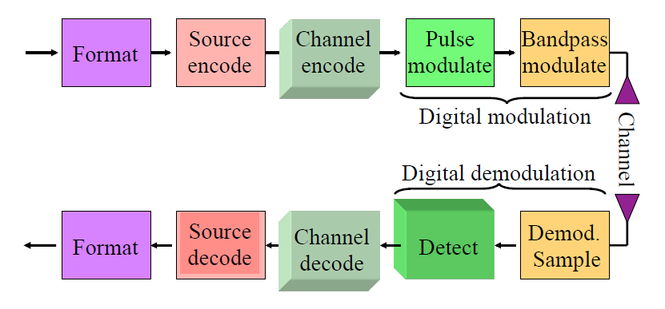
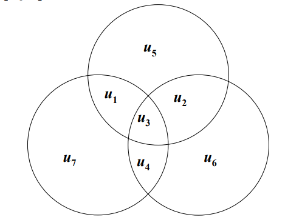
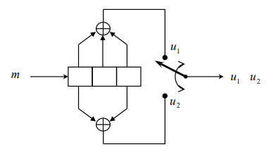
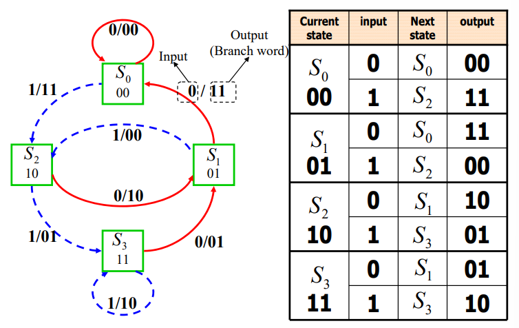
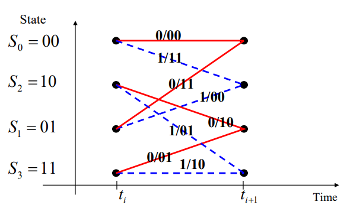
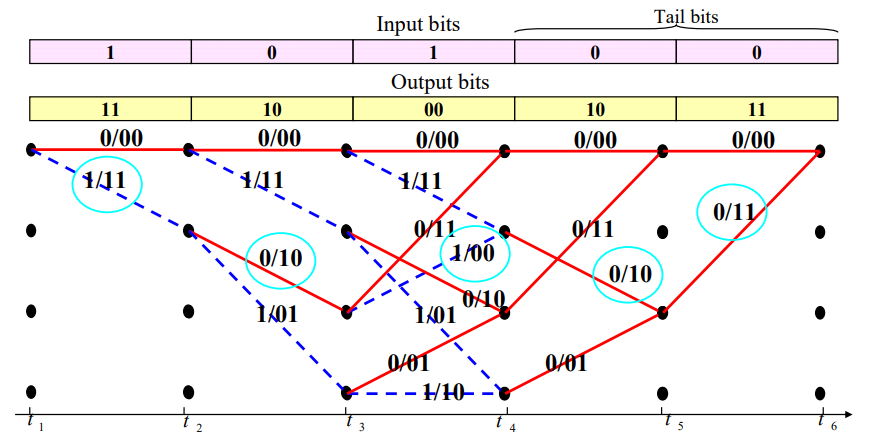

Content
- [Repetition Codes](#repetition-codes)
- [Linear block codes](#linear-block-codes)
- [Hamming Codes (n,m)](#hamming-codes-nm)
- [Convolutional codes](#convolutional-codes)
  - [State diagram](#state-diagram)
  - [Trellis](#trellis)
  - [The Viterbi Decoding Algorithm](#the-viterbi-decoding-algorithm)

---
- Block diagram of a DCS
  > 

- Channel coding: 
  - Transforming signals to improve communicaFons performance by increasing the robustness against channel impairments (noise, interference, fading, ..) 
  - Waveform coding: Transforming waveforms to better waveforms 
  - Structured sequences: Transforming data sequences into beKer sequences, having structured redundancy. 
    - “Better” in the sense of making the decision process less subject to errors.

# Repetition Codes
- Transmit the message 
  - {0 0 1 0}
- Encoder $R_n$: Repeat every bit n times
  - R3 : {000 000 111 000}
- Receive bits 
  - {000 100 110 000}
- Decoder: Majority-Vote
- The probability of error of Rn is
  > $\displaystyle P_n=\sum_{j=(n+1)/2}^n{\left(\begin{matrix}n\\j\end{matrix}\right)}f^j(1-f)^{n-j}$

# Linear block codes
- $k$ bits Data block $\to$ Channel encoder $\to$ $n$ bits codeword
- Redundant bits: $n-k$
- Code rate: $R_c=\dfrac{k}{n}$
- Encoding in $(n,k)$ block code
  > $U=mG\\$ 
  > $(u_1,u_2,\cdots,u_n)=(m_1,m_2,\cdots,m_n)\cdot\begin{bmatrix}V_1\\V_2\\\vdots\\V_k\end{bmatrix}$
  - The rows of G, are linearly independent
- Systematic block code (n,k)
  - $G=[P|I_k]$
  - $I_k=k\times k\text{ identity matrix}$
  - $P=k\times(n-k) \text{ matrix}$
- For any linear code we can find a matrix H
  > $GH^T=0\\$
  > $H=[I_{n-k}|P^T]$
  - Receive data $r=U+e$
  - Error pattern or vector: $e$
  - Syndrome testing
    > $S=rH^T=eH^T$
        
# Hamming Codes (n,m)
- Code length: $n=2^m-1$
- Number of information bits: $k=2^m-m-1$
- Number of parity bits: $n-k=m$
- Error correction capability: $t=1$
  > $G=[I_{k\times k}|P]$
- Representation of encoding for Hamming code (7,4)
  > 
  
        
# Convolutional codes
- Coding rate: $R_c=k/n$
- Constraint length $K$
- Effective code rate: 
  - L is the number of data bits 
    > $R_{eff}=\dfrac L {n(L+K-1)}<R_c=\dfrac 1 n$
- Rate 1/2 Convolutional encoder with $g_1=(111),\ g_2=(101)$
  > 
## State diagram
- A finite-state machine only encounters a finite number of states.
- State of a machine: the smallest amount of information that, together with a current input to the machine, can predict the output of the machine.
- In a Convolutional encoder, the state is represented by the content of the memory.
- Hence, there are $2^{K-1}$ states.
- A state diagram is a way to represent the encoder. 
- A state diagram contains all the states and all possible transitions between them.
- Only two transitions initiating from a state
- Only two transitions ending up in a state
- An example 
  > 
## Trellis
- Trellis diagram is an extension of the state diagram that shows the passage of time.
  > 
  > 
## The Viterbi Decoding Algorithm
- The Viterbi algorithm performs Maximum Likelihood decoding.
- It finds a path through trellis with the largest metric (maximum correlation or minimum distance). 
  - It processes the demodulator outputs in an iterative manner.
  - At each step in the trellis, it compares the metric of all paths entering each state, and keeps only the path with the largest metric, called the survivor, together with its metric.
  - It proceeds in the trellis by eliminating the least likely paths.
- It reduces the decoding complexity to $L2^{K-1}$
- Viterbi Algorithm
  - Start at state zero at time . Follow the surviving branches backwards through the trellis. The path thus defined is unique and correspond to the ML codeword.
  - Label all the branches with the branch metric (Hamming distance)
  > 

---
[Back: Synchronization](4.%20TELE4653%20Synchronization.md)

[Next: Detection Theory](6.%20TELE4653%20Detection%20Theory.md)