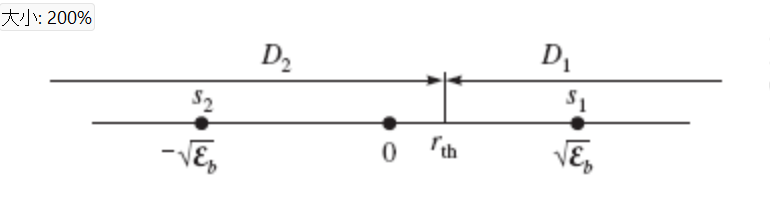
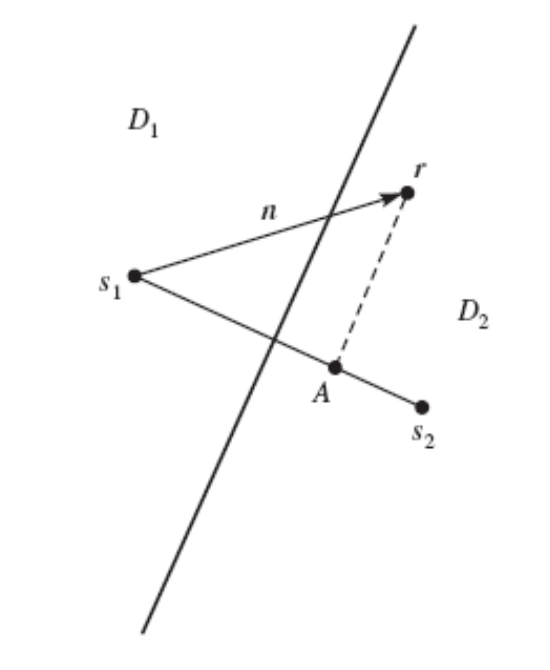
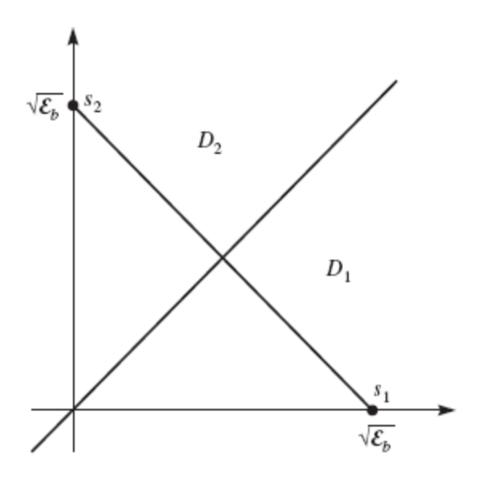

Content
- [MAP and ML Receivers](#map-and-ml-receivers)

---
# MAP and ML Receivers
- Goal is to design an optimal detector that minimizes the error probability. In other words,

  > $\begin{aligned}\hat{m} =& g_{\text{opt}}(\mathbf{r}) = \arg \max_{1 \leq m \leq M} P[m|\mathbf{r}]\\
  > &= \arg \max_{1 \leq m \leq M} P[\mathbf{s}_m|\mathbf{r}]\end{aligned}$

- MAP receiver:

  > $\hat{m} = \arg \max_{1 \leq m \leq M} \frac{P_m p(\mathbf{r}|\mathbf{s}_m)}{p(\mathbf{r})}$

- ML receiver:

  > $\hat{m} = \arg \max_{1 \leq m \leq M} p(\mathbf{r}|\mathbf{s}_m)$

# Decision Region
- Any detector partitions the output space into $M$ regions denoted by $D_1,D_2, \cdots,D_M$ such that if $r ∈ D_m$, then $\hat{m} = g(r) = m$, i.e., the detector makes a decision in favor of $m$. The region $D_m$, $1 ≤ m ≤ M$, is called the decision region for message $m$.
- For a MAP detector we have

  > $D_m = \left\{ \mathbf{r} \in \R^N : P[m|\mathbf{r}] > P[m'|\mathbf{r}], \forall 1 \le m' \le M \text{ and } m' \ne m \right\}$

## The Error Probability
- When $s_m$ is sent, an error occurs when the received $\mathbf{r}$ is not in $D_m$

  > $\displaystyle\begin{aligned}P_e
  > &= \sum_{m=1}^{M}{P_m P[\mathbf{r} \notin D_m | \mathbf{s}_m]}\\
  > &= \sum_{m=1}^{M}{P_m P_{e|m}}
  > \end{aligned}$

  where 

  > $\displaystyle\begin{aligned}P_{e|m} 
  > &= \int_{D_m^c}{p(\mathbf{r}|\mathbf{s}_m)dr}\\
  > &= \sum_{1≤m'≤M,m'≠m}^{M} \int_{D_{m'}}{p(\mathbf{r}|\mathbf{s}_m)dr}
  > \end{aligned}$

## Optimum Detection in AWGN
- The MAP detector for AWGN channel is given by

  > $\displaystyle \begin{aligned} \hat{m} 
  &= \arg \max [{P_m} p(\mathbf{r}|\mathbf{s}_m)]\\
  &= \arg \max [{P_m} p_\mathbf{n}(\mathbf{r} - \mathbf{s}_m)]\\
  &= \arg \max \left[{P_m} \left( \frac{1}{\sqrt{\pi N_0}} \right)^N e^{-\frac{\|\mathbf{r}-\mathbf{s}_m\|^2}{N_0}} \right]\\
  &= \arg \max \left[\ln{P_m} - \frac{\|\mathbf{r} - \mathbf{s}_m \|^2}{N_0} \right]\\
  &= \arg \max \left[\frac{N_0}{2} \ln{P_m} - \frac{\|r - s_m\|^2}{2}\right]\\
  &= \arg \max \left[\frac{N_0}{2} \ln{P_m} - \frac{1}{2} \mathcal{E}_m + \mathbf{r} \cdot \mathbf{s}_m \right]
  \end{aligned}$

- If the signals are equiprobable, then 

  > $$

  - Nearest-neighbor detector 

- If the signals are equiprobable and have equal energy 

  > $$

# The decision regions for different signals 
  | Signals         | Antipodal                                             | Binary Equiprobable                                                       | Equiprobable Binary Orthogonal                                                                  |
  | --------------- | ----------------------------------------------------- | ------------------------------------------------------------------------- | ----------------------------------------------------------------------------------------------- |
  | **Decision Region** |  |  |  |

## Error Probability
### Error Probability for Binary Antipodal Signaling
- $s_1 = s(t)$ and $s_2(t) = −s(t)$. The probabilities of messages 1 and 2 are $p$ and $1 − p$, respectively. Assume each signal has the energy $\mathcal{E}_b$.
- The decision region $D_1$ is given as

  > $\displaystyle\begin{aligned} D_1
  > &= \left\{ r : r \sqrt{\mathcal{E}_b} + \frac{N_0}{2} \ln{p} - \frac{1}{2} \mathcal{E}_b > -r \sqrt{\mathcal{E}_b} + \frac{N_0}{2} \ln{1-p} - \frac{1}{2} \mathcal{E}_b\right\}\\
  > &= \left\{ r : r > \frac{N_0}{4\sqrt{\mathcal{E}_b}} \ln{\frac{1-p}{p}} \right\}\\
  > &= \left\{ r : r > r_{th}\right\}
  > \end{aligned}$

  where $r_{th} = \frac{N_0}{4\sqrt{\mathcal{E}_b}} \ln{\frac{1-p}{p}}$

- The error probability is 
  
  > $\displaystyle\begin{aligned}P_e 
  > &= p \int_{D_2}{p\left(r|s=\sqrt{\mathcal{E}_b}\right)dr} + (1-p)\int_{D_1}{p\left(r|s=-\sqrt{\mathcal{E}_b}\right)dr}\\
  > &= pP\left[\mathcal{N}\left(\sqrt{\mathcal{E}_b},\frac{N_0}{2}\right)>r_{th}\right] + (1-p)P\left[\mathcal{N}\left(-\sqrt{\mathcal{E}_b},\frac{N_0}{2}\right)>r_{th}\right]\\
  > &= pQ\left(\frac{\sqrt{\mathcal{E}_b} - r_{th}}{\sqrt{\frac{N_0}{2}}}\right) + (1-p)Q\left(\frac{\sqrt{\mathcal{E}_b} + r_{th}}{\sqrt{\frac{N_0}{2}}}\right)
  > \end{aligned}$

  When $p=\frac{1}{2}$, $r_{th}=0$. Then 

    > $P_e=Q\left(\sqrt{\dfrac{2\mathcal{E}_b}{N_0}}\right)$

### Error Probability for Equiprobable Binary Signaling
- Since the signals are equiprobable, the two decision regions are separated by the perpendicular bisector of the line connecting $s_1$ and $s_2$.
- Let $d_{12} = \|\mathbf{s}_2 − \mathbf{s}_1\|$. Therefore, the error probability is

  > $P_b = P \left[ \dfrac{\mathbf{n}\cdot(\mathbf{s}_2 − \mathbf{s}_1)}{d_{12}} > \dfrac{d_{12}}{2} \right]$

  - Note that $\mathbf{n}\cdot(\mathbf{s}_2 − \mathbf{s}_1)$ is a zero-mean Gaussian r.v. with variance $\frac{d_{12}^2N_0}{2}$. Hence,

  > $P_b = Q\left(\sqrt{\dfrac{d_{12}^2}{2N_0}}\right)$

### Error Probability for Binary Orthogonal Signaling
- The signal vector representation is $\mathbf{s}_1 = (\sqrt{\mathcal{E}_b}, 0)$ and $\mathbf{s}_2 = (0, \sqrt{\mathcal{E}_b})$.
- It is clear that $d = \sqrt{2\mathcal{E}_b}$ and

  > $P_b = Q\left(\sqrt{\dfrac{d^2}{2N_0}}\right) = Q\left(\sqrt{\dfrac{\mathcal{E}_b}{N_0}}\right)$

Usually, $\gamma_b = \frac{\mathcal{E}_b}{N_0}$ is referred to as the SNR per bit.

---
[Back: Block Coding](5.%20TELE4653%20Block%20Coding.md)

[Next: Detection Theory (cont' 1)](7.%20TELE4653%20Detection%20Theory%20(cont'%201).md)