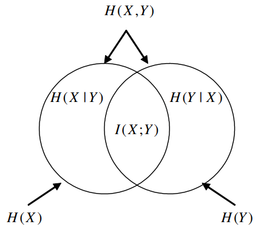

Content
- [Entropy, Joint Entropy, Conditional Entropy](#entropy-joint-entropy-conditional-entropy)
- [Relative Entropy, Mutual Information, Venn Diagram](#relative-entropy-mutual-information-venn-diagram)
- [Chain Rules](#chain-rules)
- [Information Inequality](#information-inequality)

---

# Entropy, Joint Entropy, Conditional Entropy

- Entropy
  
  > $H(X)=-\sum_{x\in X}p(x)\log{p(x)}=\sum_{x\in X}p(x)\log{\frac{1}{p(x)}}$
  
  - If $E[\cdot]$ is the expectation, $H(X)=E[\log\tfrac{1}{p(x)}]$
  
- Joint Entropy
  
  > $H(X,Y)=-\sum_{x\in X}\sum_{y\in Y}p(x,y)\log p(x,y)$
  
- Conditional Entropy
  
  > $H(Y|X)=-\sum_{x\in X}\sum_{y\in Y}p(x,y)\log p(y|x)\\$
  > $H(X|Y)\neq H(Y|X)\\$
  > $H(X|X)=0$
  
- Chain Rule
  
  > $H(X,Y)=H(X)+H(Y|X)\\$
  > $H(X,Y|Z)=H(X|Z)+H(Y|X,Z)$
  

# Relative Entropy, Mutual Information, Venn Diagram

- Relative Entropy or Kullback Leibler distance
  
  > $D(p||q)=\sum_{x\in X}p(x)\log \dfrac{p(x)}{q(x)}\geq 0$
  
- Mutual Information
  
  Consider two random variables X and Y with a **joint probability mass function** $p(x, y)$ and **marginal probability mass functions** $p(x)$ and $p(y)$. The mutual information $I(X; Y)$ is defined as
  
  > $I(X;Y)=\sum_{x\in X}\sum_{y\in Y}{p(x,y)\log{\dfrac{p(x,y)}{p(x)p(y)}}}\geq0$
  
- Relationship between I and H
  
  > $I(X;Y)=H(X)-H(X|Y)\\$
  > $I(X;Y)=H(Y)-H(Y|X)$
  
- Venn Diagram of I and H
  
  
  
# Chain Rules

- Chain Rule for Entropy
  
  > $H(X_1,X_2,...,X_n)=\sum_{i=1}^{n}{H(X_i|X_{i-1},...,X_1)}\\$
  > $p(x_1,...,x_n)=\prod_{i=1}^n{p(x_i|x_{i-1},...,x_1)}$
  
- Chain Rule for Information
  
  > $I(X_1,X_2,...,X_n;Y)=\sum_{i=1}^{n}I(X_i;Y|X_{i-1},...,X_1)$
  

# Information Inequality

- Let p(x), q(x), x ∈ X, be two probability mass functions. Then
  
  > $D(p||q)\geq0$
  
  with equality if and only if 
  
  > $p(x)=q(x),\ \text{for all }x$
  
- Let $|\mathcal{X}|$ denote the number of elements in the range of $X$. Then
  
  > $H(X)\leq\log|\mathcal{X}|$
  
  with equality if and only if $X$ has a uniform distribution over $\mathcal{X}$.
  
- (Independence bound on entropy): 
Let $X_1, X_2, · · · , X_n$ be drawn according to $p(x_1, x_2, · · · , x_n)$. Then
  
  $H(X_1,X_2,...,X_n)\leq\sum_{i=1}^{n}H(X_i)$
  
  with equality if and only if the $X_i$ are independent.

---
[Back: Detection Theory (cont' 2)](8.%20TELE4653%20Detection%20Theory%20(cont'%202).md)

[Next: Course Overview](0.%20TELE4653%20Digital%20Modulation%20&%20Coding.md)