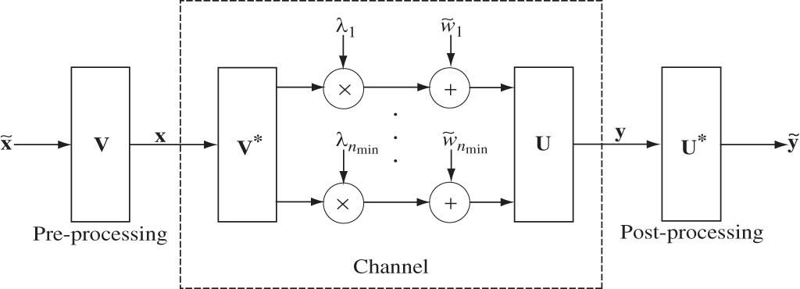
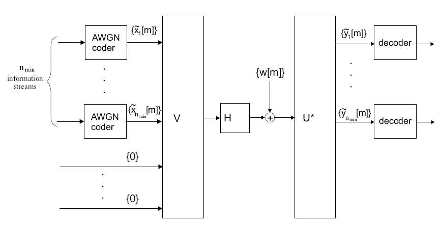
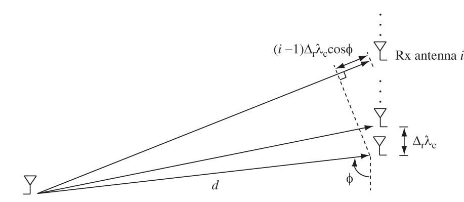
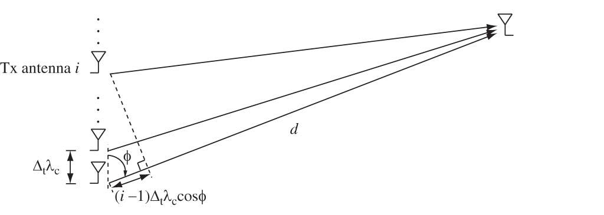
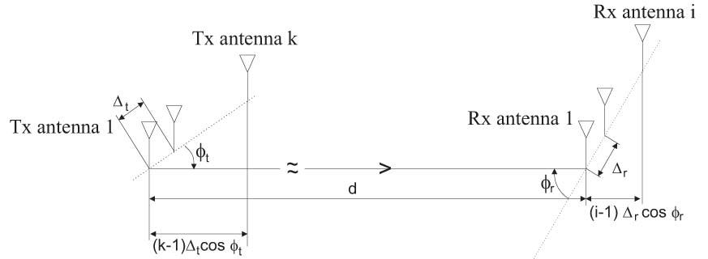
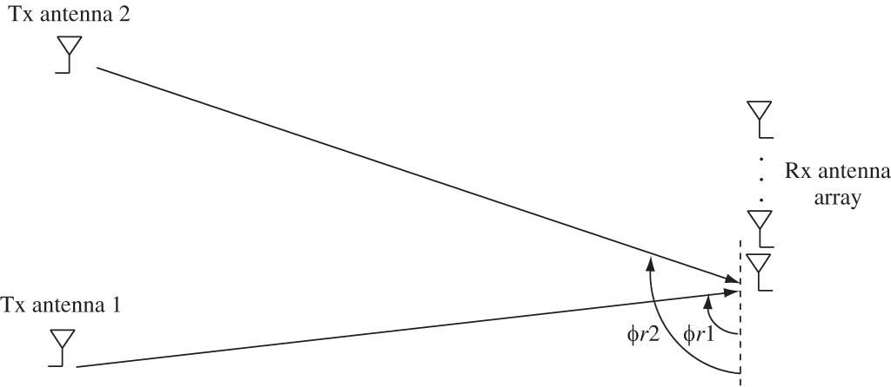
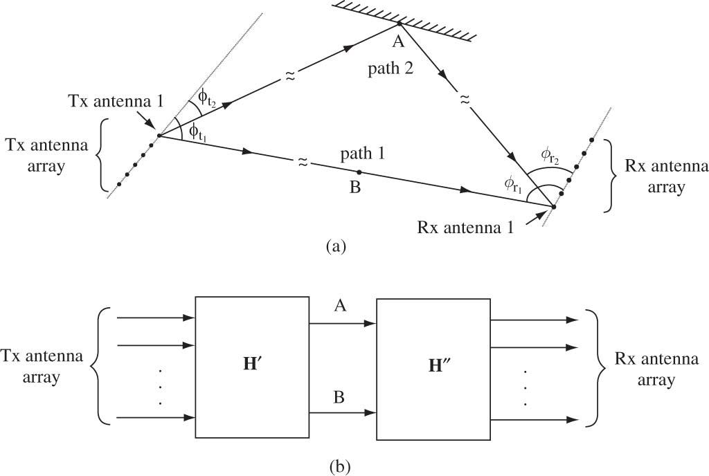

Content 
- [Main Story](#main-story)
- [Capacity of AWGN Channel](#capacity-of-awgn-channel)
- [MIMO Capacity via SVD](#mimo-capacity-via-svd)
  - [Spatial Parallel Channel](#spatial-parallel-channel)
  - [Rank and Condition Number](#rank-and-condition-number)
  - [Example 1: SIMO, Line-of-sight](#example-1-simo-line-of-sight)
  - [Example 2: MISO, Line-of-Sight](#example-2-miso-line-of-sight)
  - [Example 3: MIMO, Line-of-Sight](#example-3-mimo-line-of-sight)
    - [Beamforming Patterns](#beamforming-patterns)
  - [Example 4: MIMO, Tx Antennas Apart](#example-4-mimo-tx-antennas-apart)
  - [Example 5: Two-Path MIMO](#example-5-two-path-mimo)
- [MIMO Channel Modeling](#mimo-channel-modeling)
  - [MIMO Modeling in Angular Domain](#mimo-modeling-in-angular-domain)
  - [Spatial-Angular Domain Transformation](#spatial-angular-domain-transformation)
- [I.I.D. Rayleigh Model](#iid-rayleigh-model)
  - [Clustered Model](#clustered-model)
  - [Spatial Channel Resource](#spatial-channel-resource)
  - [Dependency on Carrier Frequency](#dependency-on-carrier-frequency)
  - [Diversity and DoF](#diversity-and-dof)
- [Conclusions](#conclusions)

---

# Main Story
- So far we have only considered single-input multi-output (SIMO) and multi-input single-output (MISO) channels.
- They provide diversity and power gains but no degree-of-freedom (d.o.f.) gain.
- D.o.f gain is most useful in the high SNR regime.
- MIMO channels have a potential to provide d.o.f gain.
- We would like to understand how the d.o.f gain depends on the physical environment and comes up with statistical models that capture the properties succinctly.
- We start with deterministic models and then progress to statistical ones.
# Capacity of AWGN Channel
- Capacity of AWGN channel 
  > $\begin{aligned}C_{\text{awgn}} &= \log(1+\text{SNR})&&\text{bits/s/Hz}\\&=W\log(1+\text{SNR})&&\text{bits/s}\end{aligned}$

- If average transmit power constraint is $\bar{P}$ watts and noise power spectral density (psd) is $N_0$ watts/Hz,
  > $C_{\text{awgn}} = W\log\left(1+\dfrac{\bar{P}}{N_0W}\right)\qquad\text{bits/s}$

- [View more information](8.%20TELE9753%20Capacity%20of%20Wireless%20Channel.md#capacity-of-awgn-channel)

# MIMO Capacity via SVD
- Narrowband MIMO channel:
  > $\bf y=Hx+w$
- $\bf H$ is $n_r\times n_t$, fixed channel matrix.
  - Singular value decomposition (SVD):
    > $\bf H = U \Lambda V^*\qquad HH^*=U\Lambda\Lambda^tU^*$
- $\bf U,\ V$ are complex orthogonal matrices and $\bf \Lambda$ real diagonal (singular values).
  > $\mathbf{H}=\displaystyle\sum_{i=1}^{n_{\min}}\lambda_i\mathbf{u}_i\mathbf{v}_i^*$

## Spatial Parallel Channel
> $\bf y=Hx+w\qquad$
> $\begin{aligned}
> \mathbf{x} &\coloneqq \mathbf{V}^* \mathbf{x}, \\
> \mathbf{y} &= \mathbf{U}^* \mathbf{y}, \\
> \mathbf{w} &= \mathbf{U}^* \mathbf{w},
> \end{aligned}\qquad$
> $\bf \~y=\Lambda\~x+\~w$
>
> 
- Capacity is achieved by waterfilling over the eigenmodes of H. (Analogy to frequency-selective channels.)
> $\tilde{y}_i = \lambda_i \tilde{x}_i + \tilde{w}_i, \quad i = 1, 2, \ldots, n_{\text{min}}$
> 
> $C = \displaystyle\sum_{i=1}^{n_{\text{min}}} \log \left( 1 + \frac{P_i^* \lambda_i^2}{N_0} \right) \qquad\text{bits/s/Hz}$
> 
> $P_i^* = \left( \mu - \frac{N_0}{\lambda_i^2} \right)^+$
> 
> 
## Rank and Condition Number
- At high SNR, equal power allocation is optimal:
  > $C \approx \displaystyle\sum_{i=1}^{k} \log \left( 1 + \frac{P \lambda_i^2}{k N_0} \right) \approx k \log \text{SNR} + \sum_{i=1}^{k} \log \left( \frac{\lambda_i^2}{k} \right)$
  - where k is the number of nonzero i2 's, i.e. the rank of H.
- It is also called the spatial degrees of freedom (Spatial multiplexing gain) per second per Hertz.
- With Jensen’s inequality
  > $\displaystyle \frac{1}{k} \sum_{i=1}^{k} \log \left( 1 + \frac{P \lambda_i^2}{k N_0} \right) \leq \log \left( 1 + \frac{P}{k N_0} \left(\dfrac{1}{k} \sum_{i=1}^{k} \lambda_i^2 \right) \right)$
  > 
  > $\displaystyle \sum_{i=1}^{k} \lambda_i^2 = \text{Tr}[\mathbf{HH}^*] = \sum_{i,j} |h_{ij}|^2$
- The capacity is maximized when the eigenvalues are equal.
- The closer the condition number:
  $\dfrac{\max_i \lambda_i}{\min_i \lambda_i}$
  - to 1 (i.e., the matrix is well-conditioned), the higher the capacity.
## Example 1: SIMO, Line-of-sight
> 
> $y=hx+w$
> $h_i(\tau) = a\delta(\tau - \frac{d_i}{c}) \\
> h_i = a \exp \left( -\dfrac{j 2\pi f_c d_i}{c} \right) = a \exp \left( -\dfrac{j 2\pi d_i}{\lambda_c} \right) \\
> d_i \approx d + (i - 1)\Delta_r \lambda_c \cos \phi$

- $\bf h$ is along the **receive spatial signature** in the direction,
- $\Omega:=\cos\phi$: directional cosine with respect to the receive antenna array.
- **Spatial signature**:
  > $\mathbf{h} = [h_1, \ldots, h_{n_r}]^t \\
  > \mathbf{h} = a \exp \left( -\dfrac{j 2\pi d}{\lambda_c} \right)
  > \begin{bmatrix}
  > 1 \\
  > \exp(-j 2\pi \Delta_r \Omega) \\
  > \exp(-j 4\pi \Delta_r \Omega) \\
  > \vdots \\
  > \exp \left(-j 2\pi (n_r - 1) \Delta_r \Omega \right)
  > \end{bmatrix}$
- The signal received at consecutive antenna differ in phase by $2\pi\Delta_i\Omega$
- The unit receive spatial signature in the direction, $\Omega:=\cos\phi$
  > $e_r(\Omega) \coloneqq \dfrac{1}{\sqrt{n_r}}
  > \begin{bmatrix}
  > \exp(-j2\pi \Delta_r \Omega) \\
  > \exp(-j2\pi 2\Delta_r \Omega) \\
  > \vdots \\
  > \exp \left(-j2\pi (n_r - 1) \Delta_r \Omega\right)
  > \end{bmatrix}$

- With MRC, $n_r$ – fold power gain.
  > $C = \log \left( 1 + \dfrac{P ||\mathbf{h}||^2}{N_0} \right) = \log \left( 1 + \dfrac{P a^2 n_r}{N_0} \right) \text{ bits/s/Hz}$

## Example 2: MISO, Line-of-Sight
> 
> $\bf y=h*x+w$
- $\bf h$ is along the transmit spatial signature in the direction $\Omega:=\cos\phi$
  > $e_r(\Omega) \coloneqq \dfrac{1}{\sqrt{n_r}}
  > \begin{bmatrix}
  > \exp(-j2\pi \Delta_r \Omega) \\
  > \exp(-j2\pi 2\Delta_r \Omega) \\
  > \vdots \\
  > \exp \left(-j2\pi (n_r - 1) \Delta_r \Omega\right)
  > \end{bmatrix}$

- $n_t$ – fold power gain.

## Example 3: MIMO, Line-of-Sight
> 

> $h_{ik} = a \exp \left( -\dfrac{j 2\pi d_{ik}}{\lambda_c} \right)$
> 
> $d_{ik} = d + (i - 1) \Delta_r \lambda_c \cos \phi_r - (k - 1) \Delta_t \lambda_c \cos \phi_t$
> 
> $h_{ik} = a \exp \left( \dfrac{j 2\pi d}{\lambda_c} \right) \exp \left( j2\pi (k - 1) \Delta_t \Omega \right) \exp \left( -j2\pi (i - 1) \Delta_r \Omega \right)$
> 
> $\mathbf{H} = \mathbf{G} \cdot e_r (\Omega_r) e_t (\Omega_t)^*$
- $n_r,n_t$ - fold power gain 
- Rank 1, only one degree of freedom. No spatial multiplexing gain
### Beamforming Patterns
- The receive beamforming pattern associated with $\mathbf{e_r}(\Omega)$:
  > $B_r(\Omega):=|\mathbf{e_r}(\Omega)^*\mathbf{e_r}(\Omega)|$

- $L_r$ is the length of the antenna array, normalized to the carrier wavelength.
Beamforming pattern gives the antenna gain in different directions

## Example 4: MIMO, Tx Antennas Apart
> 
> $\bf{H=[h_1,h_2]}$

- $\bf{h_i}$ is the receive spatial signature from Tx antenna $i$ along direction $\Omega_i = \cos \phi_{ri}$:
  > $h_i = G_i \cdot e_r(\Omega_i).$

- Two degrees of freedom if h1 and h2 are different, or $\Delta \le1/2$
  > $\Omega_r \coloneqq \Omega_{r2} - \Omega_{r1} \neq 0 \mod \dfrac{1}{\Delta_r}$

- Condition number depends on $|\mathbf{e_r}(\Omega_1)^*\mathbf{e_r}(\Omega_2)|$

- Channel $\bf H$ is **well conditioned** if
  > $|\Omega_1 - \Omega_2| \gg \dfrac{1}{L_r}.$
  - i.e. the signals from the two Tx antennas can be resolved.

## Example 5: Two-Path MIMO
> 
- A scattering environment provides multiple degrees of freedom even when the antennas are close together.
- Rank and Conditioning
  - Question: Does spatial multiplexing gain increase without bound as the number of multipaths increase?
  - The rank of H increases but looking at the rank by itself is not enough.
  - The condition number matters.
  - As the angular separation of the paths decreases, the condition number gets worse.
- Beamforming Patterns
  - The receive beamforming pattern associated with $\mathbf{e_r}(\Omega_0)$:
      > $B_r(\Omega):=|\mathbf{e_r}(\Omega_0)^*\mathbf{e_r}(\Omega)|$
  - $L_r$ is the length of the antenna array, normalized to the carrier wavelength.
  - Beamforming pattern gives the **antenna gain** in **different directions**.
  - But it also tells us about **angular resolvability**.
- Angular Resolution
  > 
  - Antenna array of length $L_r$ provides angular resolution of $1/L_r$: paths that arrive at angles closer is not very distinguishable.
- Varying Antenna Separation
  > 
  - Decreasing antenna separation beyond /2 has no impact on angular resolvability.

# MIMO Channel Modeling
- Recall how we modeled multipath channels in Chapter 2.
- Start with a deterministic continuous-time model.
- Sample to get **a discrete-time tap delay line model**.
- The physical paths are **grouped into delay bins of width $1/W$ seconds**, one for each tap.
- **Each tap gain $h_l$ is an aggregation of several physical paths** and can be modeled as Gaussian.
- We can follow the same approach for MIMO channels.
## MIMO Modeling in Angular Domain
> 
- The outgoing paths are grouped into resolvable bins $\{\mathcal{T}_l\}$ of angular width $1/L_t$
- The incoming paths are grouped into resolvable bins $\{\mathcal{R}_l\}$ of angular width $1/L_r$.
- The $(k,l)^{th}$ entry of $\mathbf{H}^a$ is (approximately) the aggregation of paths in $\mathcal{T}_l\$
- Can statistically model each entry as independent and Gaussian.
- Bins that have no paths will have zero entries in $\mathbf{H}^a$.
## Spatial-Angular Domain Transformation
- What is the relationship between angular $\mathbf{H}^a$ and spatial $\mathbf{H}$?
- $2L_t \times 2L_t$ transmit angular basis matrix (orthonormal for TX signal space):
  > $\mathbf{U_t} := \left[\mathbf{e_t}(0),  \mathbf{e_t}\left(\dfrac{1}{L_t}\right),  \dots,  \mathbf{e_t}\left(2 - \dfrac{1}{L_t}\right)\right]$
- $2L_r \times 2L_r$ receive angular basis matrix (orthonormal for RX signal space):
  > $\mathbf{U_r} := \left[\mathbf{e_t}(0),  \mathbf{e_r}\left(\dfrac{1}{L_r}\right),  \dots,  \mathbf{e_r}\left(2 - \dfrac{1}{L_r}\right)\right]$
> Angular Basis
> > The angular transformation decomposes the received (transmit) signals into components arriving (leaving) in different directions, upto a resolution of 1/Lr.
- $\bf x$ is the transmitted signal, $\bf x^a$ is angular domain representation
- Input,output in angular domain:
  > $\begin{aligned}
  > x &= U_t x^a, \\
  > y &= U_r y^a, \\
  > y^a &= U_r^* H U_t x^a + U_r^* w, \\
  > &= H^a x^a + w^a, \\
  > H^a &:= U_r^* H U_t.
  > \end{aligned}$
- The (k,l)th entry of $\mathbf{U_t}$:
  > $\dfrac{1}{\sqrt{n_t}} \exp\left( -j \dfrac{2\pi k l}{n_t} \right)$
- The angular domain representation is nothing but IDFT.
- The tern $\mathbf{e_r}(k/L_r)^*\mathbf{e_r}(\Omega_{ri})$ is significant for the $i^\text{th}$
  > $\left| \Omega_{ri} - \dfrac{k}{L_r} \right| \lt \dfrac{1}{L_r}$
- $R_k$ be the set of paths whose receive direction cosine is within window of width $1/L_r$ around $k/L_r$
- Bin $R_k$ be the set of all physical paths whose most energy along the receive angular basis vector $\mathbf{e_r}(k/L_r)$
- $T_l$ be the set of paths whose transmit direction cosine is within window of width $1/L_t$ around $l/L_t$
- The (k,l)th entry of $\mathbf{H}^a$ is (approximately) the aggregation of paths in $\mathcal{T}_l\cap\mathcal{R}_k$

# I.I.D. Rayleigh Model
- Scatterers at all angles from Tx and Rx.
  > $\mathbf{H}=\mathbf{U}_r\mathbf{H^a}\mathbf{U}_t^*$
  - $\mathbf{H^a}$ i.i.d. Rayleigh since $\mathbf{H}$ Rayleigh 
- Angular spread $\Omega_t=\Omega_r=2$
  - D.O.F = $\min\{2L_t,2L_r\}$=$\min\{n_t,n_r\}$
- Correlated Fading
- When scattering only comes from certain angles, Ha has zero entries.
- Corresponding spatial H has correlated entries.
- Same happens when antenna separation is **less than** $\lambda/2$ (but can be reduced to a lower-dimensional i.i.d. matrix)
- Angular domain model provides a physical explanation of correlation.
## Clustered Model
> 
- For $L_t,L_r$ large, number of d.o.f.:
  > $\min\{L_t\Omega_t, L_r\Omega_r\}$
  - where $\Omega_t$, $\Omega_r$ are the total angular spreads of the scatterers at the transmitter and the receiver. (Poon,Brodersen,Tse 05)
## Spatial Channel Resource
- Single-antenna:
  - $T$ seconds of transmission over a channel of bandwidth $W$ yields $WT$ degrees of freedom (Nyquist).
- MIMO:
  - Antenna array of size $L$ over a channel with angular spread $\Omega$ yields $L\Omega$ spatial degrees of freedom per second per Hz.
## Dependency on Carrier Frequency
> 
- signals at higher frequency attenuate more after passing through or bouncing off channel objects, thus **reducing the number of effective clusters**;
- at higher frequency the wavelength is small relative to the feature size of typical channel objects, so scattering appears to be more specular in nature and results **in smaller angular spread**.
## Diversity and DoF
- Diversity 
  - Number of non-zero entries in Ha, depends on the connectivity between the TX and RX angles.
- DoF
  - Depends on angular spread of scatters/reflectors at TX and RX
  - They all have 4 degrees of freedom but they have diversity 4, 8 and 16 respectively

# Conclusions
Modern wireless communication theory exploits fading to increase spectral efficiency.
Real advances require marriage of theory with understanding of system issues.
The new point of view even suggests that fading can be induced by appropriate system design.

---
[Back: Multiuser Capacity and Opportunistic Communications](9.%20TELE9753%20Multiuser%20Capacity%20and%20Opportunistic%20Communications.md)

[Next: Course Overview](0.%20TELE9753%20Advanced%20Wireless%20Communications%20Overview.md)