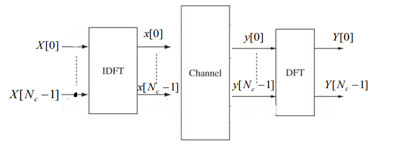
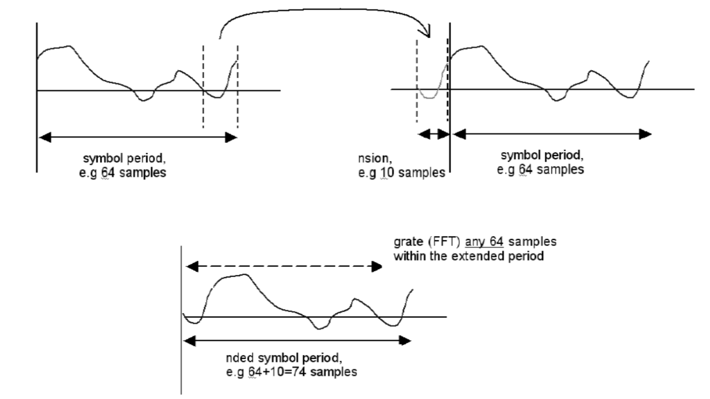
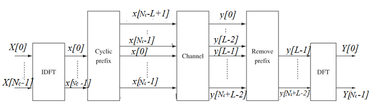

Content
- [Background](#background)
  - [Frequency Selective Fading Channel](#frequency-selective-fading-channel)
- [Architecture of an OFDM system](#architecture-of-an-ofdm-system)
  - [OFDM – Basic Concept](#ofdm--basic-concept)
  - [Cyclic Prefix (CP)](#cyclic-prefix-cp)
- [Frequency diversity revisit and Implementation issues](#frequency-diversity-revisit-and-implementation-issues)
  - [Cyclic Prefix Overhead](#cyclic-prefix-overhead)
- [Summary](#summary)

---

```This part is all about Orthogonal Frequency Division Multiplexing (OFDM)```

# Background
## Frequency Selective Fading Channel
- In a wideband system, signals undergo frequency selective fading.
- In time domain, this means that the channel response has **multiple taps**
  > $y[t]=\displaystyle\sum_{l=0}^{L-1}{h_l x[t-l] + n[t]},\ t=0,...,T-1$

  which causes **inter-symbol interference (ISI)**.
- One approach to tackle ISI is **Equalization**, where
  - The **transmitter is lazy**: it just sends message symbols one after one;
  - The receiver has a tough life: it works hard to equalize the ISI.
- Computational **complexity** (of the receiver) may be too high.

# Architecture of an OFDM system
## OFDM – Basic Concept
- Consider a different approach to solve ISI.
- **Both** the **transmitter** and **receiver** share the burden.
-  Fact: most communication scenarios are **under spread**, i.e.,
    > Delay spread << coherence time.
-  Can be approximated as a **linear time-invariant** channel.
- **Sinusoids** are the only **Eigen-functions** of a linear time-invariant channel. 
- Basic idea: should **signal in frequency domain** and transform into time domain. Then, **no ISI**.
- OFDM Steps
  - Step 1 Use different sinusoids to modulate the message symbols.
  - Step 2 Use IDFT to convert the signal to time-domain.
  - Step 3 Signal undergoes a linear time-invariant channel. 
  - Step 4 Use DFT to convert the signal back to freq-domain, and make decision. (No ISI for sinusoids).
  > 
- Orthogonality
  - Correlation between two (periodic) signals are zero.
## Cyclic Prefix (CP)
- Sinusoids are eigen-functions, but true sinusoids have infinite duration. 
- For a finite duration, sinusoids are no longer eigen-functions.
- Want to restore the eigen-function property: add a cyclic prefix (CP) of length $L-1$ to the front of $x[0],x[1],...,x[N_c-1]$. $L$ is the number of taps.
  > 
  - The steps of OFDM adding CP
  > 
- Then, linear convolution will become cyclic convolution. 
  - The received signal in the time domain is 
    > $y[t]=\displaystyle\sum_{i}^{L-1}{h_ix\left[(t-i-(L-1))\mod N_c\right]+n[t]}$
  - Denote the following 
    > $\begin{aligned}\mathbf{x}&=\left[x[0],...,x[N_c-1]\right]^T\\
    > \mathbf{h}&=[h_0,...,h_{L-1},0,...,]\end{aligned}$
  - Then we hanve
    > $\mathbf{y} = \mathbf{h} \otimes \mathbf{x} + \mathbf{n}$ which is cyclic convolution
- Taking the $N_c$ point discrete Fourier transform (DFT) of $y$, we get 
  > $\begin{aligned}\text{DFT}(\mathbf{y})&=\text{DFT}(\mathbf{h}\otimes\mathbf{x})+\text{DFT}(\mathbf{n}\\
  > &=\sqrt{N_c}\text{DFT}(\mathbf{h})\cdot\text{DFT}(\mathbf{x})+\text{DFT}(\mathbf{n})\\
  > &=\sqrt{N_c}\left[\begin{matrix}\~{H}_{0}\\\vdots\\\~{H}_{N_c-1}\end{matrix}\right]\cdot\left[\begin{matrix}X[0]\\\vdots\\X[{N_c-1}]\end{matrix}\right]+\left[\begin{matrix}\~{n}_{0}\\\vdots\\\~{n}{[N_c-1]}\end{matrix}\right]\\
  > \left[\begin{matrix}{Y_0}\\\vdots\\{Y[N_c-1]}\end{matrix}\right]&=\sqrt{N_c}\left[\begin{matrix}\~{H}_0 X[0]\\\vdots\\\~{H}_{N_c-1}X[N_c-1]\end{matrix}\right]+\left[\begin{matrix}\~{n}_{0}\\\vdots\\\~{n}{[N_c-1]}\end{matrix}\right]\end{aligned}\\
  > \text{where}\\
  > \~{H_k}=\displaystyle\sum_{l=0}^{L-1}h_l\exp\left(-\dfrac{-j2\pi kl}{N_c}\right)$
  - Therefore, these is no ISI.
- We begin with the discrete-time baseband model 
  > $y[m]=\displaystyle\sum_l{h_l[m]x[m-l]+w[m]}$
- For LTI system 
  > $y[m]=\displaystyle\sum_{l=0}^{L-1}{h_lx[m-l]+w[m]}$
- For every block of symbols of length $N_c$ denoted by 
  > $\mathbf{d}=\left[d[0],...,d[N_c-1]\right]^t$
- We create an $N_c+L-1$ input block as 
  > $\mathbf [x]=\left[d[N_c-L+1],d[N_c-L+2],...,d[N_x-1],d[0],d[1],...,d[N_c-1]\right]^t$
- We add a perfix of length $L-1$ consisting of data symols
  > $y[m]=\displaystyle\sum_{l=0}^{L-1}h_lx[m-l]+w[m],\qquad m=1,...,N_c+L-1$
- The ISI extends over the first $L-1$ symbols and the receiver ignose it by considering the output over the time interval $m\in[L,N_C+L-1]$. Due to the additional CP, the output over this time interval (of length $N_c$) is 
  > $y[m]=\displaystyle\sum_{l=0}^{L-1}{h_ld[(m-L-1)\mod N_c]+w[m]}$

# Frequency diversity revisit and Implementation issues
## Cyclic Prefix Overhead
- Cyclic overhead = length of CP/OFDM symbol time 
- CP dictated by delay spread 
- OFDM symbol time limited by channel coherence time 
- Equivalently, the inter-carrier spacing should be much larger than the Doppler spread 
- Since most channels are underspread, the overhead can be made small 
- Implement   
  - CP overhead is given by $\dfrac{L-1}{N}$
  - Want the CP overhead to be small -> increase N 
  - What decides the largest $N_c$ is $N_cT_s\ll T_c$
  - in frequency domain, 
    > $\dfrac{N_c}{B_w}\ll\dfrac{1}{D_s}\text{ or }N_c\ll\dfrac{B_w}{D_x}$
  - Separation of subcarriers must be greater than the Doppler spread. Otherwise these will be **inter-carrier interference (ICI)**
  - The higher the speed, the less $N_c$ and larger CP overhead

# Summary
- Transmitter does <u>IFFT (Inverse Fast Fourier Transform)</u> and <u>adding CP (Cyclic Prefix).</u>
- Receiver does <u>removal of CP</u> and <u>FFT (Fast Fourier Transform)</u>.
- Why we need CP?
  - To avoid ISI 
- The length of the CP must be greater than the Doppler spread to avoid ISI.
- In OFDM, frequency diversity is achieved by doing <u>subcarrier modulation</u> and <u>utilizing the frequency-selective fading of the channel</u>.
- The complexity of OFDM is determined by <u>the number of subcarriers and the use of FFT/IFFT operations</u>.
- What is the condition that the OFDM subcarriers are orthogonal?
  - The orthogonality condition for OFDM subcarriers is achieved when the subcarrier spacing equals the reciprocal of the symbol period (excluding the cyclic prefix). 
  - Mathematically, the subcarriers are orthogonal if the product of any two different subcarriers integrated over the symbol period equals zero.
- What determines the maximum number of subcarriers $N_c$?
  - Bandwidth: The total available bandwidth and the spacing between subcarriers define how many subcarriers can fit into a given spectral space.
  - FFT Size: The size of the FFT/IFFT used in the OFDM system limits the number of subcarriers. Larger FFT sizes allow for more subcarriers but require more computational power and introduce more complexity.

---
[Back: Wireless Networking - an Overview](1.%20Wireless%20Networking%20-%20an%20Overview.md)

[Next: Cellular System: Multiple Access and Interference Management](7.%20Cellular%20System%20-%20Multiple%20Access%20and%20Interference%20Management.md)