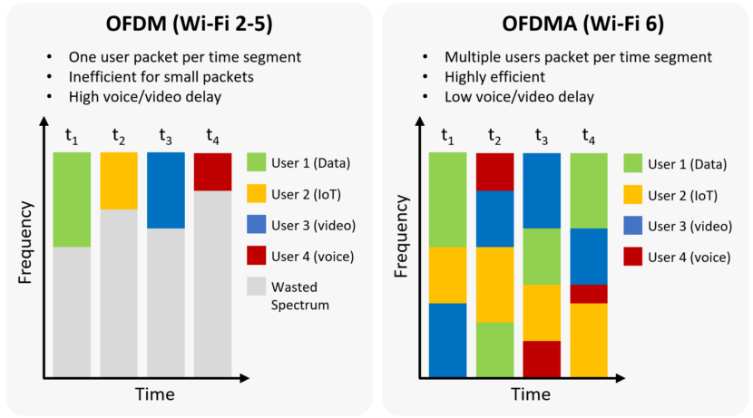

Content 
- [Wireless Networks](#wireless-networks)
- [Cellular system](#cellular-system)
- [Cellular Concept](#cellular-concept)
- [Cellular Implementation](#cellular-implementation)
  - [Frequency Reuse](#frequency-reuse)
  - [Small vs Large Cluster Size](#small-vs-large-cluster-size)
  - [System Expansion Techniques](#system-expansion-techniques)
  - [Cellular Telephone Systems](#cellular-telephone-systems)
- [Three Systems](#three-systems)
  - [Narrowband (GSM)](#narrowband-gsm)
    - [Frequency Reuse](#frequency-reuse-1)
  - [Wideband System: CDMA](#wideband-system-cdma)
    - [Design Goals](#design-goals)
    - [Point-to-Point Link Design](#point-to-point-link-design)
    - [CDMA Uplink](#cdma-uplink)
    - [Pseudo noise Sequences](#pseudo-noise-sequences)
    - [Statistics of Interference](#statistics-of-interference)
    - [IS-95 Uplink](#is-95-uplink)
    - [IS-95 Downlink](#is-95-downlink)
    - [Issues with CDMA](#issues-with-cdma)
  - [Wideband System: OFDM](#wideband-system-ofdm)
    - [Intra-cell Orthogonality](#intra-cell-orthogonality)
    - [Inter-Cell Interference Averaging](#inter-cell-interference-averaging)
    - [Example: Flash OFDM](#example-flash-ofdm)
    - [States of Users](#states-of-users)
  - [Multiple Access Technology](#multiple-access-technology)
- [Summary](#summary)
- [Questions](#questions)

---

# Wireless Networks
- Types
    - Infrastructure based (Cellular, Wi-Fi) and non-infrastructure based (WSN, Tactical network, Walkie-Talkie)
    - Unidirectional (Radio, Satellite broadcast) and bidirectional (Walkie-Talkie, Interactive Satellite comm., cellular)
    - Licensed frequency band and license-free frequency band

**Spectrum efficiency** is the key for licensed frequency band wireless networks

# Cellular system
- Infrastructure based, bidirectional and licensed frequency band based
- In a cellular system, additional issues come into forefront when compared to point-to-point comm.
    - **Multiple access**: how the overall resource of the system is shared by the users in the same cell (*intra-cell*)
    - **Interference management**: interference caused by simultaneous signal transmissions in different cells (*inter-cell*)
    - **Handoff problems** in the network layer

- Some History
    - Cellular concept (Bell Labs, early 70's)
    - 1G: AMPS (analogy, early 80’s)
    - 2G: GSM (digital, narrowband, late 80’s)
    - 2G: IS-95 (digital, wideband, early 90’s)
    - 3G: WCDMA, CDMA2000, TD-SCDMA (digital, wideband, 2000)
    - 4G: LTE -A(digital, wideband, 2010)
    - 5G: eMBB, URLLC, mMTC (digital, wideband, 2020)

# Cellular Concept
- Pre-cellular radio
    - A single, high powered transmitter with a highly-elevated antenna in a large service area.
    - Small number of channels available to users. (Bell mobile system in New York City in the 1970s could only support a maximum of 12 simultaneous calls)
    - Very low capacity.
- Basic Principles
    - [Frequency reuse (path loss)](#frequency-reuse)
    - Cell splitting
    - Cellular network has become the biggest wireless network in the world in terms of number of users (subscribers).

# Cellular Implementation
- Important concepts: cell, cluster
- A fewest number of cells can cover the service area with hexagonal geometry.
  - Why Hexagonal? 
  > covers the entire geographical area without any gaps and overlapping, closer to the radiation pattens of omnidirectional antennas.

## Frequency Reuse
- Assume that a cellular system has in total S duplex channels.
- Each cell is allocated a group of $k (k<S)$ channels, and $S$ channels are **equally divided** among $N$ cells into unique and disjoint channel groups.
  > $𝑆 = 𝑘𝑁$
- The $N$ cells that collectively use the complete set of available frequencies is called a cluster. If a cluster is replicated M times within the system, the capacity is given by
  > $𝐶 = 𝑀𝑘𝑁 = 𝑀𝑆$

## Small vs Large Cluster Size
- The value for cluster size $N$ is a function of how much interference a mobile or base station can tolerate.
- Reducing the value of $N$ means
  - higher interference, due to closer location of co-channel cells.
  - higher capacity, because more clusters are required to cover a given service area.
- Increasing the value of $N$ means
  - lower interference
  - lower capacity
- **Frequency reuse factor**: $1/N$.

## System Expansion Techniques
- Adding new channels
  - can only be done if there are channels available.
- Frequency borrowing
  - to borrow channels from a neighbouring cell, supervised by the mobile switching center (MSC), **works on an interim basis**
- Change of cell pattern
  - introduces higher co-channel interference, and it is costly
- Cell Splitting:
  - divides an area of a cell into more cell areas, with each cell having its own base station and a subsequent reduction in antenna height and transmitter power. Issue: # of handoffs increases
- Sectorization:
  - each cell is subdivided into radial sectors with directional BS antennas

## Cellular Telephone Systems
- Basic Call Procedure/Setup
- Communication between the base station and mobiles
  - forward (reverse) voice channels ~ 95% of the total channels
  - forward (reverse) control channels ~ 5% of the total channels
- When a call is placed to a mobile user
  1. Mobile identifies and monitors the control channel.
  2. When a phone call is placed to a user, MSC dispatches the request to all base stations (BS).
  3. Mobile Id. Number (MIN) is broadcasted as a paging message over all the Forward Control Channels (FCC).
  4. The mobile identifies itself over the Reverse Control Channels (RCC).
  5. The BS informs the MSC of the handshake.
  6. MSC instructs the BS to allocate an unused channel.
  7. BS instructs the mobile to change frequencies.
  8. Ring

# Three Systems
- [Narrowband (GSM)](#narrowband-gsm)
- [Wideband system: CDMA (IS-95, cdma2000, UMTS)](#wideband-system-cdma)
- [Wideband system: OFDM (Flash OFDM, LTE, LTE Advanced)](#wideband-system-ofdm)
## Narrowband (GSM)
- The total bandwidth is divided into many narrowband channels. (200 kHz in GSM)
- Frequency division multiple access (FDMA) with orthogonal channels, and time division multiple access (TDMA) in parallel.
- Users are given time slots in a narrowband channel (8 users)
- Interference between users on the same channel in different cells is minimized by reusing the same channel only in cells far apart.
- Users operate at high SINR regime
- The price to pay is in **reducing the overall available degrees of freedom (DoF)**.
- For outdoors, the delay spread is of 1us and the coherence band is 500 kHz. No frequency diversity
- To provide time diversity, interleaving plus coding over eight consecutive time slots.
- To provide frequency diversity, slow frequency hopping is used.
### Frequency Reuse
- Frequency reuse is poor in narrowband systems because of lack of interference averaging
  - The interference from neighboring cells is random and be in a wide range due to location change.
- Diversity technique can improve SNR, but can not improve the SINR
  - To improve the SINR, we need to average interference
## Wideband System: CDMA
- **Universal frequency reuse**: all the users in all cells share the same bandwidth (1.25 MHz in IS-95 and 1x)
- Main advantages:
  - Maximizes the degrees of freedom usage (all users share the DoF, it is **interference-limited** rather than the **DoF-limited**)
  - Allows interference averaging across many users
  - Soft capacity limit
  - Allows soft handoff
  - Simplify frequency planning
- Challenges
  - Very tight power control to solve the **near-far** problem.
  - **More sophisticated coding/signal processing** to extract the information of each user in a very low SINR environment.
### Design Goals
- make the interference look as much like a white Gaussian noise as possible:
  - Spread each user’s signal using a pseudo noise noise sequence
  - Tight power control for managing interference within the cell
  - Averaging interference from outside the cell as well as fluctuating voice activities of users.
- apply point-to-point design for each link
  - Extract all possible diversity in the channel
### Point-to-Point Link Design
- Extracting maximal diversity is the name of the game.
- **Time diversity** is obtained by interleaving across different coherence time and convolutional coding.
- **Frequency diversity** is obtained by Rake combining of the multipaths. (wideband results in frequency diversity)
- **Transmit diversity** in 3G CDMA systems
### CDMA Uplink
- Uplink with K users
  > 
  - The data of the $k^{th}$ user is encoded into two BPSK sequences $\{a_{k}^{I}[m]\}$ and $\{a_{k}^{Q}[m]\}$ modulated by a pseudo noise sequence, so that the transmitted complex sequence
    > $x_k[m]=a_{k}^{I}[m]s_{k}^{I}[m]+ja_{k}^{Q}[m]s_{k}^{Q}[m],\qquad m=1,2,...,$
  - $\{s_{k}^{I}[m]\}$ and $\{s_{k}^{Q}[m]\}$ are pseudo noise sequence taking values $\pm1$
    > $y[m]=\displaystyle\sum_{k=1}^K{\left(\sum_{l}{h_l^{(k)}[m]x_k[m-l]}\right)+w[m]}.$
### Pseudo noise Sequences
- The pseudo noise sequences are generated by **maximum length shift registers**.
- This pseudo noise sequence has the following characteristics
  - The fraction of 0’s and 1’s is almost half-half over the period p.
    > $\dfrac{1}{p}\displaystyle\sum_{m=1}^ps[m]=-\dfrac{1}{p}$
  - The shifted versions of the pseudo noise sequence are nearly orthogonal to each other.
    > $\dfrac{1}{p}\displaystyle\sum_{m=1}^ps[m]s[m+l]=-\dfrac{1}{p}$
### Statistics of Interference
- Focusing on the demodulation of user 1, the aggregate interference it sees is:
  > $I[m]:=\displaystyle\sum_{k>1}\left(\sum_{l}h_l^{(k)}[m]x_k[m-l]\right)$
- $\{I[m]\}$ has zero mean. The **second-order statistics** are then characterized 
  > $\mathbb{E}[|I[m]|^2] = \displaystyle\sum_{k>1}\mathcal{E}_k^c,\qquad \mathbb{E}[I[m]I[m+l]^*]=0\text{ for }l\ne0\\
  > \mathcal{E}_k^c := \mathbb{E}[|x_k[m]|^2]\displaystyle\sum_l\mathbb{E}[|h_l^{(k)}[m]|^2]\\$
  is the total average energy received per chip from the k-th user due to the multipath
- When there is a large number of users in the network, and none of them contributes to a significant part of the interference
- The Central Limit Theorem can be invoked to justify a **Gaussian approximation** of the interference process.
- From the second-order statistics, we see that this process is **white**.
- A reasonable approximation of designing the point-to-point link for user 1 is to consider it as a multipath fading channel with white Gaussian noise of $\displaystyle\sum_{k>1}{\mathcal{E}_k^c+N_0}$
### IS-95 Uplink
- Uplink Process
  > 
  - 64-ary Orthogonal Modulator
    - $2^6=64$
  - 1.2288Mchips/s
    - $G=\dfrac{W}{R}=\dfrac{\frac{64}{6}\times4}{\frac{1}{3}}=128$
    - $R_c=9.6\times128=1.2288\text{Mchips/s}$
- Power Control
  - Maintain equal received power for all users in the cell
  - Tough problem since the dynamic range is very wide. Users’ attenuation can differ by many 10’s of dB
  - Consists of both open-loop and closed loop
  - Open loop sets a reference point, based on FDD
  - Closed loop is needed since IS-95 is FDD (frequency-division duplex)
  - Consists of 1-bit up-down feedback at 800 Hz.
  - Consumes about **10%** of capacity in IS-95.
  - **Latency** in access due to slow powering up of mobiles
  > 
  > > Inner loop: based on beta, adjust the power lever 
  > > Outer loop: adjust beta based on frame error rate
#### Interference Averaging
- The system capacity is the maximum number of users that can accommodated in the system for a link level of SINR.
- The received signal-to-interference-plus-noise ratio for a user:
  > $\text{SINR}=\dfrac{P}{N_0+(K-1)P+\displaystyle\sum_{i\notin\text{cell}}I_i}$
- In a large system, each interferer contributes a small fraction of the total out-of-cell interference.
- This can be viewed as providing **interference diversity**. Independent users are unlikely to be active all the time, allowing system to admit more users than all users active all the time.
- Same interference-averaging principle applies to voice activity and imperfect power control.
#### Soft and softer Handoff
- Provides another form of diversity: macro-diversity
  > 
  - Soft handoff: between diff BS, selective
  - Softer handoff: between diff sectors, MRC
#### Uplink vs Downlink
- Near-far problem does not exist for downlink. Power control is less crucial.
- Can make downlink signals for different users orthogonal at the transmitter. Still because of multipaths, they are not completely orthogonal at the receiver.
- Inter-cell interference is more severe since less averaging from fewer base-stations.
- Less interference averaging: interference come from a few high-power base stations as opposed to many low-power mobiles.
### IS-95 Downlink
- Downlink Process
  > 
### Issues with CDMA
- Intra-cell interference reduces capacity.
- Power control is expensive, particularly for data applications where users have low duty cycle but require quick access to resource.
- Intra-cell interference is not an inherent property of systems with universal frequency reuse.
- We can keep users in the cell orthogonal.
## Wideband System: OFDM
- We have seen OFDM as a point-to-point modulation scheme, converting the frequency-selective channel into a group of parallel frequency flat channels.
- It can also be used as a multiple access technique.
- By assigning different time/frequency slots to users, they can be kept orthogonal, no matter what the multipath channels are.
- Equalization is not needed.
- The key property of sinusoids is that they are eigenfunctions of all linear time-invariant channels.
- Have universal frequency reuse across cells, through interference averaging.
### Intra-cell Orthogonality
- The basic unit of resource is a virtual channel: a hopping sequence.
- Each hopping sequence spans all the sub-carriers to get full frequency diversity.
- At any symbol time, different channel occupies different sub-carrier.
- This is called the **Latin square**, $N_c$.
- Coding is performed across the symbols in a hopping sequence.
- Hopping sequences of different virtual channels in a cell are orthogonal.
- Each user is assigned a number of virtual channels (n) depending on their data rate requirement.
- The number of user can be supported: $N_c/n$
### Inter-Cell Interference Averaging
- The hopping patterns of virtual channels in adjacent cells are designed such that any pair has minimal overlap.
- This ensures that a virtual channel sees interference from many users instead of a single strong user.
- This is a form of interference diversity.
### Example: Flash OFDM
- Bandwidth = 1.25 Mz
- \# of data sub-carriers = 113
- OFDM symbol = 128 samples = 100 m s
- Cyclic prefix = 16 samples = 11 ms delay spread
> OFDM symbol time determines the accuracy requirement of user synchronization (not chip time). 
> Ratio of the cyclic prefix to OFDM symbol time determines overhead (fixed, unlike power control)
### States of Users
- Users are divided into 3 states:
  - Active: users that are currently assigned virtual channels (<30)
  - Hold: users that are not sending data but maintain synchronization (<130)
  - Inactive (<1000)
- Users in hold state can be moved into active states very quickly.
- Because of the orthogonality property, tight power control is not crucial and this enables quick access for these users.
- Important for certain applications (requests for http transfers, acknowledgements, etc.)
## Multiple Access Technology 
- OFDM vs OFDMA
  > 
- Multiple Access Technology 
  > 

# Summary 

|                                | Narrowband System | Wideband CDMA   | Wideband OFDM     |
| ------------------------------ | ----------------- | --------------- | ----------------- |
| Signal Band                    | Narrowband        | Wideband        | Wideband          |
| Intra-cell BW allocation       | Orthogonal        | Pseudo random   | Orthogonal        |
| Intra-cell interference        | None              | significant     | None              |
| Inter-cell BW allocation       | Partial reuse     | Universal reuse | Universal reuse   |
| inter-cell uplink interference | Bursty            | Averaged        | Averaged          |
| Accuracy of power control      | Low               | High            | Low               |
| Operating SINR                 | High              | Low             | Range:low to high |
| PAPR of uplink signal          | Low               | Mediun          | High              |
| Example system                 | GSM               | IS-95           | Flash-OFDM        |

# Questions
- [Questions for this note](xii.%20TELE9753%20TUT&HW%20-%207.md)

---

[Back: Frequency Diversity](6.%20TELE9753%20Frequency%20Diversity.md)

[Next: Capacity of Wireless Channel](8.%20TELE9753%20Capacity%20of%20Wireless%20Channel.md)