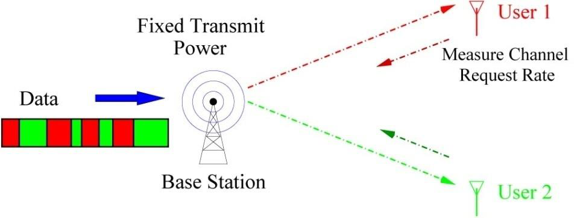

Content 
- [Information Theory](#information-theory)
- [AWGN Channel](#awgn-channel)
  - [Capacity of AWGN Channel](#capacity-of-awgn-channel)
  - [Uplink and Downlink Capacity](#uplink-and-downlink-capacity)
  - [SIMO Channel](#simo-channel)
  - [MISO Channel](#miso-channel)
  - [Frequency-Selective Channel](#frequency-selective-channel)
    - [Waterfilling or Power allocation](#waterfilling-or-power-allocation)
- [Fading Channels](#fading-channels)
  - [Slow Fading Channel](#slow-fading-channel)
    - [Outage for Rayleigh Channel](#outage-for-rayleigh-channel)
    - [Receive Diversity](#receive-diversity)
    - [Transmit Diversity](#transmit-diversity)
    - [Time Diversity](#time-diversity)
  - [Fast Fading Channel](#fast-fading-channel)
  - [Capacity with Full CSI](#capacity-with-full-csi)
  - [Waterfilling vs Channel Inversion](#waterfilling-vs-channel-inversion)
  - [Rate Control](#rate-control)
- [Summary](#summary)

---

# Information Theory
- So far we have only looked at specific communication schemes.
- Information theory provides a fundamental limit to (coded) - performance.
- It succinctly identifies the impact of channel resources on performance as well as suggests new and cool ways to communicate - over the wireless channel.
- It provides the basis for the modern development of wireless - communication.
- We answer the questions:
  - What is the optimal performance achievable on a given channel?
  - What are the techniques to achieve such optimal performance?
  
# AWGN Channel
> $y[m]=x[m]+w[m]$

- Repetition coding
  - Using uncoded BPSK symbols $x[m]=\mp\sqrt{P}$, the error probability is $Q\left(\sqrt{P/\sigma^2}\right)$
  - If average transmit power constraint is $\bar{P}$ watts and for repetition coding, error probability is 
    
    > $Q\left(\dfrac{\|\mathbf{x}_A-\mathbf{x}_B\|}{2\sigma}\right)=Q\left(\sqrt{\dfrac{NP}{\sigma^2}}\right)$

  - It puts codewords in one dimension, not N-dimension 
  - Rate is only $1/N$

## Capacity of AWGN Channel

  > $\begin{aligned}C_{\text{awgn}} &= \log(1+\text{SNR})&&\text{bits/s/Hz}\\&=W\log(1+\text{SNR})&&\text{bits/s}\end{aligned}$
  
  - If average transmit power constraint is $\bar{P}$ watts and noise power spectral density (psd) is $N_0$ watts/Hz,

    > $C_{\text{awgn}} = W\log\left(1+\dfrac{\bar{P}}{N_0W}\right)\qquad\text{bits/s}\\$
    > $\text{SNR} = \dfrac{\bar{P}}{N_0W}$

  - Bandwidth limited regime $\text{SNR}\gg1$: capacity logarithmic in power, approximately linear in bandwidth.

    > $\log_2(1+x)\approx\log_2(x)\qquad\text{when }x\gg1$

  - Power limited regime $\text{SNR}\ll1$: capacity linear in power, insensitive to bandwidth.

    > $\log_2(1+x)\approx x\log_2(e)\qquad\text{when }x\approx0$

- Capacity vs SNR
  - At **low SNR**, the capacity increases **linearly with power**, every 3dB increase in power doubles the capacity.
  - At **high SNR**, the capacity increases **logarithmically with power**, every 3dB increases in power yields only one additional bit per dimension.
    > 

- Capacity vs Bandwidth

  > $W\log\left(1+\dfrac{\bar{p}}{N_0W}\right)\approx W\left(\dfrac{\bar{P}}{N_0W}\right)\log_2e=\dfrac{\bar{P}}{N_0}\log_2e$
  > 

- Capacity Limits
  - In some communications, the objective is to minimize the required energy per bit, $E_b$ , operating in the most power-efficient regime.
  - The minimum $E_b$ is $P/C(P, W)$.

    > $\left(\dfrac{\mathcal{E}_b}{N_0}\right)_{\min}=\displaystyle\lim_{\bar{P}\to0}\dfrac{\bar{p}}{C_{\text{awgn}}(\bar{P},W)N_0}=\dfrac{1}{\log_2e}=-1.59\text{dB}$

  - To achieve this, one needs to pay use the price of delay or infinite bandwidth.
  - In the infinite bandwidth regime, orthogonal codes achieve the capacity (achieve the minimum $E_b/N_o$ of -1.59dB).

- Example 1: Impact of Frequency Reuse
  - Different degree of frequency reuse allows a **tradeoff** between **SINR** and **degrees of freedom** per user.
  - Users in narrowband systems have **high** link SINR but **small** fraction of system bandwidth.
  - Users in wideband systems have **low** link SINR but **full** system bandwidth.
  - Capacity depends on both SINR and d.o.f. and can provide a guideline for optimal reuse.
  - Optimal reuse depends on how the out-of-cell interference fraction $f(\rho)$ depends on the reuse factor $\rho$.
    > $R_\rho=\rho W\log_2(1+\text{SINR})=\rho W\log_2\left(1+\dfrac{\text{SNR}}{\rho+f_\rho\text{SNR}}\right)\text{bits/s}$

- Example 2: CDMA Uplink Capacity
  - Single cell with K users.
    
    > $\text{SINR}=\dfrac{P}{N_0+(K-1)P}\approx\dfrac{1}{K}\qquad(-15\text{dB for }K=32)$

  - Capacity per user
    
    > $=\log(1+\text{SINR})\approx\log_2e\qquad\text{bits/s/Hz}$

  - Cell capacity (interference-limited)
    
    > $\approx K\cdot\text{SINR}\log_2e\approx1.442\text{bits/s/Hz}$

  - If out-of-cell interference is a fraction f of in-cell interference:
    
    > $C\approx\dfrac{1.442}{1+f}\text{bits/s/Hz}

## Uplink and Downlink Capacity
- CDMA and OFDM are specific multiple access schemes.
- But information theory tells us what is the capacity of the uplink and downlink channels and the optimal multiple access schemes.

## SIMO Channel
> $y_l[m]=h_lx[m]+w_l[m]\\$
> $h_l$ are time-invariant

- A sufficient statistic for detecting $x[m]$ from $\mathbf{y}[m]:=[y_1[m],...,y_L[m]]^t is 

  > $\~{y}[m]:=\mathbf{h}^*\mathbf{y}[m] = \|\mathbf{h}\|^2x[m] + \mathbf{h}^*\mathbf{w}[m],$

- The capacity is 

  > $C = \log\left(1+\dfrac{P\|\mathbf{h}\|^2}{N_0}\right)\qquad\text{bits/s/Hz}$

- The multiple receive antennas icrease the effective SNR and providee a power gain via receive beamforming.

## MISO Channel
> $y[m] = \mathbf{h}^*\mathbf{x}[m]+w[m]$

- $\mathbf{h}=[h_1,...,h_l]^t$ and $h_l$ is the (fixed) channel gain from transmit antenna $l$.

  > $\mathbf{x}[m] = \dfrac{\mathbf{h}}{\|\mathbf{h}\|}\~{x}[m]$,

- The MISO channel is reduced to the scaler AWGN channel:

  > $y[m]=\|\mathbf{h}\|\~{x}[m]+w{m}$,

- The capacity is
  
  > $C=\log\left(1+\dfrac{P\|\mathbf{h}\|^2}{N_0}\right)\qquad\text{bits/s/Hz}$
  
- The multiple transmit antennas aligning the transmitted signal ing the direction of the transmit antenna array pattern, increase the effective SNR, and provide a power gain via transmit beamforming.

## Frequency-Selective Channel
> $y[m]=\displaystyle\sum_l{h_lx[m-l]+w[m]}$

- $h_l$ are time-invariant

- OFDM converts it into a parallel channel: 

  > $\~{y}_n=\~{h}_n\~{d}_n+\~{w}_n,\qquad n=1,...,N_c$
  > > $\begin{aligned}
  > > \~{\mathbf{d}}[i]&:=\left[\~{d}_0[i],...,\~{d}_{N_c-1}[i]\right]^t,\\
  > > \~{\mathbf{w}}[i]&:=\left[\~{w}_0[i],...,\~{w}_{N_c-1}[i]\right]^t,\\
  > > \~{\mathbf{y}}[i]&:=\left[\~{y}_0[i],...,\~{y}_{N_c-1}[i]\right]^t,
  > > \end{aligned}$

### Waterfilling or Power allocation
- The total capacity for $N_c$ parallel channels is

  > $C_{N_C}=\displaystyle\sum_{n=0}^{N_c-1}\log\left(1+\dfrac{P_n|\~{h}_n|^2}{N_0}\right)\\$
  > subject to
  > > $\displaystyle\sum_{n=0}^{N_c-1}P_n=N_cP,\qquad P_n\ge0,\ n=0,...,N_c-1.\\$
  > Where $P_n^*$ is the waterfilling allocation for the n-th subchannel
  > > $P_n^*=\left(\dfrac{1}{\lambda}-\dfrac{N_0}{|\~{h}_n|^2}\right)^+$
  > With $\lambda$ chosen to meet the power constraint

- Can be achieved with separate coding for each subcarrier

- Waterfilling in frequency domain
  > 

# Fading Channels
- Different notions of capacity, depending on scenarios:
  - Slow fading channel: outage capacity
  - Fast fading channel: “ergodic” capacity under infinitely deep time interleaving
  - Capacity also depends on whether channel knowledge is known at the transmitter and/or receiver.

## Slow Fading Channel
> $y[m]=hx[m]+w[m]$

- Fading $h$ is random, there is no definite capacity
- Coding cannot significantly improve the error probability, as it cannot average the channel fading

- Outage Probability:

  > $\begin{aligned}
  > p_{\text{out}}(R)&=\mathcal{P}\{\log\left(1+|h|^2\text{SNR}\right)<R\} \\
  > p_{\text{out}}(R)&=1-\exp\left(\dfrac{-(2^R-1)}{\text{SNR}}\right) \\
  > p_{\text{out}}(R)&\approx\dfrac{2^R-1}{\text{SNR}} @\text{ high SNR}
  > \end{aligned}$

  - The probability density function (pdf) of $p_{\text{out}}(R)\approx\dfrac{2^R-1}{\text{SNR}}$
  
    > 

- Outage Capacity 

  > $C_\epsilon=p_{\text{out}}^{-1}(\epsilon)$

### Outage for Rayleigh Channel 
- Let $F$ be the complementary cumulative distribution function of $|h|^2$

  > $F(x)=P(|h|^2>x)$

- Outage capacity 

  > $C_\epsilon=\log(1+F^{-1}(1-\epsilon)\text{SNR})\qquad\text{bits/s/Hz}$

- Fading margin: To achieve the same rate as the AWGN channel, am extra $10\log(\dfrac{1}{F^{-1}(1-\epsilon)})$ dB of power is needed.
- Outage capacity as fraction of AWGN capacity as **high** SNR 
    
  > $\begin{aligned}
  > C_\epsilon & \approx \log{\text{SNR}}+ \log{(F^{-1}(1-\epsilon))}\\
  >            & \approx C_{awgn} - \log{\left(\dfrac{1}{F^{-1}(1-\epsilon)}\right)}
  > \end{aligned}$

- Outage capacity as fraction of AWGN capacity as **low** SNR 

  > $\begin{aligned}
  > C_\epsilon & \approx F^{-1}(1-\epsilon) \text{SNR} \log_2 e\\
  > & \approx F^{-1}(1-\epsilon)C_{\text{awgn}}
  > \end{aligned}$

  > 
  > > Impact is more significant at low snr

### Receive Diversity
$\begin{aligned}
  p_{\text{out}}(R) &= \mathcal{P}\{\log(1+\|\mathbf{h}\|^2\text{SNR}<R\}\\
  p_{\text{out}}(R) &= \mathbb{P}\left\{\|\mathbf{h}\|^2<\dfrac{2^R-1}{\text{SNR}}\right\}\\
  f(x) &= \dfrac{1}{(L-1)!}x^{L-1}e^{-x},\qquad x \ge 0
 \end{aligned}$

$\mathbb{P}\{\|\mathbf{h}^2\|<\delta\}\approx\dfrac{1}{L!}\delta^L,\qquad \text{For small }x,e^x=1$

- At high SNR: $p_{\text{out}}(R)\approx\dfrac{(2^R-1)^L}{L!\text{SNR}^L}$
- Diversity plus power gain 
- Coding does not provide diversity 
- Outage capacity as a fraction of AWGN capacity 
  - At **low** SNR
    
    > $\begin{aligned}
    > C_\epsilon &\approx F^{-1}(1-\epsilon)\text{SNR}\log_2 e\\ 
    > &\approx (L!)^{\tfrac{1}{L}}(\epsilon)^{\tfrac{1}{L}}\text{SNR}\log2 e \qquad \text{bits/s/Hz}
    > \end{aligned}$

    > 

### Transmit Diversity 
- Transmit beamforming (with CSI at Tx):
  
  > $p_{\text{out}}(R)=\mathcal{P}\{\log(1+\|\mathbf{h}\|^2\text{SNR})<R\}$

- Alamouti (2 Tx) (without CSI at Tx):
  
  > $p_{\text{out}}(R)=\mathcal{P}\left\{\log\left(1+\|\mathbf{h}\|^2\dfrac{\text{SNR}}{2}\right)<R\right\}$

- Transmit vs Receive Diversity

  > $\begin{aligned}
  > \text{RX Diversity}&: p_{\text{out}}^{Rx}(R):=\mathbb{P}\{\log(1+\|\mathbf{h}\|^2\text{SNR})<R\}\\
  > \text{TX Diversity}&: p_{\text{out}}^{Tx}(R):=\mathcal{P}\left\{\log\left(1+\|\mathbf{h}\|^2\dfrac{\text{SNR}}{L}\right)<R\right\} 
  > \end{aligned}$
  > > A loss of factor of L in the SNR in TX diversity.
  > > The outage probability and capacity of SIMO and MISO system:
  > > > 

- Repetition vs Alamouti
  > 
  >
  > $\begin{aligned}
  > \text{Repetition}&: p_{\text{out}}^{Rx}(R):=\mathcal{P}\left\{\dfrac{1}{2}\log(1+\|\mathbf{h}\|^2\text{SNR})<R\right\}\\
  > \text{Alamouti}&: p_{\text{out}}^{Tx}(R):=\mathcal{P}\left\{\log\left(1+\|\mathbf{h}\|^2\dfrac{\text{SNR}}{2}\right)<R\right\} 
  > \end{aligned}$
  > > **Loss** in degrees of freedom under **repetition**.
  > >   
  > > At **Low** SNR, **repetition** coding is almost optimal.

### Time Diversity
> $y_l=h_lx_l+w_l,\qquad l=1,...,L$

- Coding done over L coherence blocks, each of many symbols.
- This is a parallel channel. If transmiier knows the channel, can do waterfilling.
- Can achieve:
  > $p_{\text{out}}(R) = \mathcal{P}\left\{\dfrac{1}{L}\displaystyle\sum_{l=1}^{L}\log(1+P_l^*|h_l|^2)<R\right\}$

- Without channel knowledge 
  
  > $p_{\text{out}}(R) = \mathcal{P}\left\{\dfrac{1}{L}\displaystyle\sum_{l=1}^{L}\log(1+|h_l|^2\text{SNR})<R\right\}$

- Rate or power allocation cannot be done
- Equal power allocation is the choice 

- Coding across different coherence blocks becomes now necessary 

## Fast Fading Channel 
- Channel with L-fold time diversity:
  > $p_{\text{out}}(R) = \mathcal{P}\left\{\dfrac{1}{L}\displaystyle\sum_{l=1}^{L}\log(1+|h_l|^2\text{SNR})<R\right\}$

  - As $L\to\infty$
    > $\dfrac{1}{L}\displaystyle\sum_{l=1}^{L}\log(1+|h_l|^2\text{SNR}) \to \mathcal{E}[\log(1+|h|^2\text{SNR})]$

- Fast fading channel as a definite capacity 
  > $C=\mathcal{E}[\log(1+|h|^2\text{SNR})]$
  - Tolerance dealy $\gg$ coherence time
- Capacity of fading channel is always less than that of AWGN 
  - At **low** SNR, the fading channel capacity is: 
    > $C=\mathcal{E}[\log(1+|h|^2\text{SNR})]\approx\mathbb{E}[|h|^2\text{SNR}]\log_2 e = \text{SNR}\log_2 e \approx C_{\text{awgn}}$

  - At **high** SNR:
    > $C\approx\mathbb{E}[\log(|h|^2\text{SNR})]=\log\text{SNR}+\mathbb{E}[\log|h|^2]\approx C_\text{awgn}+\mathbb{E}[\log|h|^2]$

## Capacity with Full CSI
- This is a parallel channel, with a sub-channel for each fading state.
  > $C=\mathcal{E}\left[\log\left(1+\dfrac{P^*(h)|h|^2}{N_0}\right)\right]$
  > 
  > where 
  > $P^*(h)=\left(\dfrac{1}{\lambda}-\dfrac{N_0}{|h|^2}\right)^+$
  >
  > is the waterfilling power allocation as a function of the fading state, and $\lambda$ is chosen to satisfy the average power constraint 

- Can be achieved with separate coding for each fading state.
- Performance 
  > 
  - At **high** SNR, waterfilling does not provide any gain. But transmitter knowledge allows rate adaptation and simplifies coding.
  - At **low** SNR
    > $\begin{aligned}C&\approx\mathbb{p}\{|h|^2\approx G_{\max}\}\log\left(1+G_{\max}\cdot\dfrac{\text{SNR}}{\mathbb{p}\{|h|^2\approx G_{\max}\}}\right)\\
    &\approx G_{\max}\cdot\text{SNR}\log_2 e\qquad \text{bits/s/Hz}\end{aligned}$
      > 
      - Waterfilling povides a significant power gain at low SNR.

## Waterfilling vs Channel Inversion
1. Waterfilling and rate adaptation maximize long-term throughput but incur significant delay.
2. Channel inversion: huge amount of power is consumed to invert the channel when it is bad.
3. Channel inversion is power-inefficient but maintains the same data rate at all channel states.
4. Channel inversion achieves a delay-limited capacity.

- Example of Rate Adaptation:1xEV-DO Downlink
  > 
  - Multiple access is TDMA via scheduling.
    - Each user is **rate-controlled** rather than *power-controlled* (CDMA IS-95).
    - (**waterfilling** vs *channel inversion*)
    - (**variable rate** vs *constant rate*)
    - (**Data** vs *voice*)

## Rate Control
- Mobile measures the channel based on the pilot and predicts the SINR torequest a rate.
- They use the same rate 1/5 turbo code as mother code.
- Each requires 4 bits feedback, 10% uplink capacity.

# Summary 
- A slow fading channel is a source of *unreliability*: very poor outage capacity. **Diversity** is needed.
- A fast fading channel with only receiver CSI has a capacity close to that of the AWGN channel. Delay is long compared to channel coherence time.
- A fast fading channel with full CSI can have a capacity **greater** than that of the AWGN channel: fading now provides more **opportunities** for performance boost.
- The idea of **opportunistic communication** is even more powerful in multiuser situations, as we will see.

---
[Back: Cellular System: Multiple Access and Interference Management](7.%20TELE9753%20Cellular%20System%20-%20Multiple%20Access%20and%20Interference%20Management.md)

[Next: Multiuser Capacity and Opportunistic Communications](9.%20TELE9753%20Multiuser%20Capacity%20and%20Opportunistic%20Communications.md)