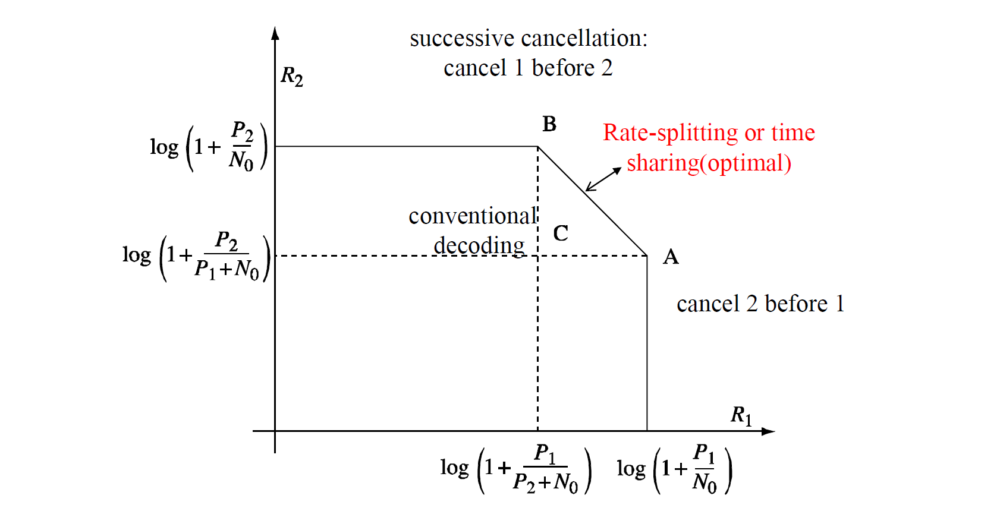
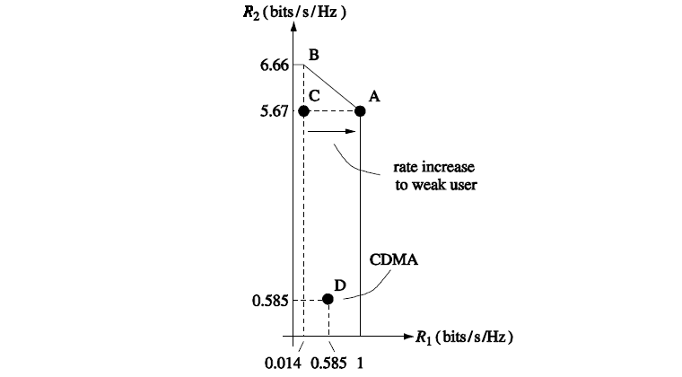
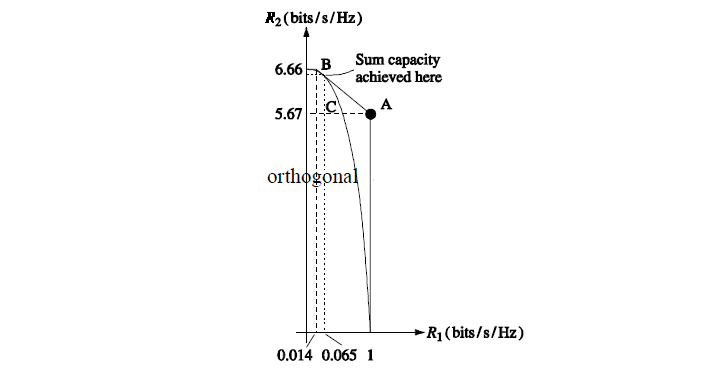
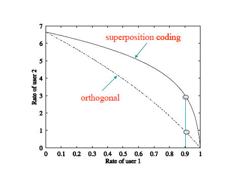
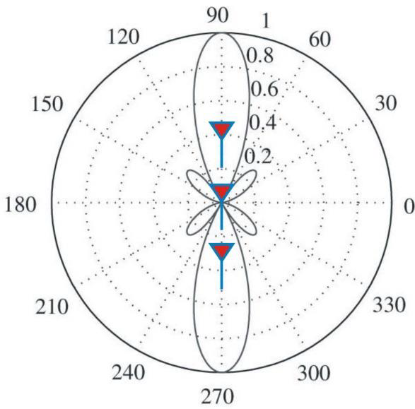
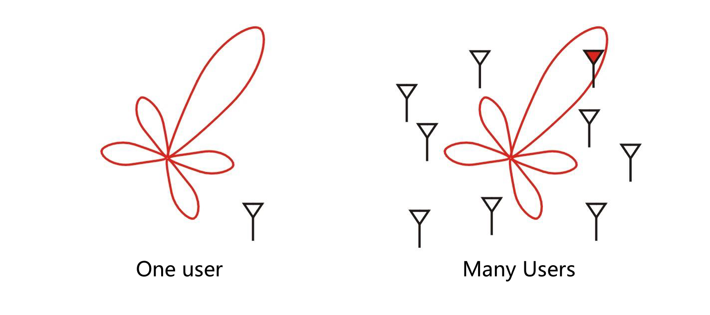
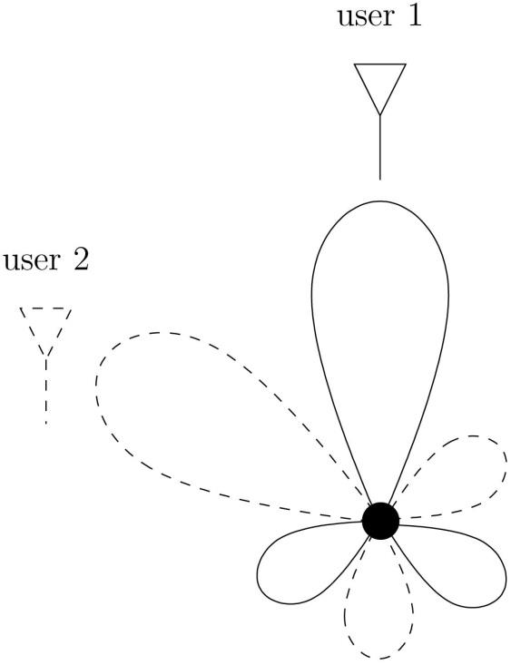
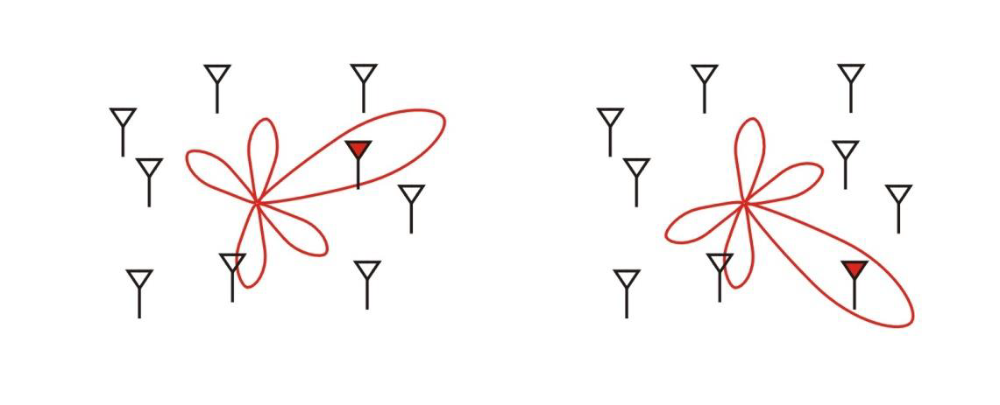

Content 
- [Multiuser Capacity](#multiuser-capacity)
  - [Uplink AWGN Capacity](#uplink-awgn-capacity)
    - [Conventional CDMA vs Capacity](#conventional-cdma-vs-capacity)
    - [Orthogonal vs Capacity](#orthogonal-vs-capacity)
    - [General K-user uplink](#general-k-user-uplink)
- [Downlink Capacity](#downlink-capacity)
  - [Genral K-user Downlink Capacity](#genral-k-user-downlink-capacity)
- [Fundamental Feature of Wireless Channels: Time Variation](#fundamental-feature-of-wireless-channels-time-variation)
  - [Traditional Approach to Wireless System Design](#traditional-approach-to-wireless-system-design)
  - [Multipath Fading: Another Look](#multipath-fading-another-look)
- [Opportunistic Communication](#opportunistic-communication)
  - [A Different View](#a-different-view)
  - [Hitting the Peaks](#hitting-the-peaks)
  - [Multiuser Diversity](#multiuser-diversity)
  - [Symmetric Users](#symmetric-users)
  - [Channel Dynamics](#channel-dynamics)
- [Dumb Antennas](#dumb-antennas)
  - [Beamforming Interpretation](#beamforming-interpretation)
  - [Dumb Antennas in Action](#dumb-antennas-in-action)
  - [Slow Fading: Opportunistic Beamforming](#slow-fading-opportunistic-beamforming)
  - [Smart vs Dumb Antennas](#smart-vs-dumb-antennas)
  - [Cellular Systems: Opportunistic Nulling](#cellular-systems-opportunistic-nulling)
- [Questions](#questions)

---

# Multiuser Capacity
- New techniques and concepts:
  - Successive interference cancellation (SIC)
  - Superposition coding
  - Multiuser diversity

## Uplink AWGN Capacity
> $y[m]=x_1[m]+x_2[m]+w[m]$

- Capacity Region: 
  - The set of all capacity pairs (R1, R2) such that simultaneously user 1 and user 2 can reliably communicate.
- The symmetric capacity
  > $C_{\text{sym}}:=\displaystyle\max_{(R,R)\in C}R$
- Sum Capacity:
  > $C_{\text{sum}}:=\displaystyle\max_{(R_1,R_2)\in C}R_1+R_2$

- Capacity region
  > $\begin{aligned}
  > R_1&<\log\left(1+\dfrac{P_1}{N_0}\right)\\
  > R_2&<\log\left(1+\dfrac{P_2}{N_0}\right)\\
  > R_1+R_2&<\log\left(1+\dfrac{P_1+P_2}{N_0}\right)  
  > \end{aligned}$

  - Each user cannot exceed the capacity of the point-to-point link with the other user absent.
  - The total rate cannot exceed the capacity of an AWGN channel with the sum of the received powers of the two users.

- Successive interference cancellation (SIC):
  > $R_2^*=\log\left(1+\dfrac{P_1+P_2}{N_0}\right)-\log\left(1+\dfrac{P_1}{N_0}\right)=\log\left(1+\dfrac{P_2}{P_1+N_0}\right)$
  - Decode user 2 at rate $R^*_2$ by treating user 1’s signal as interference/noise.
  - After decoding user 2, subtract it from the aggregate received signal.
  - Decode user 1’s signal. Now it only has background AWGN without interference.
  - User 1 is able to achieve the capacity of
    > $R_1<\log\left(1+\dfrac{P_1}{N_0}\right)$
  > 

### Conventional CDMA vs Capacity
- 20 dB power difference between 2 users
  > 
  - C: Conventional CDMA decoding
  - D: CDMA with power control
- Successive cancellation allows the weak user to have a good rate without lowering the power of the strong user.
- With the SIC, we turn the **near-far problem** into a **near-far advantage**.

### Orthogonal vs Capacity
- 20 dB power difference between 2 users
  > 
- Orthogonal schemes are in general sub-optimal , except for one point: when the amount of degree of freedom allocated to each user is proportional to its received power

- Orthogonal achieves maximum throughput but may not be fair. Resources are given to strong users.

### General K-user uplink
- The capacity region is described by 2K-1 constrains, one for each non-empty subset of users
  > $\displaystyle\sum_{k\in\mathcal{S}}R_k<\log\left(1+\dfrac{\sum_{k\in\mathcal{S}}P_k}{N_0}\right)\qquad \text{for all }\mathcal{S}\subset\{1,...,K\}$

- The sum capacity is
  > $C_{\text{sum}}=\log\left(1+\dfrac{\sum_{k\in\mathcal{S}}^KP_k}{N_0}\right)\qquad \text{bits/s/Hz}$

- There are **K! corner points**, each for a successive cancellation order among users.
- The symmetric sum capacity is
  > $C_{\text{sum}}=\log\left(1+\dfrac{KP}{N_0}\right)$
  > $C_{\text{sum}}=\dfrac{1}{K}\log\left(1+\dfrac{KP}{N_0}\right)$

# Downlink Capacity
> $\begin{aligned}
> y_k[m]&=h_kx[m]+w_k[m]\\
> R_k&<\log\left(1+\dfrac{P|h_k|^2}{N_0}\right)
> \end{aligned}$
> > Symmetric Case: $|h_1|=|h_2|$
> >
> > $R_1+R_2<\log\left(1+\dfrac{P|h_k|^2}{N_0}\right)$

- The transmit signal (superposition with total power of P):
  > $x[m]=x_1[m]+x_2[m]$

- User 1 treats User 2’s signal as noise
  > $R_1 = \log \left( 1 + \frac{P_1 |h_1|^2}{P_2 |h_1|^2 + N_0} \right) = \log \left( 1 + \frac{(P_1 + P_2) |h_1|^2}{N_0} \right) - \log \left( 1 + \frac{P_2 |h_1|^2}{N_0} \right)$

- User 2 performs SIC (decode User 1’s signal first then decodes its own signal)
  > $R_2=\log \left( 1 + \frac{P_2 |h_2|^2}{N_0} \right)$

- 20 dB gain difference between 2 users
  > 
  - Strong user Increases From 1 bits/s/Hz to 3 bits/s/hz
  - Orthogonal scheme:
    > $R_1 = \alpha \log \left( 1 + \frac{P_1 |h_1|^2}{\alpha N_0} \right) \text{ bits/s/Hz}, \\
    > R_2 = (1 - \alpha) \log \left( 1 + \frac{P_2 |h_2|^2}{(1 - \alpha) N_0} \right) \text{ bits/s/Hz}.$ 

## Genral K-user Downlink Capacity
- The capacity region for symmetric channel
  > $\displaystyle\sum_{k=1}^KR_k<\log\left(1+\dfrac{P|h|^2}{N_0}\right)$

- With channel ordering, $h_1<h_2<…<h_K$, the boundary of the capacity region is
  > $R_k = \log \left( 1 + \frac{P_k |h_k|^2}{N_0 + \left(\sum_{j=k+1}^{K} P_j\right) |h_k|^2} \right), \quad k = 1 \ldots K$

# Fundamental Feature of Wireless Channels: Time Variation
- multipath fading
- large-scale channel variations
- time-varying interference
## Traditional Approach to Wireless System Design
- Compensates for deep fades via diversity techniques over time, frequency and space.
- Example: CDMA Systems
  - Two main compensating mechanisms:
    1. Channel diversity:
       - **frequency diversity** via Rake combining
       - **time** diversity via interleaving and coding
       - **macro**-diversity via soft handoff
       - **transmit/receive** antenna diversity
    2. Interference diversity / management:
       - **power** control
       - **interference** **averaging** from many users
## Multipath Fading: Another Look
- Multipath fading provides high peaks to exploit.
- Channel capacity is achieved by such an opportunistic strategy.
- Point-to-point performance benefits mainly in the energy-limited rather than the bandwidth-limited regime.

# Opportunistic Communication
## A Different View
- Transmit more when and where the channel is good.
- Exploits fading to achieve higher long-term throughput, but no guarantee that the "channel is always there".
- Appropriate for data with non-real-time latency* requirements (file downloads, video streaming).
  > Real-time latency: Tolerable limits to latency for live, real-time processing is a subject of investigation and debate but is estimated to bebetween 6 and 20 milliseconds.
## Hitting the Peaks
- High SNR: allocating equal powers at all times is almost optimal.
- Low SNR: allocating all the power when the channel is strongest is almost optimal (opportunistic).

## Multiuser Diversity
- In a large system with users fading independently, there is likely to be a user with a very good channel at any time.
- Long term total throughput can be maximized by always serving the user with the strongest channel (Knopp&Humblet 95)

- A More Insightful Look
  - Independent fading makes it likely that users peak at different times.
  - In a wideband system with many users, each user operates at low average SNR, effectively accessing the channel only when it is near its peak.
  - In the downlink, channel tracking can be done via a strong pilot amortized between all users.

- Application to CDMA 2000 1x EV-DO
  - Multiuser diversity provides a system-wide benefit.
  - Challenge is to share the benefit among the users in a fair way.
  - Requested rate depends on the channel condition.

## Symmetric Users
  - Serving the best user at each time is also fair in terms of
  long term throughputs.
  - Asymmetric Users: Hitting the Peaks
    - Want to serve each user when it is at its peak.
    - A peak should be defined with respect to the latency time-scale tc of the application.
  - Proportional Fair Scheduler
    - Schedule the user with the highest ratio  
      $\dfrac{R_k}{T_K}$
      - Rk = current requested rate of user k
      - Tk = average throughput of user k in the past tc time slots.

## Channel Dynamics
- Channel varies faster and has more dynamic range in mobile environments.
- Why No Gain with High Mobility?
  - Can only predict the average of the channel fluctuations, not the instantaneous values.
- Inducing Randomness
  - Scheduling algorithm exploits the nature-given channel fluctuations by hitting the peaks.
  - If there are not enough fluctuations, why not purposely induce them?

# Dumb Antennas
- The information bearing signal at each of the transmit antenna is multiplied by a time-varying phase.
## Beamforming Interpretation
- Antenna array: Beamforming
  > 
- Beamforming direction is controlled by the relative phase $\Theta(t)$.
- Dumb antennas sweeps a beam over all directions.
## Dumb Antennas in Action
  - One User: Most of the time, the beam is nowhere near the user.
  - Many users: Opportunistic Beamforming
    - In a large system, there is likely to be a user near the beam at any one time.
    - By transmitting to that user, close to true beamforming performance is achieved, without knowing the locations of the users.
  > 
## Slow Fading: Opportunistic Beamforming
  - Dumb antennas create a beam in random time-varying direction.
  - In a large system, there is likely to be a user near the beam at any one time.
  - By transmitting to that user, close to true beamforming performance is achieved.
  > 

## Smart vs Dumb Antennas
  
  |                              | Dumb antennas (Opp. beamform) | Smart antennas (Space-time codes) | Smarter antennas (Transmit beamform) |
  | ---------------------------- | ----------------------------- | --------------------------------- | ------------------------------------ |
  | Channel knowledge            | Overall SNR                   | Entire CSI at Rx                  | Entire CSI at Rx, Tx                 |
  | Slow fading performance gain | Diversity and power gains     | Diversity gain only               | Diversity and power gains            |
  | Fast fading performance gain | No impact                     | Multiuser diversity ↓             | Multiuser diversity ↓ power ↑        |
  - Space-time codes improve reliability of point-to-point links but reduce multiuser diversity gain.
  - Dumb antennas add fluctuations to point-to-point links，increases multiuser diversity gains.

## Cellular Systems: Opportunistic Nulling
> 
- In a cellular systems, users are scheduled when their channel is strong and the interference from adjacent base-stations is weak.
- Multiuser diversity allows interference avoidance
- Dumb antennas provides opportunistic nulling for users in other cells.
- In practice, performance may be limited by interference averaging: a user may be within range of several base-stations.
- Conventional vs Opportunistic Communication
  
  |                        | Conventional multiple access  | Opportunistic communication       |
  |------------------------|-------------------------------|-----------------------------------|
  | Guiding principle      | Averaging out fast channel fluctuations | Exploiting channel fluctuations |
  | Knowledge at Tx        | Track slow fluctuations. No need to track fast ones | Track as many fluctuations as possible |
  | Control                | Power control the slow fluctuations | Rate control to all fluctuations |
  | Delay requirement      | Can support tight delay | Needs some laxity                  |
  | Role of Tx antennas    | Point-to-point diversity | Increase fluctuations              |
  | Power gain in downlink | Multiple Rx antennas | Opportunistic beamform via multiple Tx antennas |
  | Interference management| Averaged | Opportunistically avoided              |

# Questions
- [Questions for this note](iv.%20TELE9753%20TUT&HW%20-%209.md)

---
[Back: Capacity of Wireless Channel](8.%20TELE9753%20Capacity%20of%20Wireless%20Channel.md)

[Next: MIMO: Spatial Multiplexing and Channel Modeling](10.%20TELE9753%20MIMO%20-%20Spatial%20Multiplexing%20and%20Channel%20Modeling.md)