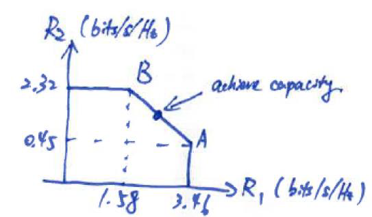

# Questions
Consider an uplink systems, a two-user multiple access scheme (in general, not for any specific system) with two users’ transmit power as P1 =10 W and P2=4 W (note that the powers are in watss). The noise power spectral density is N0=0.001. The total system bandwidth is 1 KHz.

Plot the capacity region of the two-user multiple access channel and show the key capacity points. Which (R1,R2)-points in this region are optimal operating points (indicate the segment/line on the region by labeling the corners with letters)?

# Solution 
We first convert the powers to watts:
> $\begin{aligned}
> P_1 &= 10W, \\ 
> P_2 &= 4W,\\
> N_0 &= 0.001, \\
>   B &= 1kHz\\
> P_{N_0} &= B \cdot N_0 = 1W\\
> \end{aligned}$
> 
> $\begin{aligned}
> R_1 &< \log \left( 1 + \frac{P_1}{P_{N_0}} \right) = 3.46\\
> R_2 &< \log \left( 1 + \frac{P_2}{P_{N_0}} \right) = 2.32\\
> R'_1 &= \log \left( 1 + \frac{P_1}{P_2 + P_{N_0}} \right) = 1.58\\
> R'_2 &= \log \left( 1 + \frac{P_2}{P_1 + P_{N_0}} \right) = 0.45
> \end{aligned}$

> 
- The segment/line AB contains all the “optimal” operating points of the channel, in the sense that any other point in the capacity region is component-wise dominated by some point on AB.